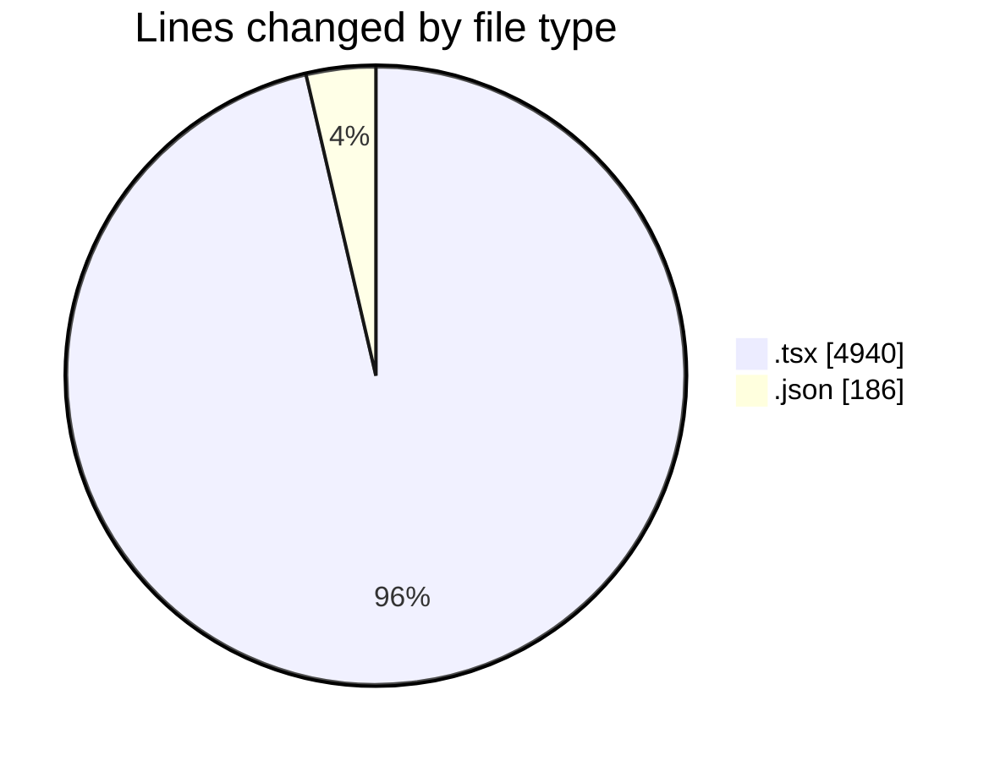
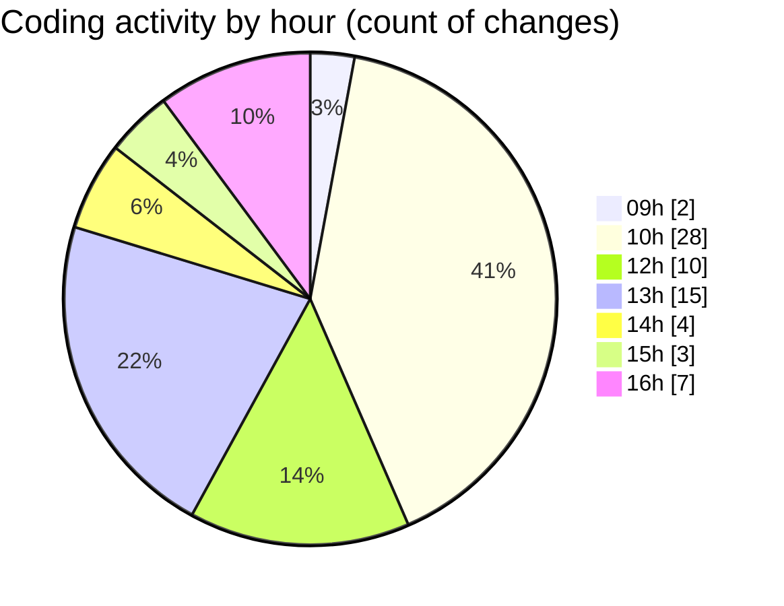

# cda - Activity Summary 

## Overall Statistics

| Stat                   | Value                                                             |
| ---------------------- | ----------------------------------------------------------------- |
| **Lines Added** (➕)   | 4121                                          |
| **Lines Removed** (➖) | 1005                                        |
| **Net Change** (↕)    | 3116                |
| **Active Time** (⌚)   | 63 minutes |

## Modified Files
- **SkillTeam.tsx** (+135, -83)
- **App.tsx** (+89, -0)
- **ConfirmationDialog.tsx** (+89, -12)
- **ConfirmatioinDialog.stories.tsx** (+448, -0)
- **ConfirmationDialog.stories.tsx** (+528, -432)
- **index.tsx** (+1, -0)
- **ConfirmationDialog.test..tsx** (+23, -22)
- **ModalNew.tsx** (+425, -3)
- **ModalNew.test.tsx** (+566, -10)
- **ModalNew.stories.tsx** (+1269, -423)
- **Button.tsx** (+362, -20)
- **package.json** (+186, -0)

## Visualizations

### By File Type (Lines Changed)

### By Hour (Estimated Activity Count)

> **Last Updated:** 06/08/2026, 16:30:14