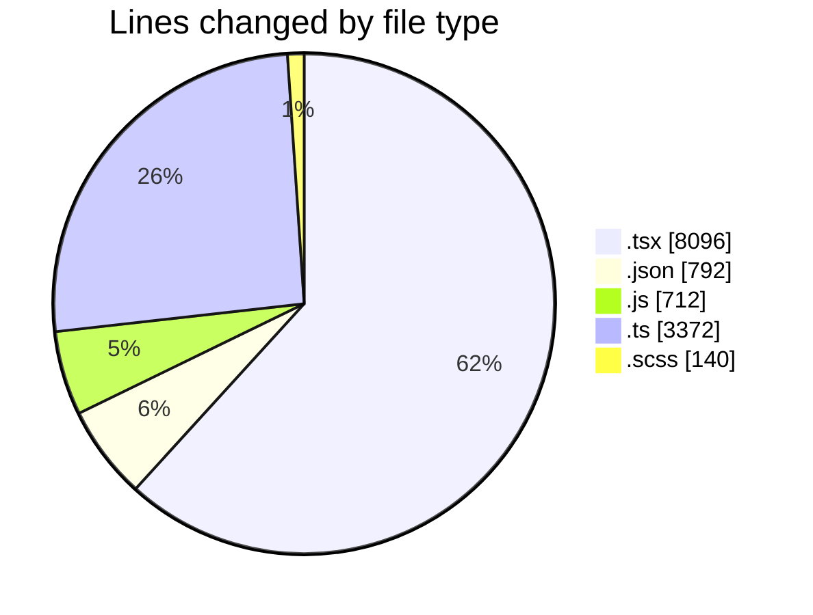
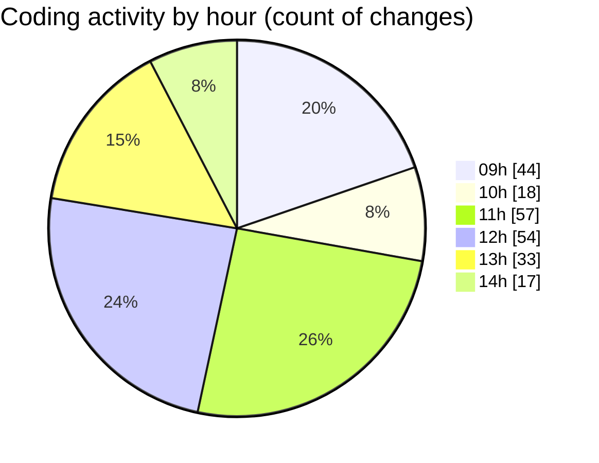

# cda - Activity Summary 

## Overall Statistics

| Stat                   | Value                                                             |
| ---------------------- | ----------------------------------------------------------------- |
| **Lines Added** (➕)   | 11033                                          |
| **Lines Removed** (➖) | 2079                                        |
| **Net Change** (↕)    | 8954                |
| **Active Time** (⌚)   | 286 minutes |

## Modified Files
- **ModalNew.tsx** (+701, -85)
- **settings.json** (+93, -0)
- **ModalNew.stories.tsx** (+1331, -66)
- **ModalNew.test.tsx** (+981, -110)
- **ConfirmationDialog.tsx** (+1342, -513)
- **index.tsx** (+27, -11)
- **ConfirmationDialog.test..tsx** (+478, -348)
- **ConfirmationDialog.stories.tsx** (+875, -439)
- **index.js** (+712, -0)
- **index.ts** (+2059, -23)
- **ConfirmationDialog.test.tsx** (+262, -14)
- **package.json** (+191, -5)
- **Button.tsx** (+513, -0)
- **settings.json** (+480, -23)
- **skill-queries.ts** (+895, -395)
- **ConfirmationDialog.scss** (+93, -47)

## Visualizations

### By File Type (Lines Changed)

### By Hour (Estimated Activity Count)

> **Last Updated:** 07/08/2026, 14:26:15