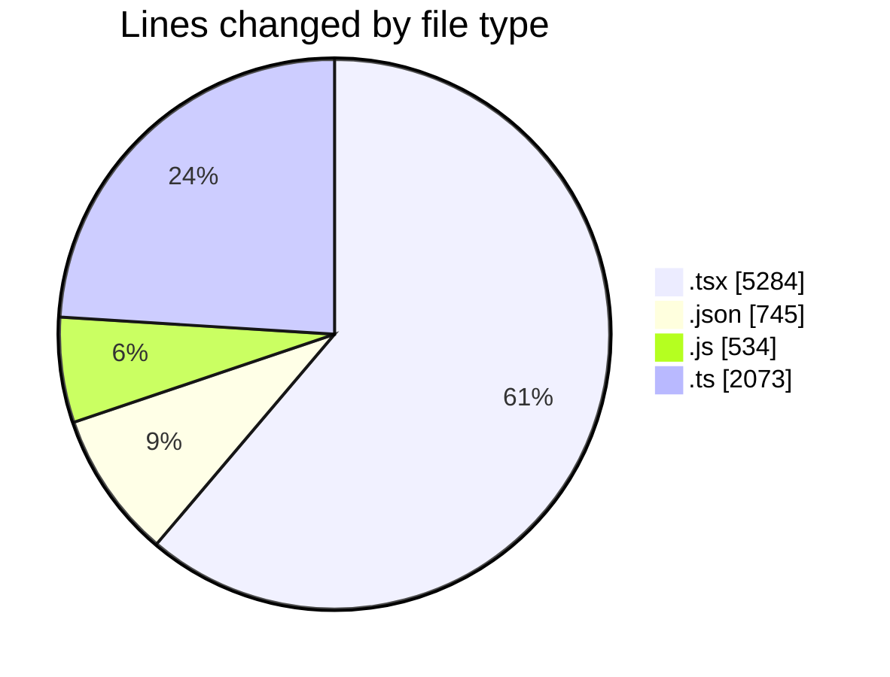
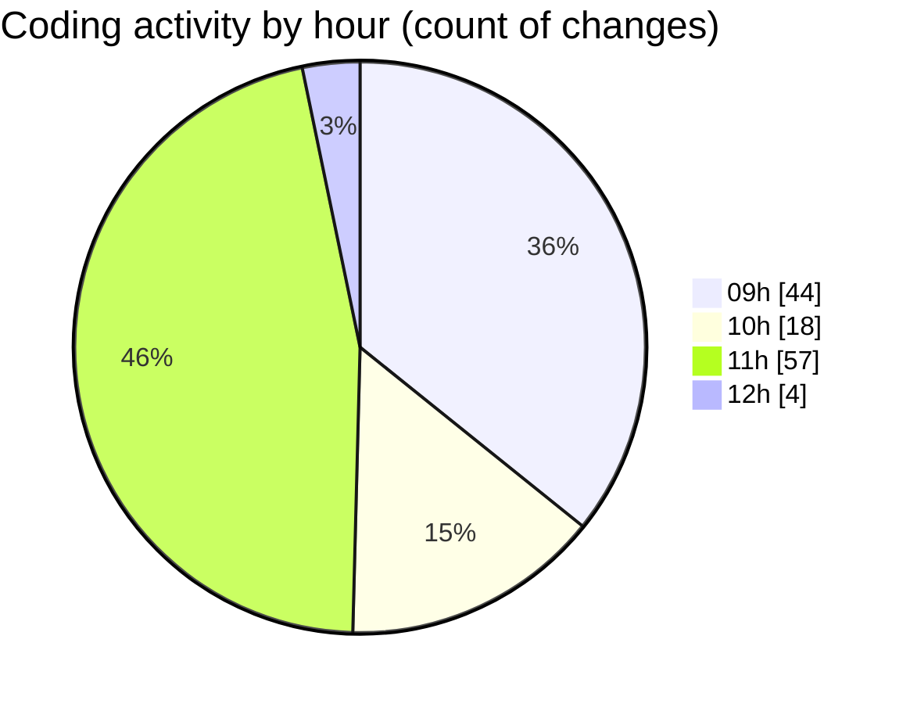

# cda - Activity Summary 

## Overall Statistics

| Stat                   | Value                                                             |
| ---------------------- | ----------------------------------------------------------------- |
| **Lines Added** (➕)   | 7654                                          |
| **Lines Removed** (➖) | 982                                        |
| **Net Change** (↕)    | 6672                |
| **Active Time** (⌚)   | 152 minutes |

## Modified Files
- **ModalNew.tsx** (+493, -85)
- **settings.json** (+46, -0)
- **ModalNew.stories.tsx** (+909, -66)
- **ModalNew.test.tsx** (+689, -110)
- **ConfirmationDialog.tsx** (+1118, -297)
- **index.tsx** (+23, -11)
- **ConfirmationDialog.test..tsx** (+349, -348)
- **ConfirmationDialog.stories.tsx** (+302, -14)
- **index.js** (+534, -0)
- **index.ts** (+1550, -23)
- **ConfirmationDialog.test.tsx** (+128, -0)
- **package.json** (+191, -5)
- **Button.tsx** (+342, -0)
- **settings.json** (+480, -23)
- **skill-queries.ts** (+500, -0)

## Visualizations

### By File Type (Lines Changed)

### By Hour (Estimated Activity Count)

> **Last Updated:** 07/08/2026, 12:06:15