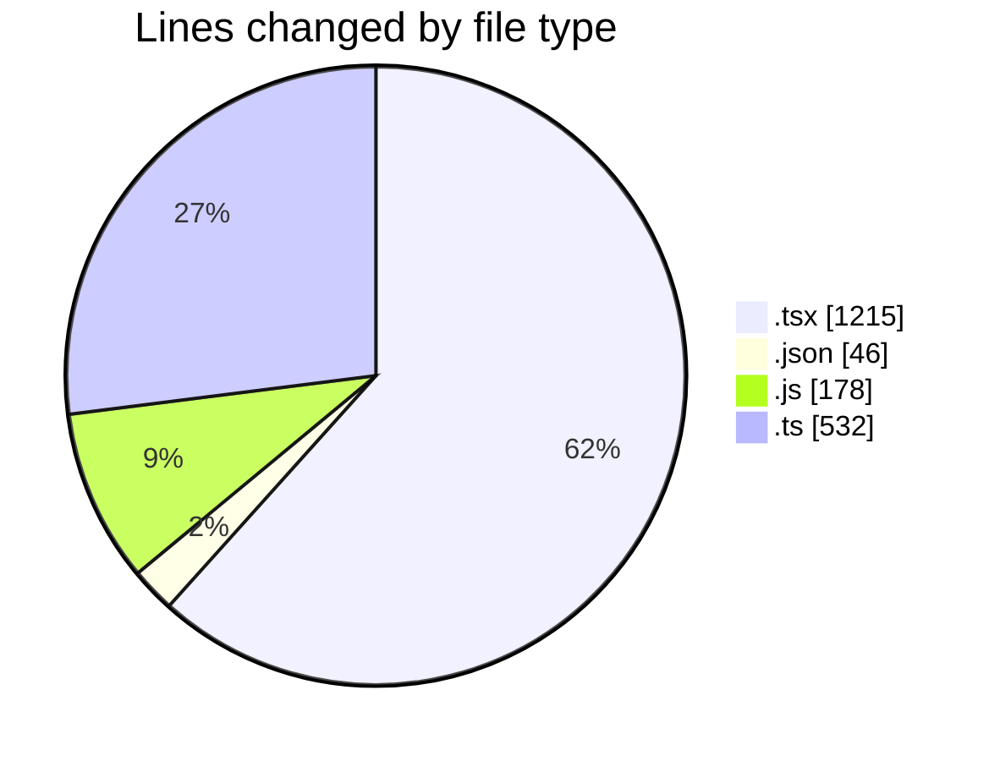
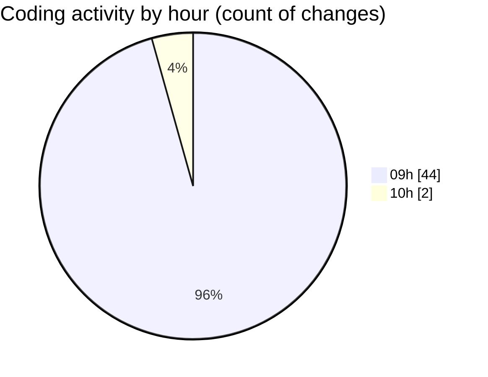

# cda - Activity Summary 

## Overall Statistics

| Stat                   | Value                                                             |
| ---------------------- | ----------------------------------------------------------------- |
| **Lines Added** (➕)   | 1546                                          |
| **Lines Removed** (➖) | 425                                        |
| **Net Change** (↕)    | 1121                |
| **Active Time** (⌚)   | 55 minutes |

## Modified Files
- **ModalNew.tsx** (+10, -85)
- **settings.json** (+46, -0)
- **ModalNew.stories.tsx** (+0, -66)
- **ModalNew.test.tsx** (+0, -110)
- **ConfirmationDialog.tsx** (+240, -11)
- **index.tsx** (+15, -11)
- **ConfirmationDialog.test..tsx** (+302, -127)
- **ConfirmationDialog.stories.tsx** (+96, -14)
- **index.js** (+178, -0)
- **index.ts** (+531, -1)
- **ConfirmationDialog.test.tsx** (+128, -0)

## Visualizations

### By File Type (Lines Changed)

### By Hour (Estimated Activity Count)

> **Last Updated:** 07/08/2026, 10:05:14