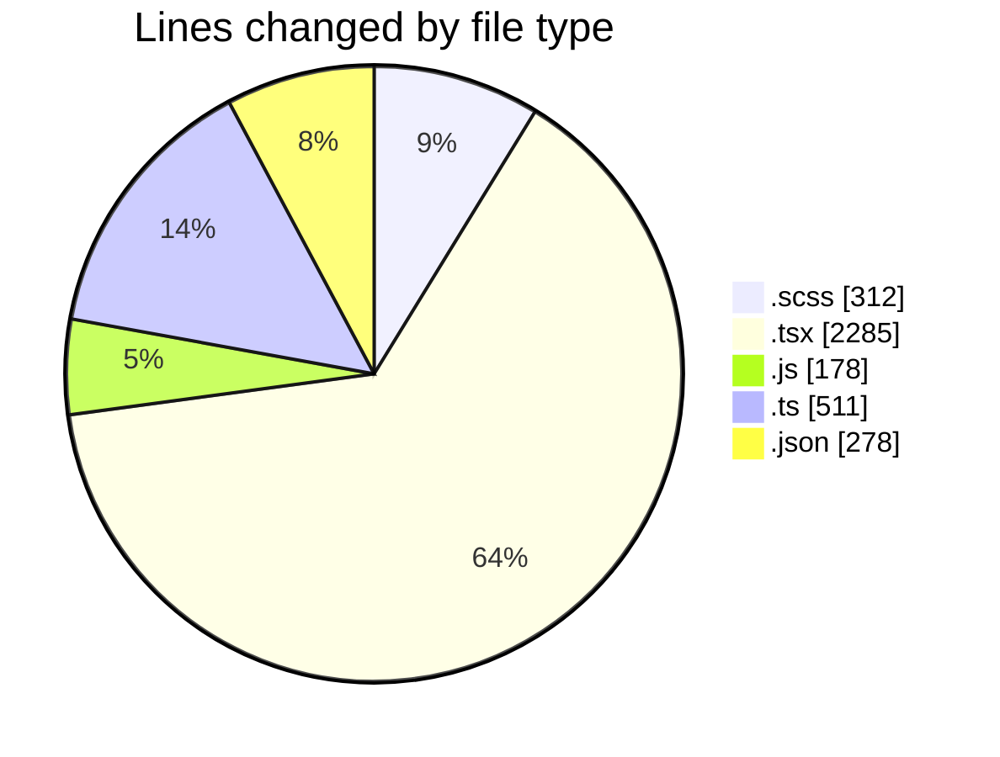
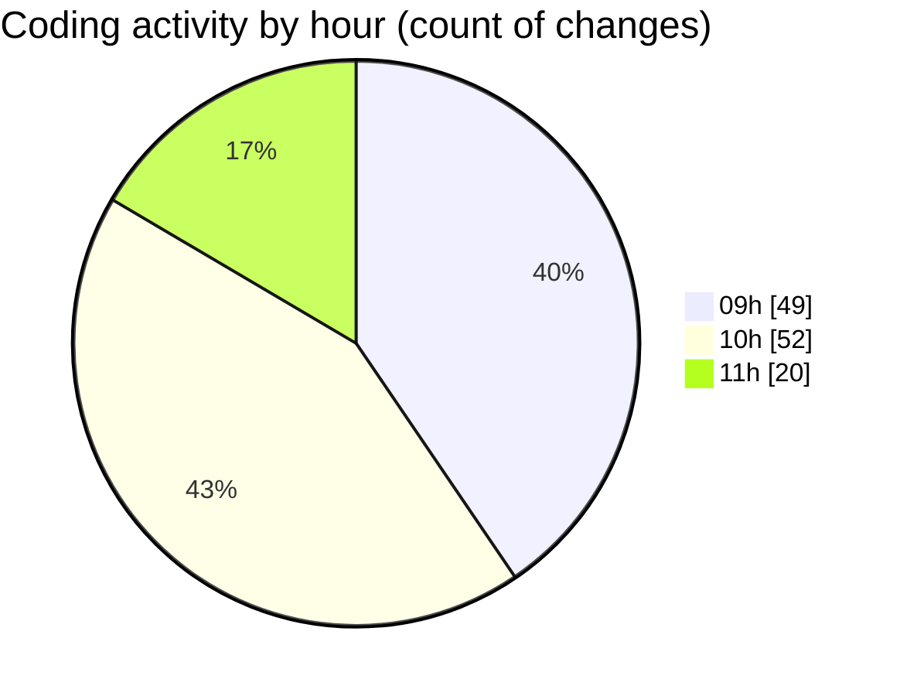

# cda - Activity Summary 

## Overall Statistics

| Stat                   | Value                                                             |
| ---------------------- | ----------------------------------------------------------------- |
| **Lines Added** (➕)   | 2853                                          |
| **Lines Removed** (➖) | 711                                        |
| **Net Change** (↕)    | 2142                |
| **Active Time** (⌚)   | 160 minutes |

## Modified Files
- **ConfirmationDialog.scss** (+139, -80)
- **ConfirmationDialog.stories.tsx** (+203, -273)
- **ConfirmationDialog.tsx** (+10, -6)
- **ModalNew.scss** (+93, -0)
- **ModalNew.tsx** (+388, -174)
- **ModalNew.stories.tsx** (+487, -65)
- **index.js** (+176, -2)
- **index.ts** (+507, -2)
- **ModalNew.test.tsx** (+400, -108)
- **package.json** (+186, -0)
- **settings.json** (+91, -1)
- **Button.tsx** (+171, -0)
- **index.ts** (+2, -0)

## Visualizations

### By File Type (Lines Changed)

### By Hour (Estimated Activity Count)

> **Last Updated:** 10/08/2026, 11:46:08