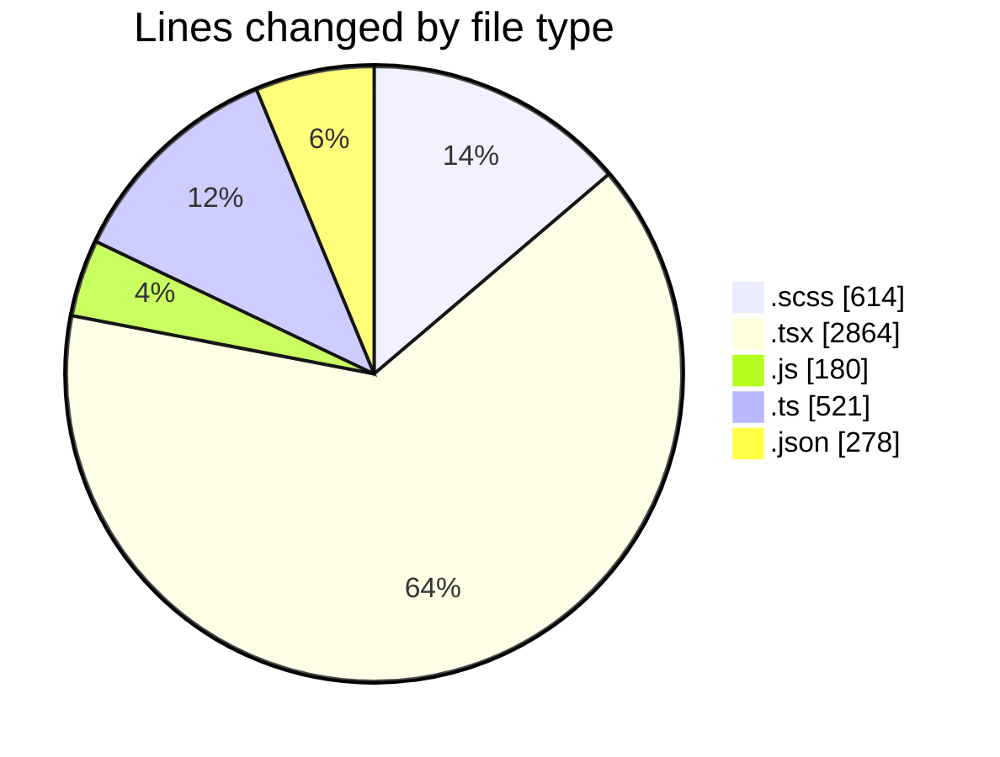
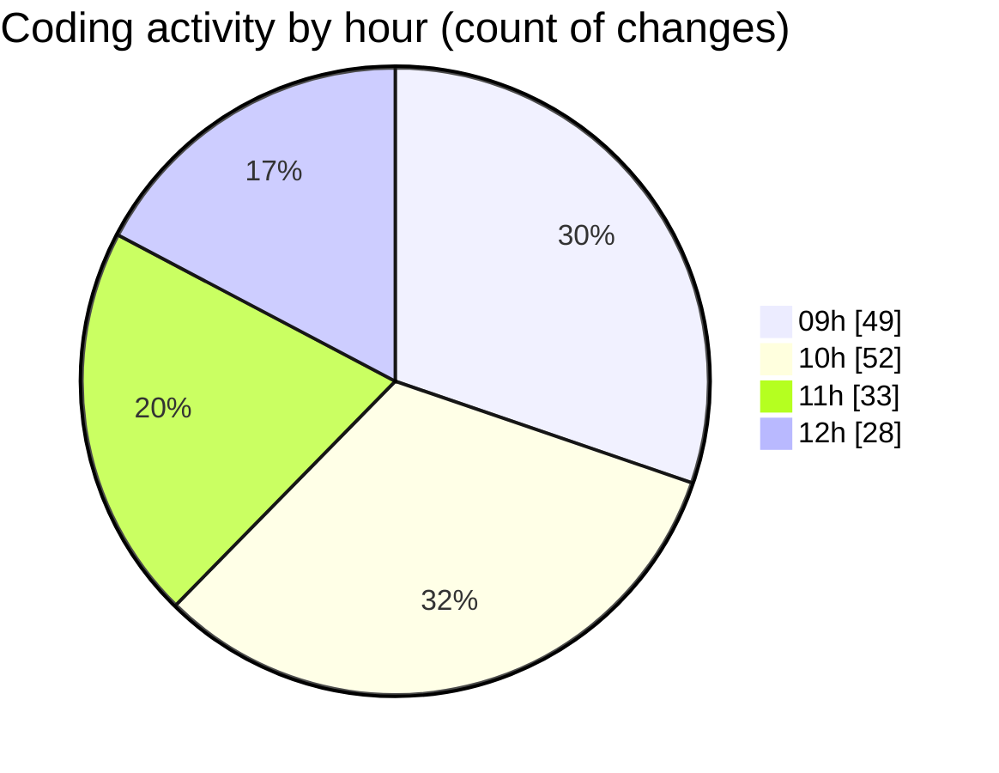

# cda - Activity Summary 

## Overall Statistics

| Stat                   | Value                                                             |
| ---------------------- | ----------------------------------------------------------------- |
| **Lines Added** (➕)   | 3553                                          |
| **Lines Removed** (➖) | 904                                        |
| **Net Change** (↕)    | 2649                |
| **Active Time** (⌚)   | 205 minutes |

## Modified Files
- **ConfirmationDialog.scss** (+364, -157)
- **ConfirmationDialog.stories.tsx** (+461, -363)
- **ConfirmationDialog.tsx** (+189, -11)
- **ModalNew.scss** (+93, -0)
- **ModalNew.tsx** (+415, -191)
- **ModalNew.stories.tsx** (+487, -65)
- **index.js** (+178, -2)
- **index.ts** (+509, -2)
- **ModalNew.test.tsx** (+403, -108)
- **package.json** (+186, -0)
- **settings.json** (+91, -1)
- **Button.tsx** (+171, -0)
- **index.ts** (+6, -4)

## Visualizations

### By File Type (Lines Changed)

### By Hour (Estimated Activity Count)

> **Last Updated:** 10/08/2026, 12:46:08