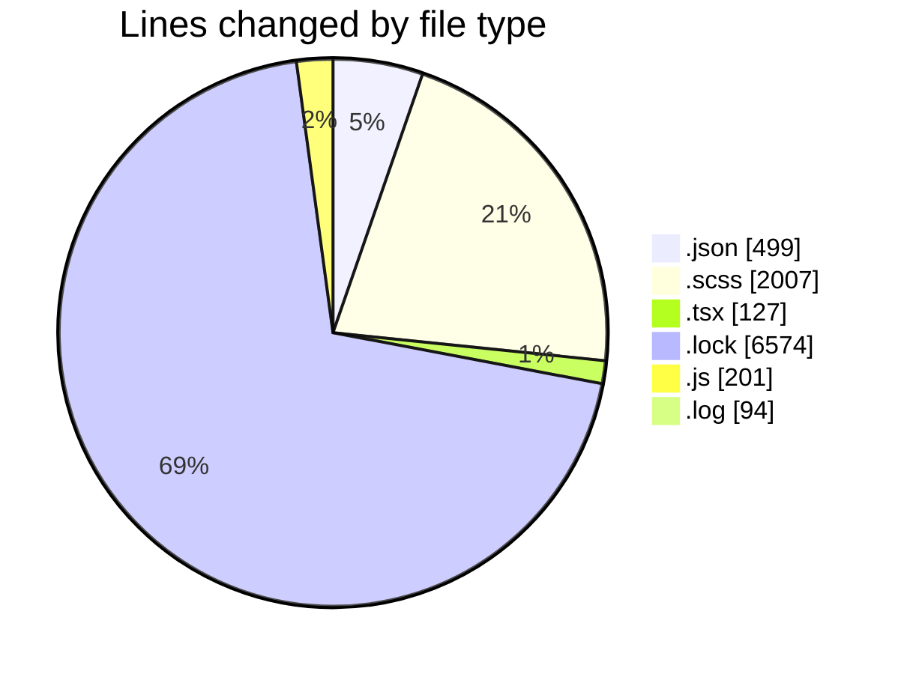
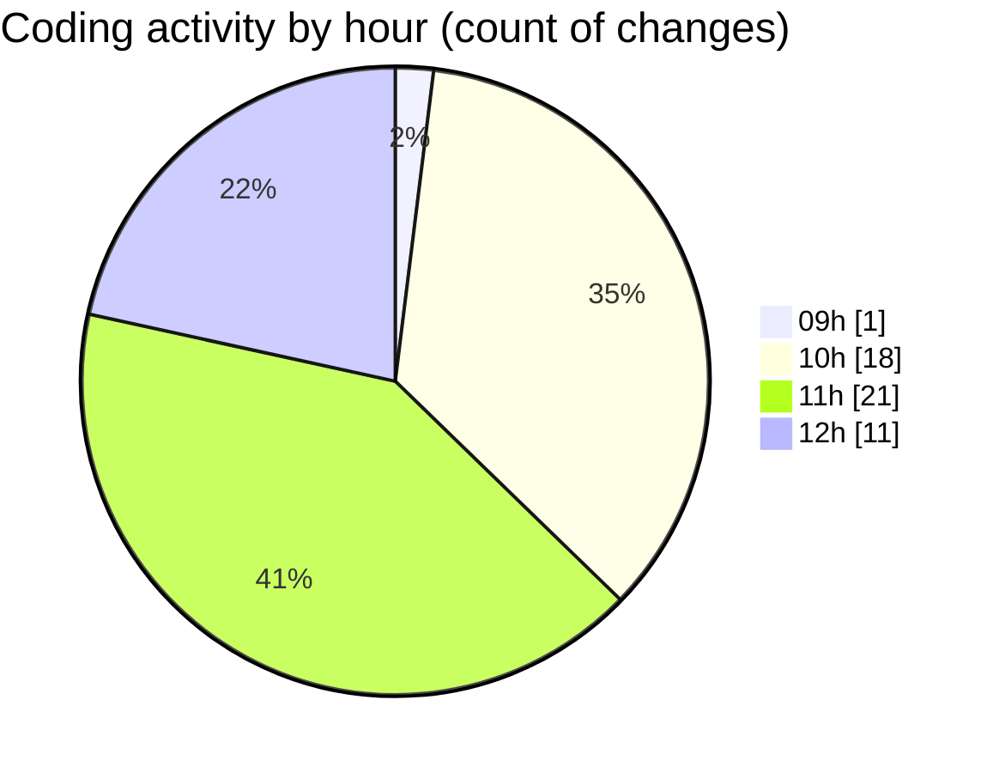

# cda - Activity Summary 

## Overall Statistics

| Stat                   | Value                                                             |
| ---------------------- | ----------------------------------------------------------------- |
| **Lines Added** (➕)   | 9425                                          |
| **Lines Removed** (➖) | 77                                        |
| **Net Change** (↕)    | 9348                |
| **Active Time** (⌚)   | 73 minutes |

## Modified Files
- **package.json** (+372, -0)
- **_button.scss** (+997, -0)
- **_button.scss** (+512, -0)
- **_demo.scss** (+50, -0)
- **package.json** (+63, -0)
- **GroupSearch.tsx** (+127, -0)
- **_grid.scss** (+27, -1)
- **sass-mq.scss** (+5, -3)
- **yarn.lock** (+6574, -0)
- **package.json** (+64, -0)
- **vite.config.js** (+52, -7)
- **main.js** (+108, -34)
- **debug-storybook.log** (+62, -32)
- **_sass-mq.scss** (+6, -0)
- **_tools.scss** (+406, -0)

## Visualizations

### By File Type (Lines Changed)

### By Hour (Estimated Activity Count)

> **Last Updated:** 11/08/2026, 13:00:00