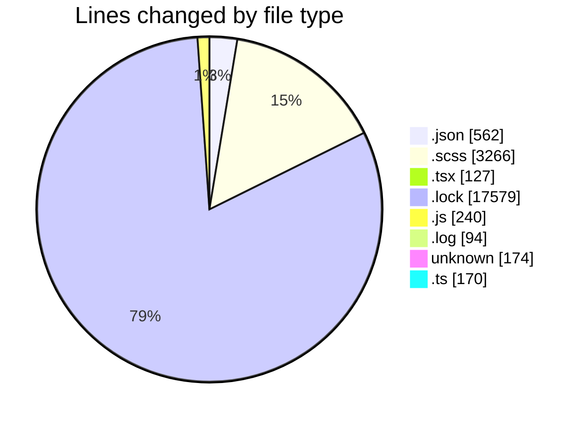
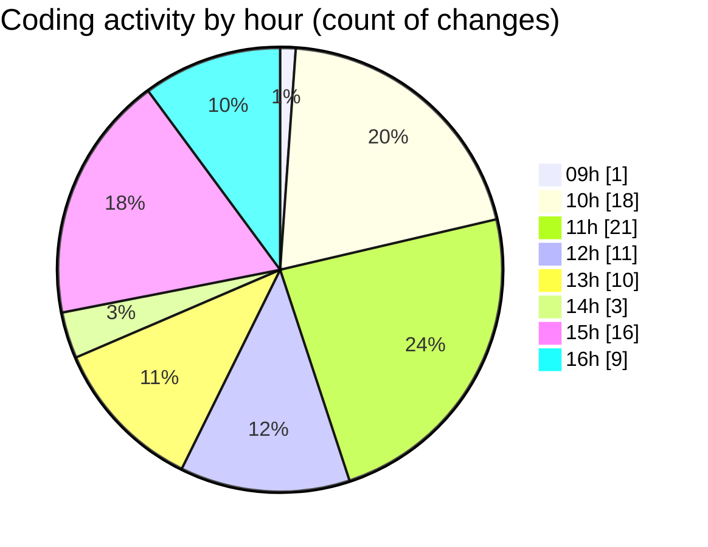

# cda - Activity Summary 

## Overall Statistics

| Stat                   | Value                                                             |
| ---------------------- | ----------------------------------------------------------------- |
| **Lines Added** (➕)   | 22029                                          |
| **Lines Removed** (➖) | 183                                        |
| **Net Change** (↕)    | 21846                |
| **Active Time** (⌚)   | 118 minutes |

## Modified Files
- **package.json** (+372, -0)
- **_button.scss** (+998, -2)
- **_button.scss** (+512, -0)
- **_demo.scss** (+50, -0)
- **package.json** (+64, -1)
- **GroupSearch.tsx** (+127, -0)
- **_grid.scss** (+27, -1)
- **sass-mq.scss** (+5, -3)
- **yarn.lock** (+6574, -77)
- **package.json** (+64, -0)
- **vite.config.js** (+52, -7)
- **main.js** (+128, -53)
- **debug-storybook.log** (+62, -32)
- **_sass-mq.scss** (+6, -0)
- **_tools.scss** (+406, -0)
- **_globals.scss** (+102, -0)
- **_globals.scss** (+102, -0)
- **_tools.scss** (+406, -0)
- **_settings.scss** (+417, -0)
- **_tools.scss** (+201, -0)
- **.env** (+121, -0)
- **yarn.lock** (+10928, -0)
- **.gitignore** (+53, -0)
- **vite.config.ts** (+68, -0)
- **_mq.scss** (+2, -0)
- **vite.config.ts** (+75, -7)
- **package.json** (+61, -0)
- **_grid.scss** (+26, -0)
- **vite.sass-importer.ts** (+20, -0)

## Visualizations

### By File Type (Lines Changed)

### By Hour (Estimated Activity Count)

> **Last Updated:** 11/08/2026, 16:20:00