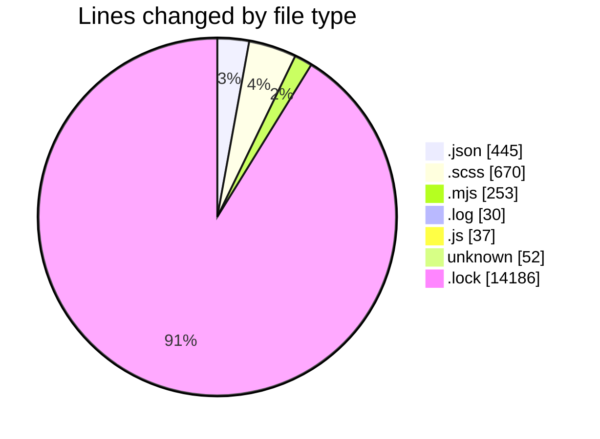
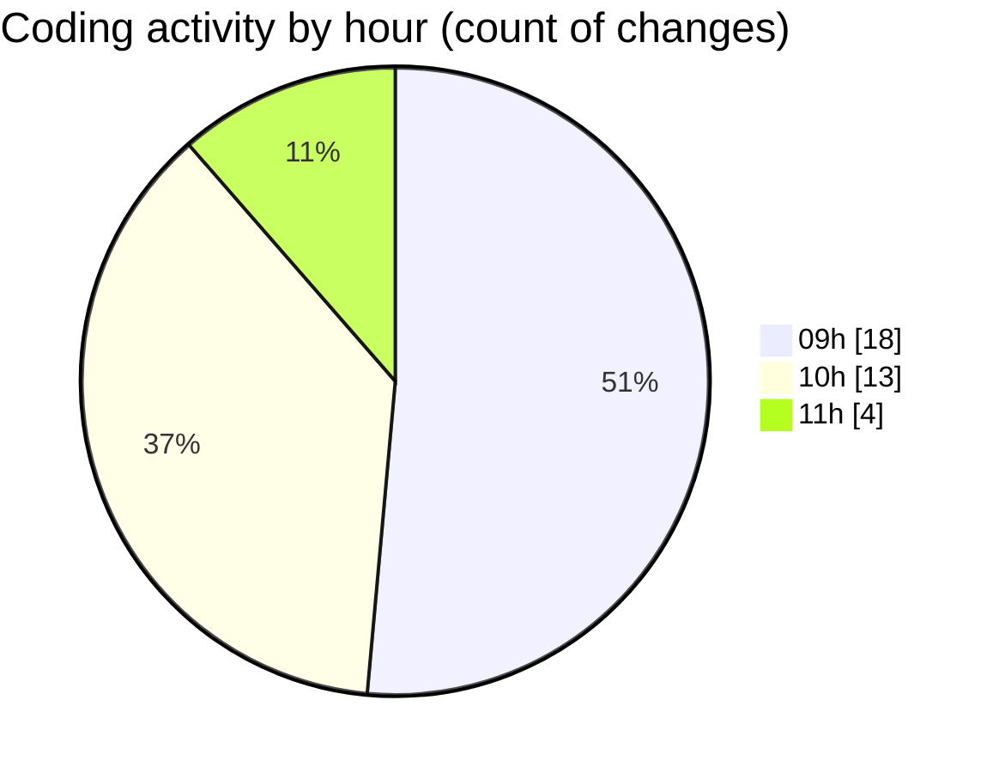

# cda - Activity Summary 

## Overall Statistics

| Stat                   | Value                                                             |
| ---------------------- | ----------------------------------------------------------------- |
| **Lines Added** (➕)   | 15641                                          |
| **Lines Removed** (➖) | 32                                        |
| **Net Change** (↕)    | 15609                |
| **Active Time** (⌚)   | 48 minutes |

## Modified Files
- **package.json** (+63, -0)
- **package.json** (+68, -0)
- **_sass-mq.scss** (+2, -0)
- **package.json** (+188, -1)
- **_grid.scss** (+26, -1)
- **_type.scss** (+438, -0)
- **prepare-sass-vendor.mjs** (+50, -26)
- **debug-storybook.log** (+30, -0)
- **usefulLinks.scss** (+101, -0)
- **vitest.config.js** (+37, -0)
- **_globals.scss** (+102, -0)
- **eslint.config.mjs** (+93, -0)
- **package.json** (+61, -0)
- **package.json** (+64, -0)
- **rollup.config.mjs** (+80, -4)
- **.gitignore** (+52, -0)
- **yarn.lock** (+14186, -0)

## Visualizations

### By File Type (Lines Changed)

### By Hour (Estimated Activity Count)

> **Last Updated:** 12/08/2026, 11:37:35