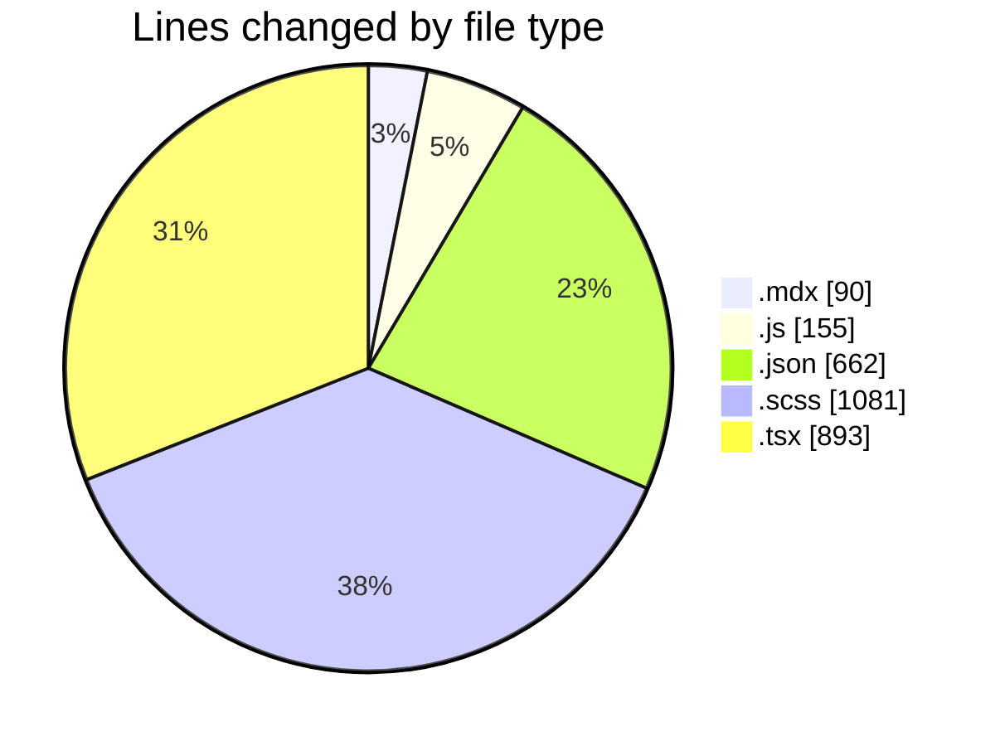
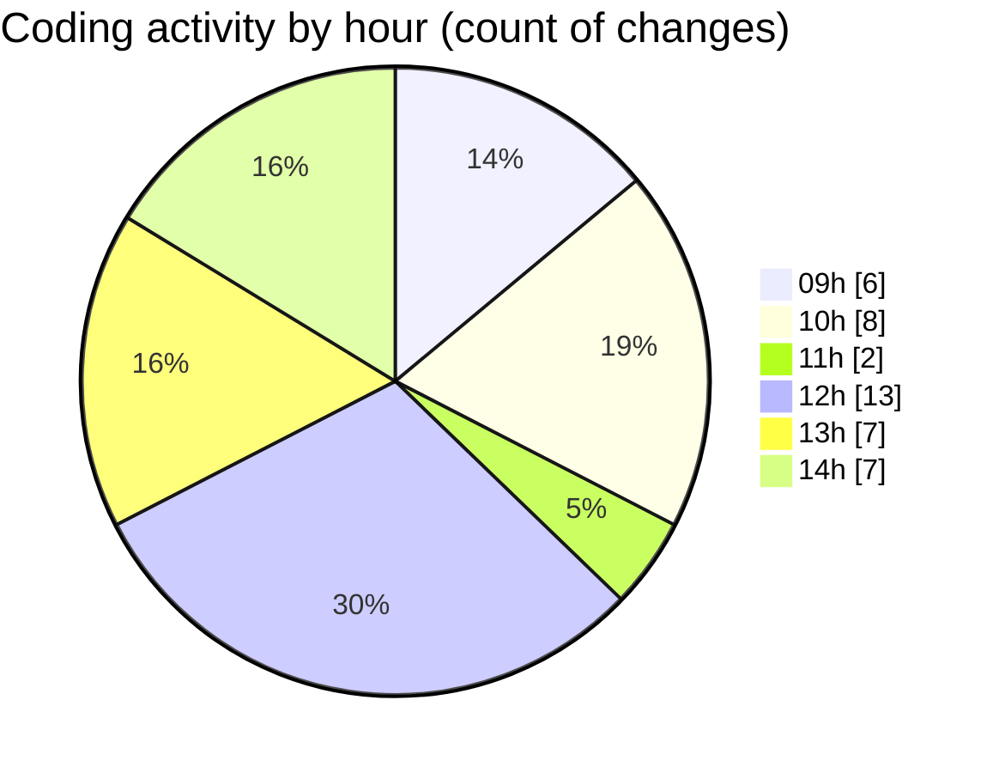

# cda - Activity Summary 

## Overall Statistics

| Stat                   | Value                                                             |
| ---------------------- | ----------------------------------------------------------------- |
| **Lines Added** (➕)   | 2721                                          |
| **Lines Removed** (➖) | 160                                        |
| **Net Change** (↕)    | 2561                |
| **Active Time** (⌚)   | 40 minutes |

## Modified Files
- **TODO-when-we-move-to-v8.mdx** (+66, -24)
- **main.js** (+144, -11)
- **package.json** (+126, -0)
- **package.json** (+187, -2)
- **_button.scss** (+1022, -0)
- **package.json** (+60, -0)
- **package.json** (+61, -0)
- **package.json** (+126, -0)
- **App.tsx** (+206, -0)
- **SkillsList.tsx** (+230, -58)
- **package.json** (+100, -0)
- **ReportTable.scss** (+44, -15)
- **ReportTable.tsx** (+138, -50)
- **StateMessage.tsx** (+211, -0)

## Visualizations

### By File Type (Lines Changed)

### By Hour (Estimated Activity Count)

> **Last Updated:** 13/08/2026, 14:42:04