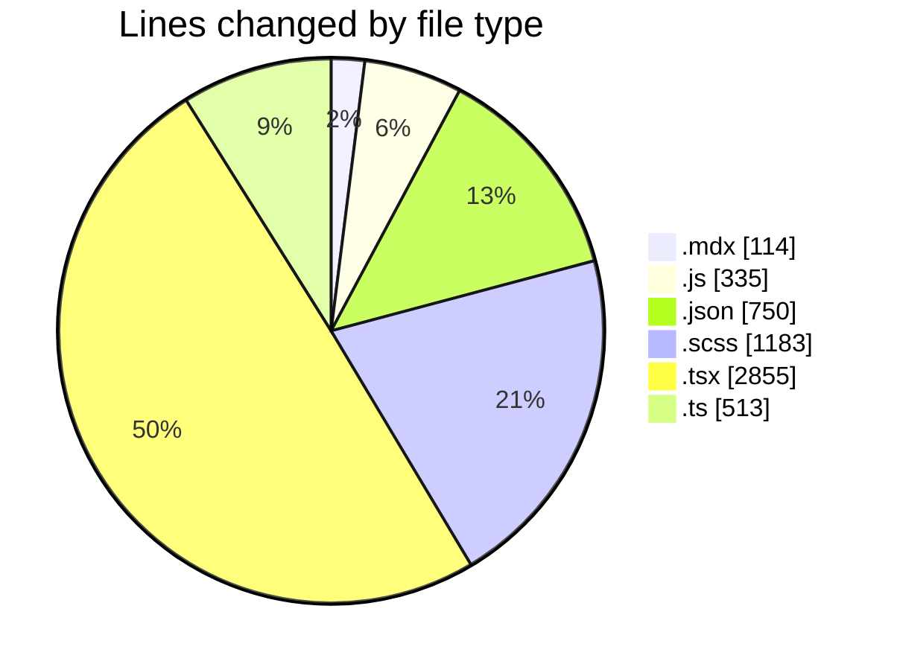
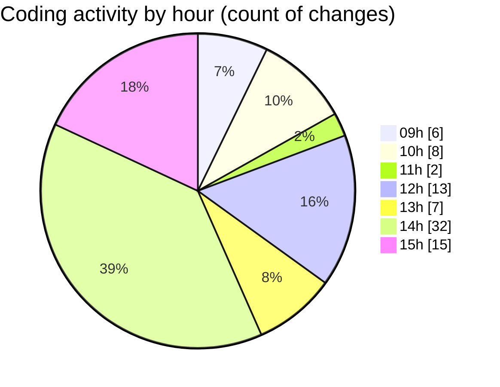

# cda - Activity Summary 

## Overall Statistics

| Stat                   | Value                                                             |
| ---------------------- | ----------------------------------------------------------------- |
| **Lines Added** (➕)   | 5536                                          |
| **Lines Removed** (➖) | 214                                        |
| **Net Change** (↕)    | 5322                |
| **Active Time** (⌚)   | 94 minutes |

## Modified Files
- **TODO-when-we-move-to-v8.mdx** (+90, -24)
- **main.js** (+144, -11)
- **package.json** (+189, -0)
- **package.json** (+188, -2)
- **_button.scss** (+1023, -0)
- **package.json** (+60, -0)
- **package.json** (+61, -0)
- **package.json** (+126, -0)
- **App.tsx** (+206, -0)
- **SkillsList.tsx** (+259, -58)
- **package.json** (+100, -0)
- **ReportTable.scss** (+88, -15)
- **ReportTable.tsx** (+138, -50)
- **StateMessage.tsx** (+211, -0)
- **ModalNew.tsx** (+218, -0)
- **ModalNew.test.tsx** (+295, -0)
- **ModalNew.stories.tsx** (+422, -0)
- **index.js** (+180, -0)
- **Button.tsx** (+171, -0)
- **index.ts** (+511, -0)
- **index.ts** (+2, -0)
- **ConfirmationDialog.test.tsx** (+274, -0)
- **ConfirmationDialog.tsx** (+193, -14)
- **ConfirmationDialog.scss** (+57, -0)
- **ConfirmationDialog.stories.tsx** (+302, -40)
- **index.tsx** (+4, -0)
- **tsconfig.json** (+24, -0)

## Visualizations

### By File Type (Lines Changed)

### By Hour (Estimated Activity Count)

> **Last Updated:** 13/08/2026, 15:32:04