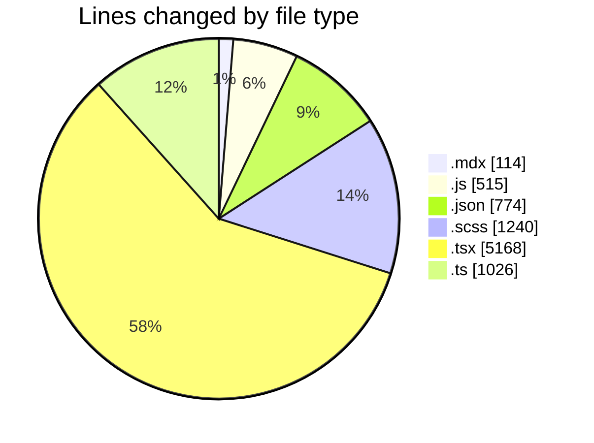
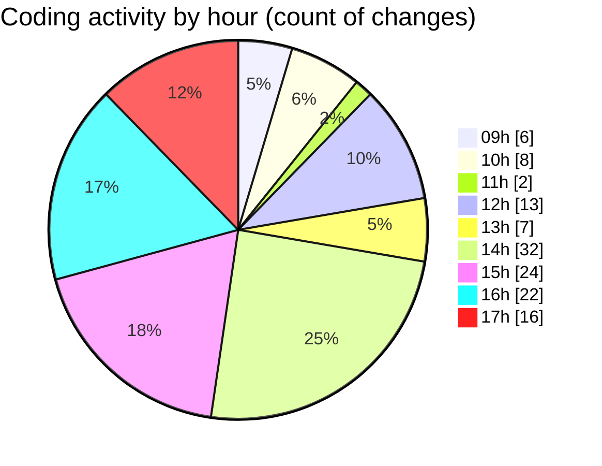

# cda - Activity Summary 

## Overall Statistics

| Stat                   | Value                                                             |
| ---------------------- | ----------------------------------------------------------------- |
| **Lines Added** (➕)   | 8519                                          |
| **Lines Removed** (➖) | 318                                        |
| **Net Change** (↕)    | 8201                |
| **Active Time** (⌚)   | 165 minutes |

## Modified Files
- **TODO-when-we-move-to-v8.mdx** (+90, -24)
- **main.js** (+144, -11)
- **package.json** (+189, -0)
- **package.json** (+188, -2)
- **_button.scss** (+1023, -0)
- **package.json** (+60, -0)
- **package.json** (+61, -0)
- **package.json** (+126, -0)
- **App.tsx** (+206, -0)
- **SkillsList.tsx** (+259, -58)
- **package.json** (+100, -0)
- **ReportTable.scss** (+88, -15)
- **ReportTable.tsx** (+138, -50)
- **StateMessage.tsx** (+422, -0)
- **ModalNew.tsx** (+436, -0)
- **ModalNew.test.tsx** (+590, -0)
- **ModalNew.stories.tsx** (+844, -0)
- **index.js** (+360, -0)
- **Button.tsx** (+342, -0)
- **index.ts** (+1022, -0)
- **index.ts** (+4, -0)
- **ConfirmationDialog.test.tsx** (+538, -10)
- **ConfirmationDialog.tsx** (+396, -24)
- **ConfirmationDialog.scss** (+114, -0)
- **ConfirmationDialog.stories.tsx** (+723, -124)
- **index.tsx** (+8, -0)
- **tsconfig.json** (+48, -0)

## Visualizations

### By File Type (Lines Changed)

### By Hour (Estimated Activity Count)

> **Last Updated:** 13/08/2026, 17:16:29