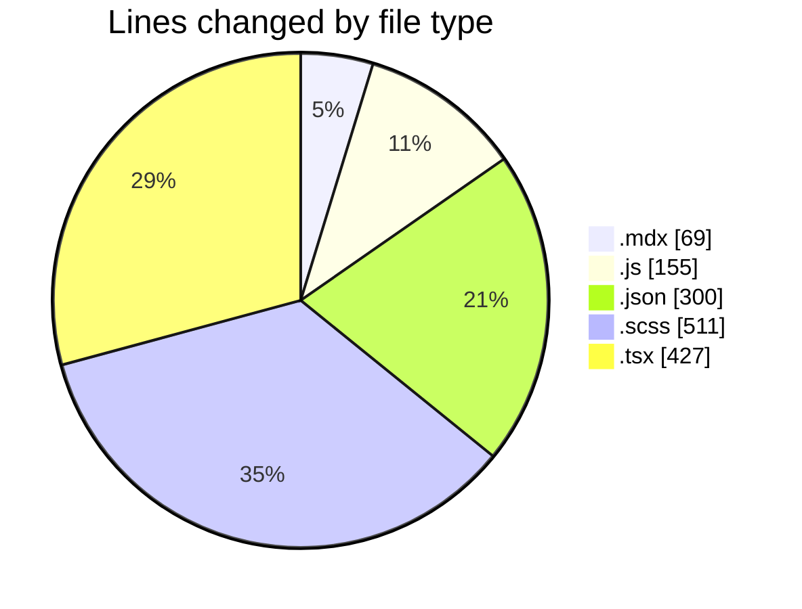
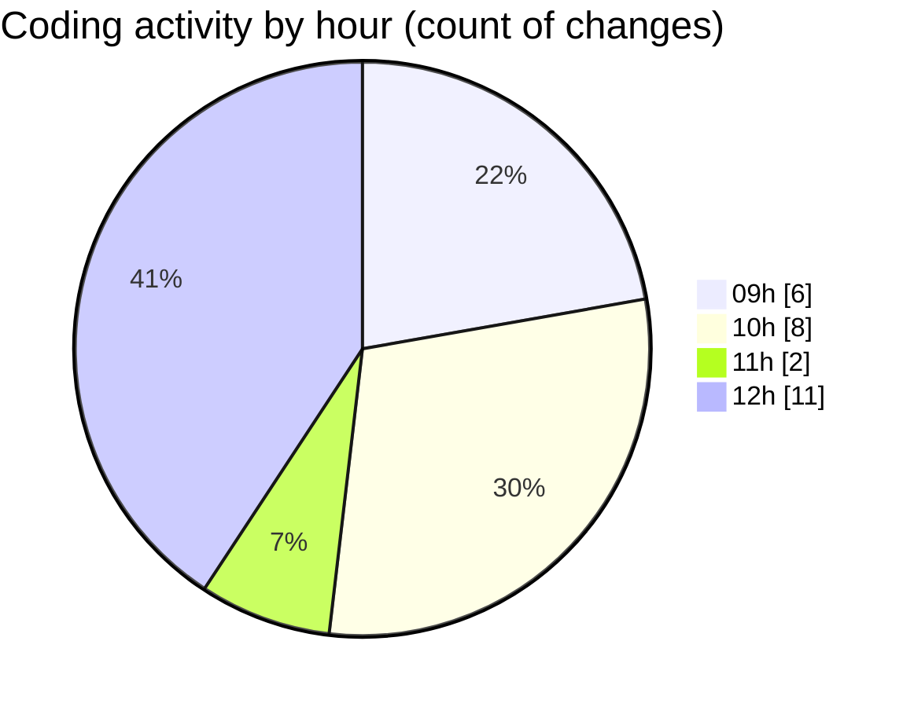

# cda - Activity Summary 

## Overall Statistics

| Stat                   | Value                                                             |
| ---------------------- | ----------------------------------------------------------------- |
| **Lines Added** (➕)   | 1367                                          |
| **Lines Removed** (➖) | 95                                        |
| **Net Change** (↕)    | 1272                |
| **Active Time** (⌚)   | 30 minutes |

## Modified Files
- **TODO-when-we-move-to-v8.mdx** (+45, -24)
- **main.js** (+144, -11)
- **package.json** (+63, -0)
- **package.json** (+1, -2)
- **_button.scss** (+511, -0)
- **package.json** (+60, -0)
- **package.json** (+61, -0)
- **package.json** (+63, -0)
- **App.tsx** (+206, -0)
- **SkillsList.tsx** (+163, -58)
- **package.json** (+50, -0)

## Visualizations

### By File Type (Lines Changed)

### By Hour (Estimated Activity Count)

> **Last Updated:** 13/08/2026, 12:45:10