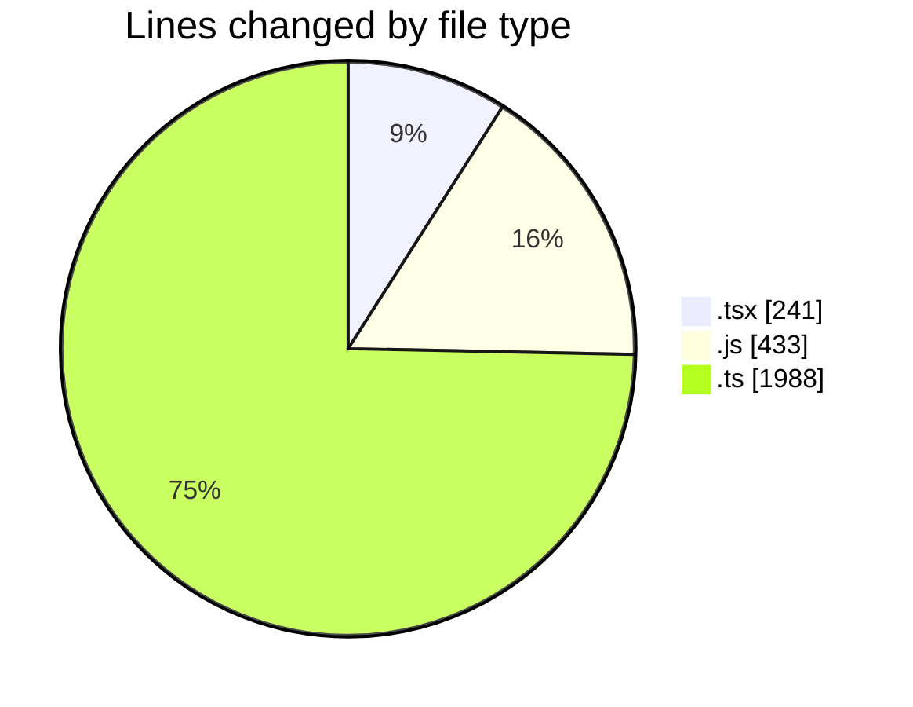
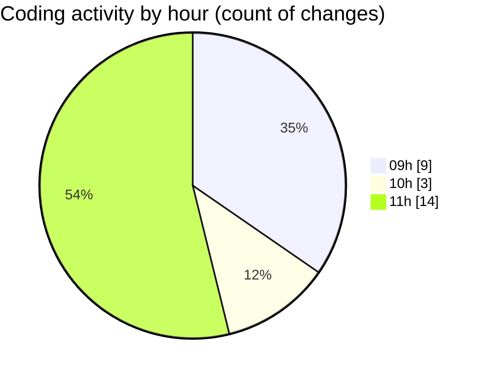

# cda - Activity Summary 

## Overall Statistics

| Stat                   | Value                                                             |
| ---------------------- | ----------------------------------------------------------------- |
| **Lines Added** (➕)   | 2517                                          |
| **Lines Removed** (➖) | 145                                        |
| **Net Change** (↕)    | 2372                |
| **Active Time** (⌚)   | 30 minutes |

## Modified Files
- **SkillTeam.tsx** (+112, -53)
- **GroupMembersList.tsx** (+74, -2)
- **skills.js** (+433, -0)
- **skills.ts** (+349, -0)
- **skill-queries.ts** (+541, -0)
- **SkillGroups.test.ts** (+765, -90)
- **skills.test.ts** (+81, -0)
- **skills.test.ts** (+81, -0)
- **transform-group-skill-progress.test.ts** (+81, -0)

## Visualizations

### By File Type (Lines Changed)

### By Hour (Estimated Activity Count)

> **Last Updated:** 17/08/2026, 11:57:46