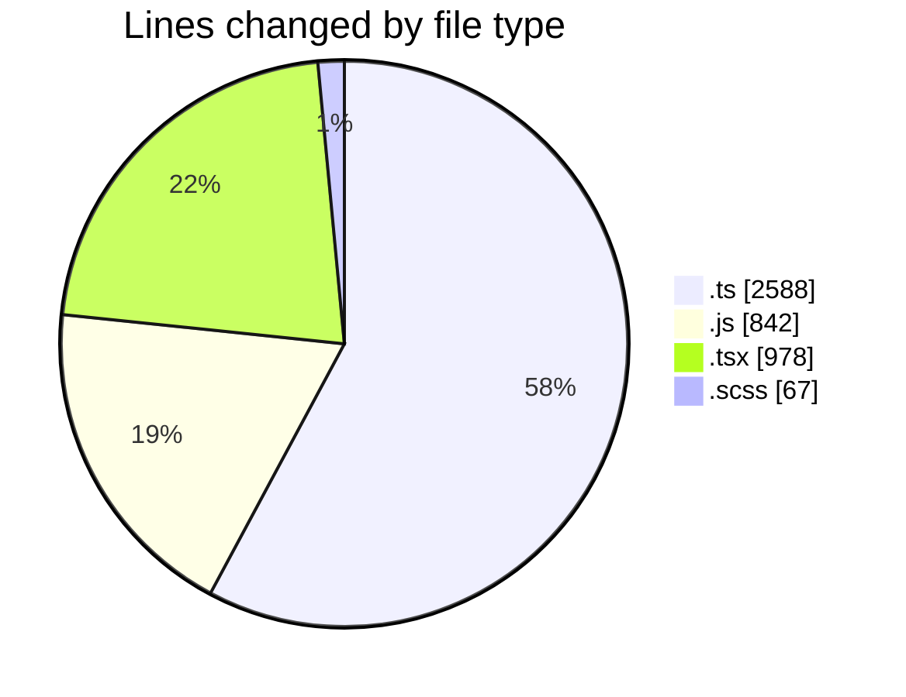
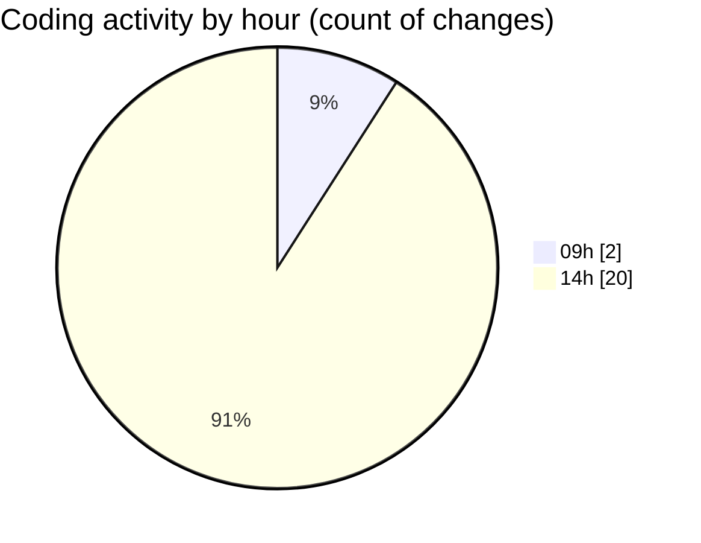

# cda - Activity Summary 

## Overall Statistics

| Stat                   | Value                                                             |
| ---------------------- | ----------------------------------------------------------------- |
| **Lines Added** (➕)   | 4475                                          |
| **Lines Removed** (➖) | 0                                        |
| **Net Change** (↕)    | 4475                |
| **Active Time** (⌚)   | 18 minutes |

## Modified Files
- **skill-queries.ts** (+1119, -0)
- **skill-export.test.ts** (+280, -0)
- **skills.js** (+433, -0)
- **skills.ts** (+358, -0)
- **SkillGroups.test.ts** (+675, -0)
- **transform-group-skill-progress.test.ts** (+152, -0)
- **queries.js** (+409, -0)
- **App.tsx** (+213, -0)
- **GroupDetails.tsx** (+179, -0)
- **GroupMembersList.tsx** (+76, -0)
- **SortableTable.tsx** (+109, -0)
- **GroupDetails.scss** (+44, -0)
- **GroupMembersView.tsx** (+14, -0)
- **GroupSkillProgress.tsx** (+133, -0)
- **index.ts** (+2, -0)
- **GroupSkillProgress.scss** (+8, -0)
- **GroupDetails.test.tsx** (+131, -0)
- **index.ts** (+2, -0)
- **SortableTable.test.tsx** (+41, -0)
- **GroupSkillProgress.test.tsx** (+82, -0)
- **SortableTable.scss** (+15, -0)

## Visualizations

### By File Type (Lines Changed)

### By Hour (Estimated Activity Count)

> **Last Updated:** 19/08/2026, 14:50:30