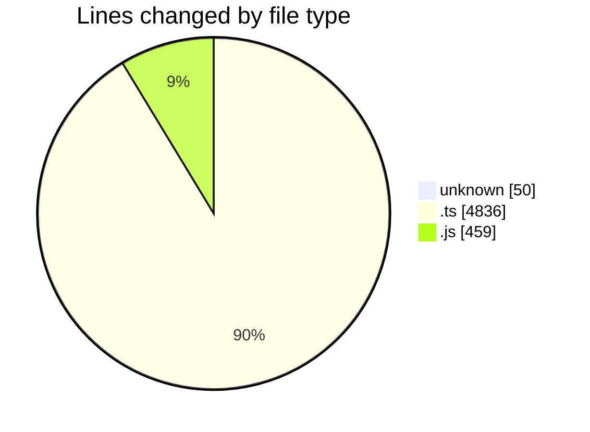
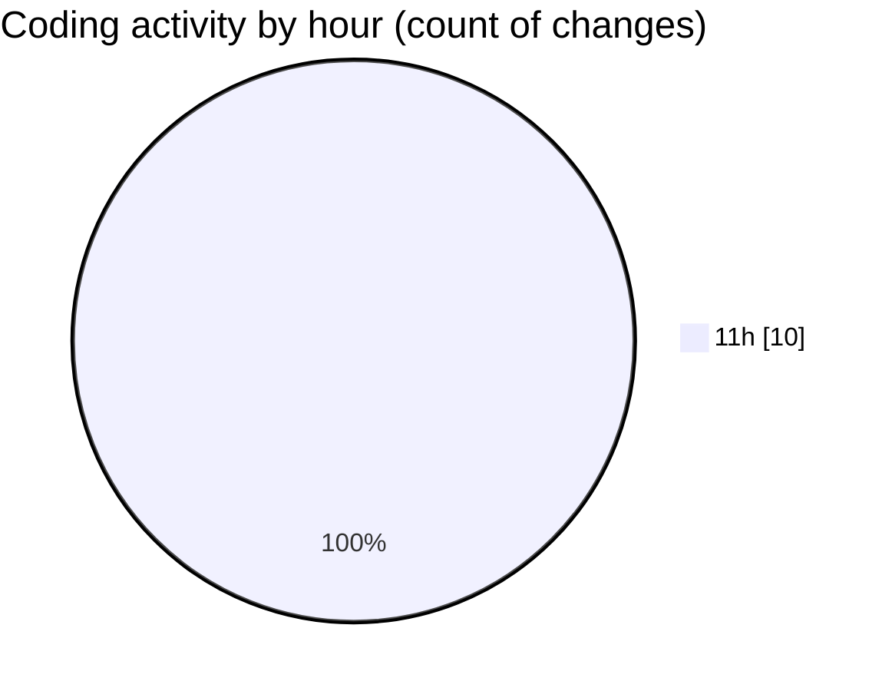

# cda - Activity Summary 

## Overall Statistics

| Stat                   | Value                                                             |
| ---------------------- | ----------------------------------------------------------------- |
| **Lines Added** (➕)   | 5345                                          |
| **Lines Removed** (➖) | 0                                        |
| **Net Change** (↕)    | 5345                |
| **Active Time** (⌚)   | 0 minute |

## Modified Files
- **.gitignore** (+50, -0)
- **skill-export.test.ts** (+371, -0)
- **skill-queries.ts** (+616, -0)
- **skills.js** (+459, -0)
- **SkillGroups.test.ts** (+830, -0)
- **SkillGroups.ts** (+303, -0)
- **skill-mutations.ts** (+1056, -0)
- **skills.ts** (+386, -0)
- **skill-group-queries.ts** (+259, -0)
- **skill-group-mutations.ts** (+1015, -0)

## Visualizations

### By File Type (Lines Changed)

### By Hour (Estimated Activity Count)

> **Last Updated:** 24/08/2026, 11:16:35