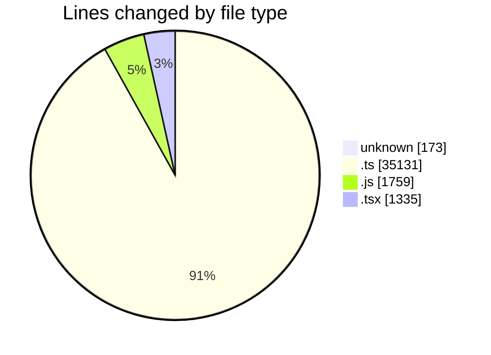
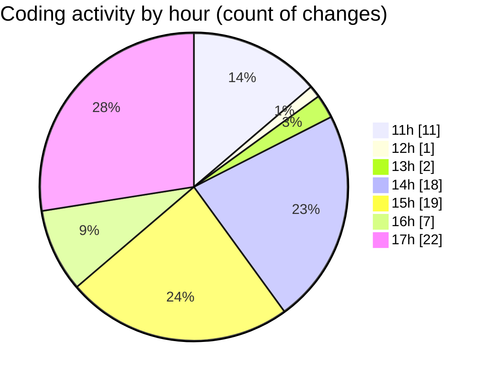

# cda - Activity Summary 

## Overall Statistics

| Stat                   | Value                                                             |
| ---------------------- | ----------------------------------------------------------------- |
| **Lines Added** (➕)   | 37869                                          |
| **Lines Removed** (➖) | 529                                        |
| **Net Change** (↕)    | 37340                |
| **Active Time** (⌚)   | 84 minutes |

## Modified Files
- **.gitignore** (+50, -0)
- **skill-export.test.ts** (+371, -0)
- **skill-queries.ts** (+652, -45)
- **skills.js** (+485, -26)
- **SkillGroups.test.ts** (+993, -163)
- **SkillGroups.ts** (+346, -43)
- **skill-mutations.ts** (+1239, -130)
- **skills.ts** (+416, -30)
- **skill-group-queries.ts** (+265, -6)
- **skill-group-mutations.ts** (+1034, -19)
- **.env** (+123, -0)
- **resolvers-types.ts** (+12529, -0)
- **queries.js** (+425, -0)
- **mutations.js** (+823, -0)
- **GroupDetails.tsx** (+214, -0)
- **GroupCreate.tsx** (+467, -5)
- **graphql.ts** (+7592, -0)
- **GroupDetails.test.tsx** (+237, -0)
- **Groups.test.tsx** (+137, -46)
- **GroupCreate.test.tsx** (+111, -0)
- **gql.ts** (+310, -0)
- **graphql.ts** (+8948, -0)
- **Groups.tsx** (+102, -16)

## Visualizations

### By File Type (Lines Changed)

### By Hour (Estimated Activity Count)

> **Last Updated:** 24/08/2026, 17:44:55