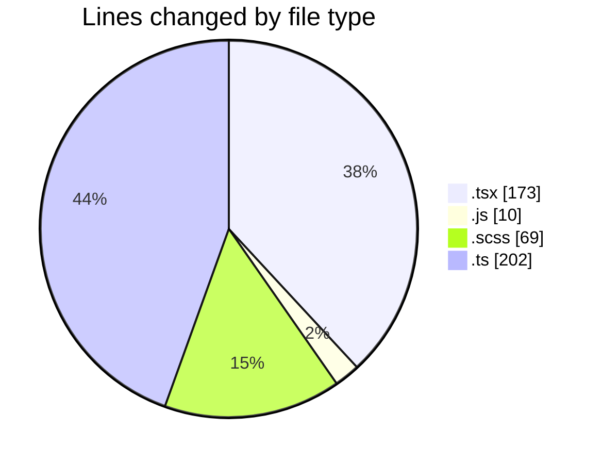
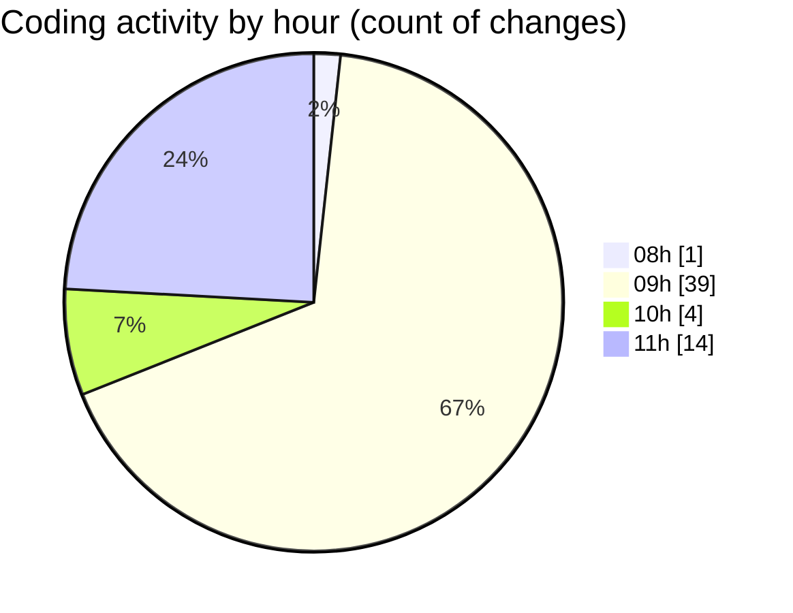

# cda - Activity Summary 

## Overall Statistics

| Stat                   | Value                                                             |
| ---------------------- | ----------------------------------------------------------------- |
| **Lines Added** (➕)   | 371                                          |
| **Lines Removed** (➖) | 83                                        |
| **Net Change** (↕)    | 288                |
| **Active Time** (⌚)   | 92 minutes |

## Modified Files
- **Groups.tsx** (+20, -10)
- **queries.js** (+10, -0)
- **Groups.test.tsx** (+9, -3)
- **GroupDetails.tsx** (+17, -12)
- **GroupDetails.scss** (+60, -9)
- **GroupCreate.tsx** (+53, -49)
- **skill-mutations.ts** (+42, -0)
- **skill-group-mutations.ts** (+160, -0)

## Visualizations

### By File Type (Lines Changed)

### By Hour (Estimated Activity Count)

> **Last Updated:** 25/08/2026, 11:49:56