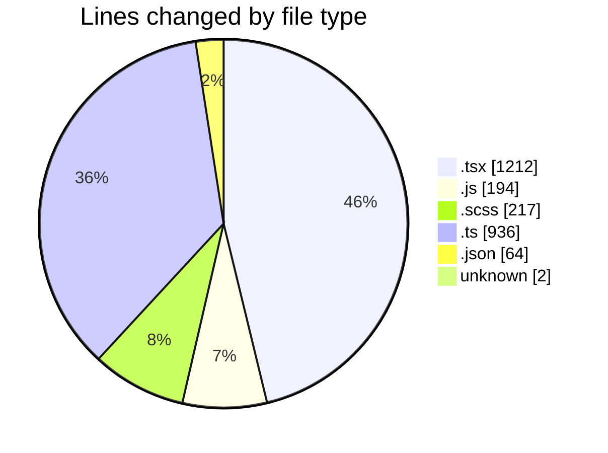
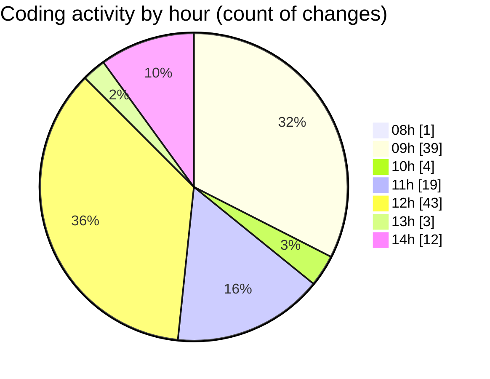

# cda - Activity Summary 

## Overall Statistics

| Stat                   | Value                                                             |
| ---------------------- | ----------------------------------------------------------------- |
| **Lines Added** (➕)   | 2215                                          |
| **Lines Removed** (➖) | 410                                        |
| **Net Change** (↕)    | 1805                |
| **Active Time** (⌚)   | 172 minutes |

## Modified Files
- **Groups.tsx** (+20, -10)
- **queries.js** (+10, -0)
- **Groups.test.tsx** (+10, -3)
- **GroupDetails.tsx** (+37, -18)
- **GroupDetails.scss** (+60, -9)
- **GroupCreate.tsx** (+168, -335)
- **skill-mutations.ts** (+48, -7)
- **skill-group-mutations.ts** (+207, -0)
- **SkillGroups.ts** (+16, -0)
- **skill-queries.ts** (+12, -0)
- **skill-group-queries.ts** (+81, -0)
- **GroupCreate.test.tsx** (+19, -19)
- **SkillGroups.test.ts** (+44, -0)
- **GroupDetails.test.tsx** (+2, -0)
- **ToggleSwitch.tsx** (+47, -0)
- **ToggleSwitch.scss** (+64, -0)
- **index.ts** (+2, -0)
- **index.js** (+182, -2)
- **index.ts** (+513, -2)
- **GroupAccess.tsx** (+200, -3)
- **GroupAccess.scss** (+20, -0)
- **App.tsx** (+217, -2)
- **GroupAccess.test.tsx** (+55, -0)
- **index.ts** (+2, -0)
- **package.json** (+64, -0)
- **ToggleSwitch.tsx** (+47, -0)
- **ToggleSwitch.scss** (+64, -0)
- **index.ts** (+2, -0)
- **.env** (+2, -0)

## Visualizations

### By File Type (Lines Changed)

### By Hour (Estimated Activity Count)

> **Last Updated:** 25/08/2026, 14:14:56