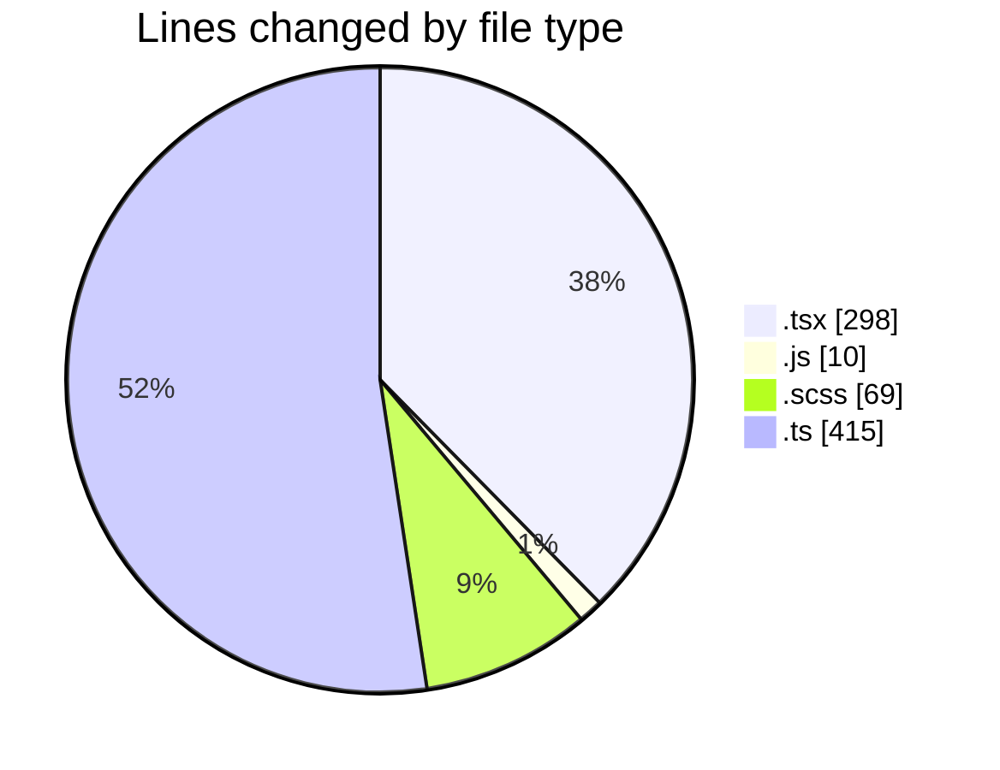
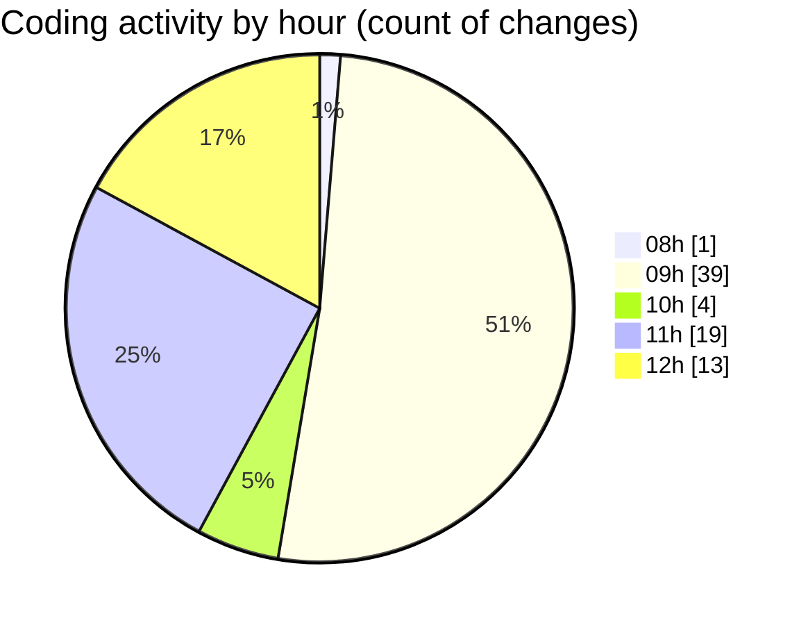

# cda - Activity Summary 

## Overall Statistics

| Stat                   | Value                                                             |
| ---------------------- | ----------------------------------------------------------------- |
| **Lines Added** (➕)   | 696                                          |
| **Lines Removed** (➖) | 96                                        |
| **Net Change** (↕)    | 600                |
| **Active Time** (⌚)   | 121 minutes |

## Modified Files
- **Groups.tsx** (+20, -10)
- **queries.js** (+10, -0)
- **Groups.test.tsx** (+10, -3)
- **GroupDetails.tsx** (+28, -18)
- **GroupDetails.scss** (+60, -9)
- **GroupCreate.tsx** (+95, -49)
- **skill-mutations.ts** (+48, -7)
- **skill-group-mutations.ts** (+207, -0)
- **SkillGroups.ts** (+16, -0)
- **skill-queries.ts** (+12, -0)
- **skill-group-queries.ts** (+81, -0)
- **GroupCreate.test.tsx** (+19, -0)
- **SkillGroups.test.ts** (+44, -0)
- **GroupDetails.test.tsx** (+1, -0)
- **ToggleSwitch.tsx** (+45, -0)

## Visualizations

### By File Type (Lines Changed)

### By Hour (Estimated Activity Count)

> **Last Updated:** 25/08/2026, 12:49:56