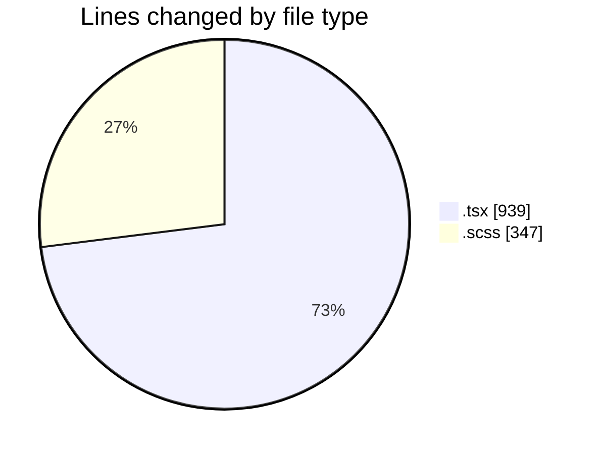
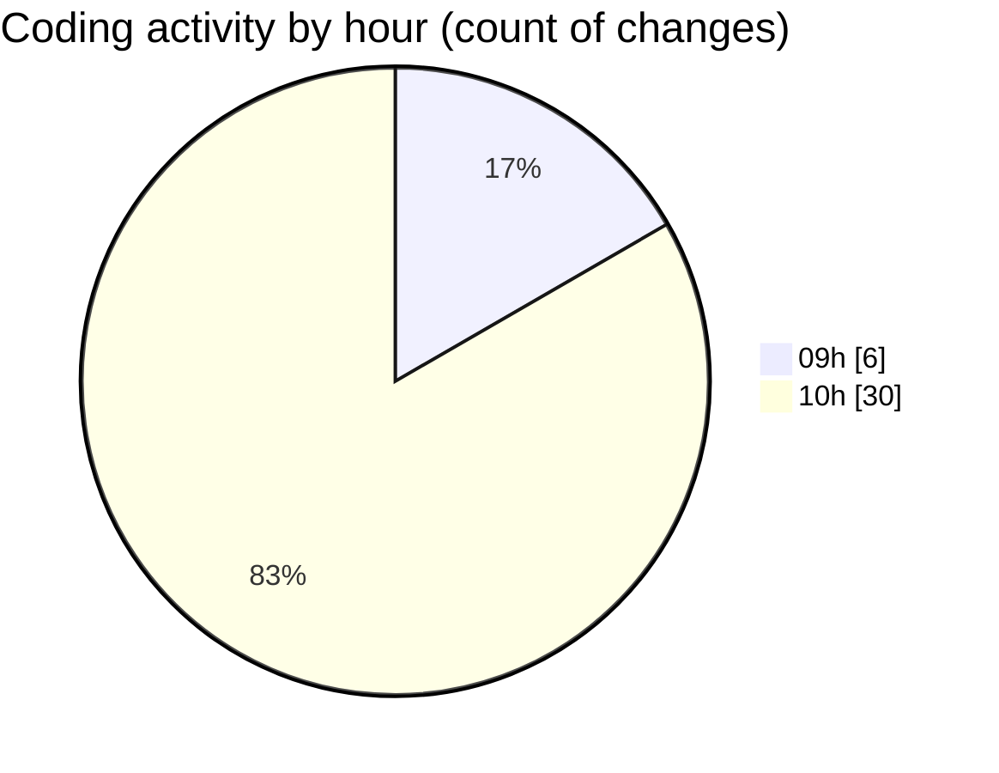

# cda - Activity Summary 

## Overall Statistics

| Stat                   | Value                                                             |
| ---------------------- | ----------------------------------------------------------------- |
| **Lines Added** (➕)   | 830                                          |
| **Lines Removed** (➖) | 456                                        |
| **Net Change** (↕)    | 374                |
| **Active Time** (⌚)   | 43 minutes |

## Modified Files
- **GroupDetails.tsx** (+8, -16)
- **GroupDetails.scss** (+5, -3)
- **GroupAccess.tsx** (+120, -139)
- **GroupAccess.scss** (+40, -0)
- **GroupAccess.test.tsx** (+54, -0)
- **GroupAccessPeopleManager.tsx** (+150, -0)
- **index.tsx** (+3, -0)
- **GroupAccessPeopleManager copy.tsx** (+150, -0)
- **GroupAccessPeopleManager.scss** (+150, -149)
- **GroupAccessPeopleManager.test.tsx** (+150, -149)

## Visualizations

### By File Type (Lines Changed)

### By Hour (Estimated Activity Count)

> **Last Updated:** 26/08/2026, 10:49:56