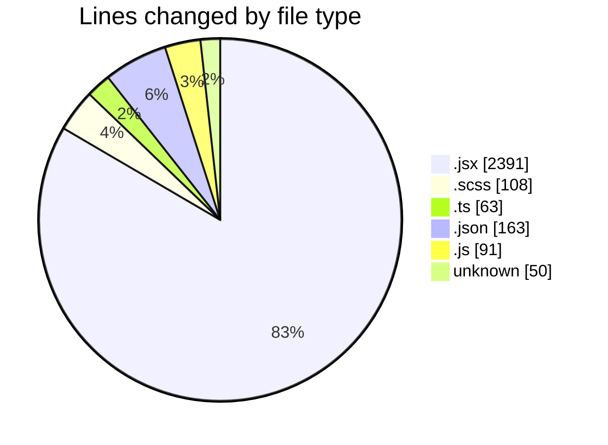
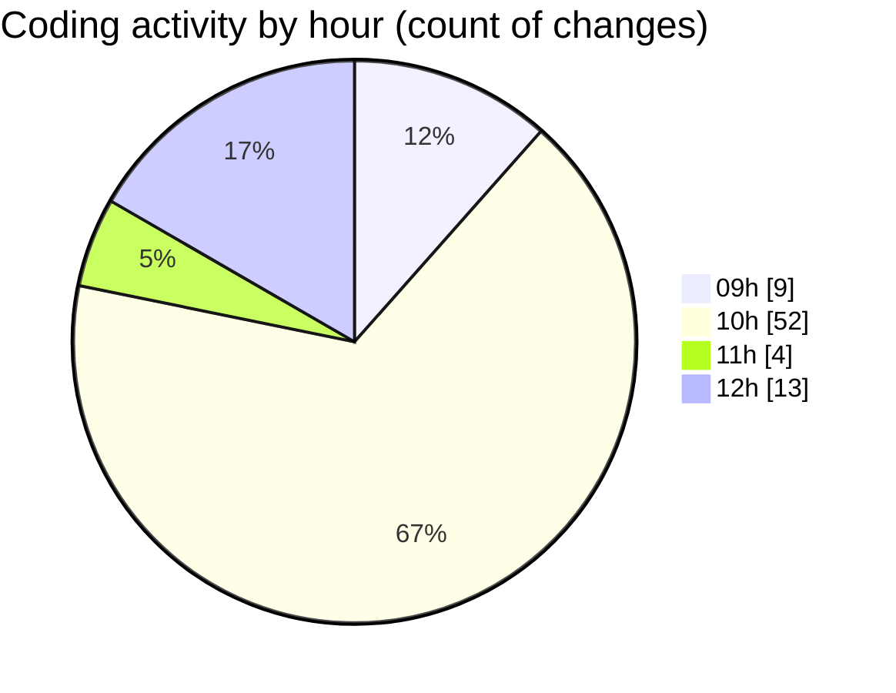

# cda - Activity Summary 

## Overall Statistics

| Stat                   | Value                                                             |
| ---------------------- | ----------------------------------------------------------------- |
| **Lines Added** (➕)   | 2818                                          |
| **Lines Removed** (➖) | 48                                        |
| **Net Change** (↕)    | 2770                |
| **Active Time** (⌚)   | 98 minutes |

## Modified Files
- **App.jsx** (+95, -0)
- **main.jsx** (+20, -1)
- **building-contact-info.scss** (+68, -0)
- **App.scss** (+40, -0)
- **setupTests.ts** (+20, -2)
- **index.jsx** (+127, -0)
- **index.jsx** (+45, -0)
- **index.jsx** (+103, -4)
- **index.jsx** (+56, -1)
- **index.jsx** (+11, -1)
- **index.jsx** (+6, -2)
- **index.jsx** (+120, -0)
- **index.jsx** (+177, -0)
- **index.jsx** (+138, -0)
- **index.jsx** (+185, -0)
- **index.jsx** (+112, -0)
- **BuildingProfile.test.jsx** (+296, -1)
- **index.jsx** (+177, -0)
- **index.jsx** (+118, -0)
- **index.jsx** (+28, -0)
- **index.jsx** (+47, -0)
- **index.jsx** (+167, -0)
- **index.jsx** (+17, -0)
- **index.jsx** (+59, -1)
- **index.jsx** (+93, -0)
- **index.jsx** (+183, -0)
- **vite.config.ts** (+41, -0)
- **tsconfig.node.json** (+14, -0)
- **tsconfig.json** (+5, -0)
- **tsconfig.app.json** (+15, -0)
- **package.json** (+94, -35)
- **App.js** (+91, -0)
- **.gitignore** (+50, -0)

## Visualizations

### By File Type (Lines Changed)

### By Hour (Estimated Activity Count)

> **Last Updated:** 01/09/2026, 12:12:06