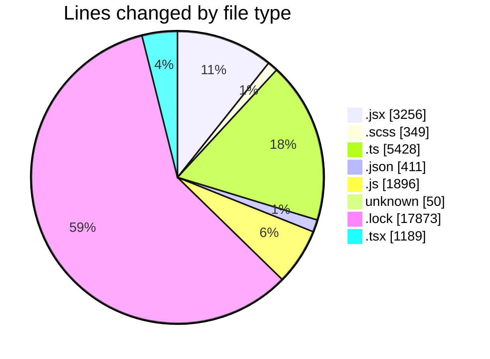
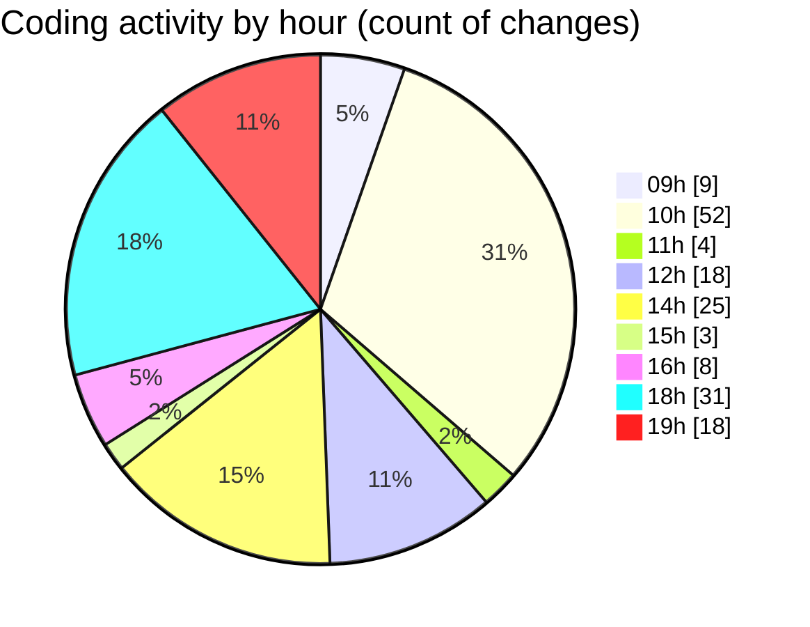

# cda - Activity Summary 

## Overall Statistics

| Stat                   | Value                                                             |
| ---------------------- | ----------------------------------------------------------------- |
| **Lines Added** (➕)   | 24195                                          |
| **Lines Removed** (➖) | 6257                                        |
| **Net Change** (↕)    | 17938                |
| **Active Time** (⌚)   | 210 minutes |

## Modified Files
- **App.jsx** (+99, -4)
- **main.jsx** (+20, -1)
- **building-contact-info.scss** (+240, -69)
- **App.scss** (+40, -0)
- **setupTests.ts** (+20, -2)
- **index.jsx** (+127, -0)
- **index.jsx** (+45, -0)
- **index.jsx** (+103, -4)
- **index.jsx** (+56, -1)
- **index.jsx** (+11, -1)
- **index.jsx** (+6, -2)
- **index.jsx** (+120, -0)
- **index.jsx** (+177, -0)
- **index.jsx** (+138, -0)
- **index.jsx** (+185, -0)
- **index.jsx** (+112, -0)
- **BuildingProfile.test.jsx** (+296, -1)
- **index.jsx** (+626, -240)
- **index.jsx** (+118, -0)
- **index.jsx** (+28, -0)
- **index.jsx** (+47, -0)
- **index.jsx** (+333, -2)
- **index.jsx** (+17, -0)
- **index.jsx** (+59, -1)
- **index.jsx** (+93, -0)
- **index.jsx** (+183, -0)
- **vite.config.ts** (+46, -0)
- **tsconfig.node.json** (+14, -0)
- **tsconfig.json** (+5, -0)
- **tsconfig.app.json** (+15, -0)
- **package.json** (+127, -63)
- **App.js** (+91, -0)
- **.gitignore** (+50, -0)
- **index.js** (+18, -0)
- **yarn.lock** (+12011, -5862)
- **skill-queries.ts** (+607, -0)
- **skill-export.test.ts** (+371, -0)
- **skills.js** (+459, -0)
- **SkillGroups.ts** (+303, -0)
- **skills.ts** (+386, -0)
- **skill-mutations.ts** (+1071, -0)
- **SkillGroups.test.ts** (+830, -0)
- **skill-group-queries.ts** (+259, -0)
- **skill-group-mutations.ts** (+1015, -0)
- **queries.js** (+409, -0)
- **mutations.js** (+737, -0)
- **GroupDetails.tsx** (+206, -0)
- **GroupCreate.tsx** (+291, -0)
- **GroupDetails.test.tsx** (+233, -0)
- **GroupCreate.test.tsx** (+109, -0)
- **Groups.test.tsx** (+49, -0)
- **Groups.tsx** (+88, -0)
- **index.ts** (+518, -0)
- **index.js** (+182, -0)
- **App.tsx** (+213, -0)
- **package.json** (+64, -0)
- **package.json** (+64, -4)
- **package.json** (+55, -0)

## Visualizations

### By File Type (Lines Changed)

### By Hour (Estimated Activity Count)

> **Last Updated:** 01/09/2026, 19:52:45