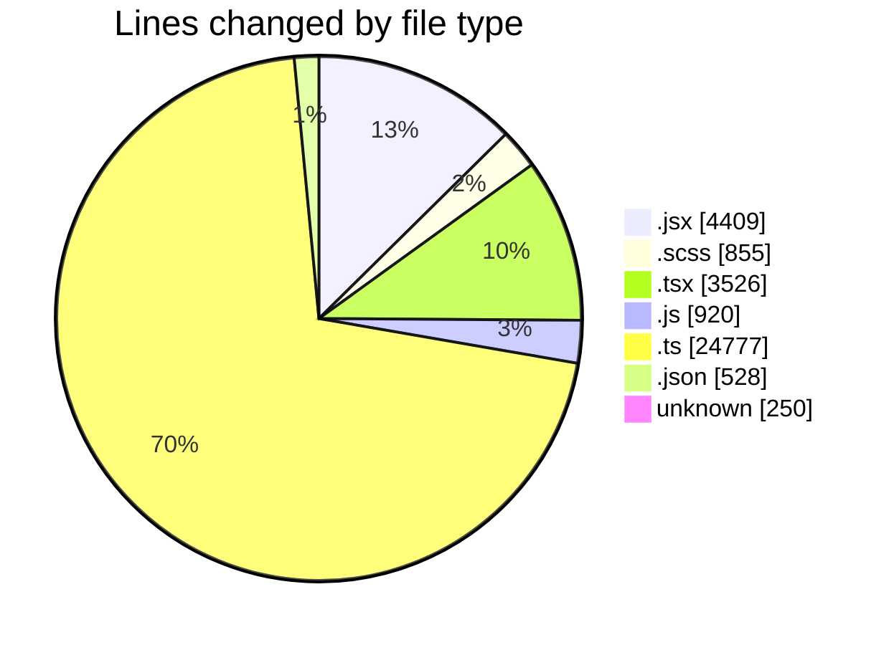
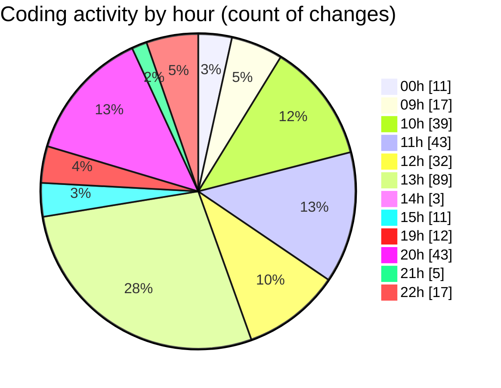

# cda - Activity Summary 

## Overall Statistics

| Stat                   | Value                                                             |
| ---------------------- | ----------------------------------------------------------------- |
| **Lines Added** (➕)   | 33839                                          |
| **Lines Removed** (➖) | 1426                                        |
| **Net Change** (↕)    | 32413                |
| **Active Time** (⌚)   | 443 minutes |

## Modified Files
- **index.jsx** (+190, -9)
- **index.jsx** (+352, -23)
- **index.jsx** (+379, -30)
- **index.jsx** (+350, -186)
- **building-contact-info.scss** (+216, -95)
- **building-profile.scss** (+221, -91)
- **index.jsx** (+735, -331)
- **index.jsx** (+55, -0)
- **building-catering-info.scss** (+11, -0)
- **index.jsx** (+199, -80)
- **EditCateringInfoModal.scss** (+32, -4)
- **index.jsx** (+177, -36)
- **index.jsx** (+155, -0)
- **index.jsx** (+104, -0)
- **EditTransportInfoModal.scss** (+10, -2)
- **EditContactInfoModal.scss** (+17, -3)
- **EditAdditionalInfoModal.scss** (+10, -2)
- **BuildingProfile.test.jsx** (+297, -2)
- **index.jsx** (+332, -38)
- **addBuildingModal.scss** (+29, -21)
- **index.jsx** (+93, -7)
- **index.jsx** (+99, -7)
- **AddCateringOutletModal.scss** (+6, -0)
- **index.jsx** (+138, -5)
- **Groups.tsx** (+97, -9)
- **GroupCreate.tsx** (+298, -7)
- **skills.js** (+459, -0)
- **skills.ts** (+386, -0)
- **skill-queries.ts** (+619, -12)
- **SkillGroups.test.ts** (+874, -44)
- **transform-group-skill-progress.test.ts** (+152, -0)
- **queries.js** (+435, -26)
- **App.tsx** (+215, -2)
- **GroupDetails.tsx** (+246, -40)
- **GroupMembersList.tsx** (+76, -0)
- **GroupDetails.scss** (+53, -9)
- **SortableTable.tsx** (+109, -0)
- **GroupMembersView.tsx** (+14, -0)
- **GroupSkillProgress.scss** (+8, -0)
- **GroupSkillProgress.tsx** (+133, -0)
- **index.ts** (+2, -0)
- **GroupDetails.test.tsx** (+239, -6)
- **index.ts** (+2, -0)
- **SortableTable.test.tsx** (+41, -0)
- **GroupSkillProgress.test.tsx** (+82, -0)
- **SortableTable.scss** (+15, -0)
- **types.ts** (+281, -67)
- **GroupManagement.tsx** (+369, -44)
- **GroupAccessPeopleManager.tsx** (+185, -81)
- **GroupManagement.stories.tsx** (+624, -88)
- **package.json** (+374, -0)
- **package.json** (+64, -0)
- **.env** (+250, -0)
- **SkillExplore.tsx** (+308, -11)
- **skill-export.test.ts** (+375, -4)
- **resolvers-types.ts** (+13007, -4)
- **graphql.ts** (+8948, -0)
- **GroupAccess.tsx** (+202, -0)
- **settings.json** (+90, -0)

## Visualizations

### By File Type (Lines Changed)

### By Hour (Estimated Activity Count)

> **Last Updated:** 02/09/2026, 22:10:39