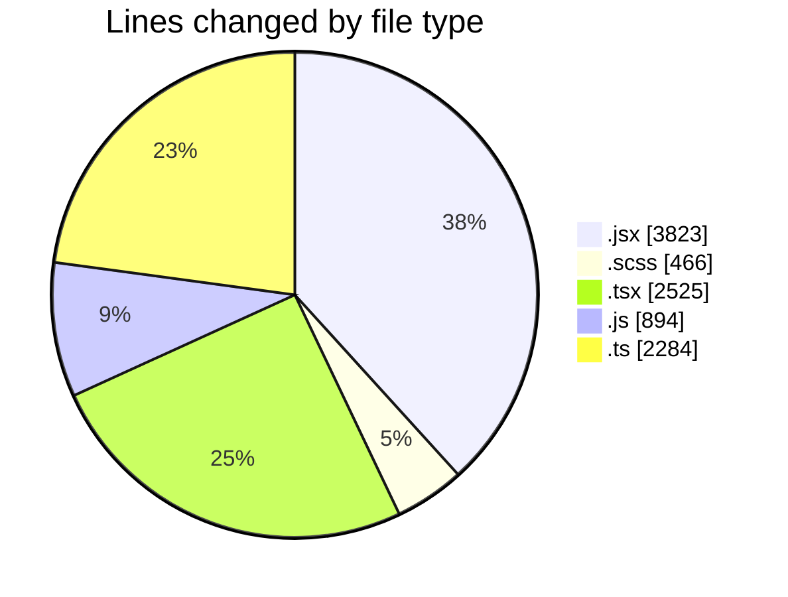
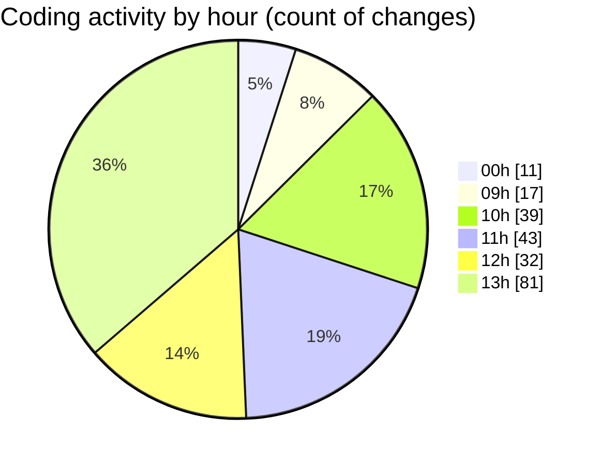

# cda - Activity Summary 

## Overall Statistics

| Stat                   | Value                                                             |
| ---------------------- | ----------------------------------------------------------------- |
| **Lines Added** (➕)   | 9133                                          |
| **Lines Removed** (➖) | 859                                        |
| **Net Change** (↕)    | 8274                |
| **Active Time** (⌚)   | 302 minutes |

## Modified Files
- **index.jsx** (+190, -9)
- **index.jsx** (+245, -23)
- **index.jsx** (+267, -30)
- **index.jsx** (+350, -186)
- **building-contact-info.scss** (+148, -95)
- **building-profile.scss** (+66, -1)
- **index.jsx** (+522, -324)
- **index.jsx** (+55, -0)
- **building-catering-info.scss** (+11, -0)
- **index.jsx** (+199, -80)
- **EditCateringInfoModal.scss** (+18, -4)
- **index.jsx** (+177, -36)
- **index.jsx** (+155, -0)
- **index.jsx** (+104, -0)
- **EditTransportInfoModal.scss** (+6, -2)
- **EditContactInfoModal.scss** (+10, -3)
- **EditAdditionalInfoModal.scss** (+6, -2)
- **BuildingProfile.test.jsx** (+297, -2)
- **index.jsx** (+185, -38)
- **addBuildingModal.scss** (+8, -4)
- **index.jsx** (+93, -7)
- **index.jsx** (+99, -7)
- **AddCateringOutletModal.scss** (+6, -0)
- **index.jsx** (+138, -5)
- **Groups.tsx** (+97, -0)
- **GroupCreate.tsx** (+297, -0)
- **skills.js** (+459, -0)
- **skills.ts** (+386, -0)
- **skill-queries.ts** (+619, -0)
- **SkillGroups.test.ts** (+874, -0)
- **transform-group-skill-progress.test.ts** (+152, -0)
- **queries.js** (+435, -0)
- **App.tsx** (+215, -0)
- **GroupDetails.tsx** (+235, -0)
- **GroupMembersList.tsx** (+76, -0)
- **GroupDetails.scss** (+53, -0)
- **SortableTable.tsx** (+109, -0)
- **GroupMembersView.tsx** (+14, -0)
- **GroupSkillProgress.scss** (+8, -0)
- **GroupSkillProgress.tsx** (+133, -0)
- **index.ts** (+2, -0)
- **GroupDetails.test.tsx** (+239, -0)
- **index.ts** (+2, -0)
- **SortableTable.test.tsx** (+41, -0)
- **GroupSkillProgress.test.tsx** (+82, -0)
- **SortableTable.scss** (+15, -0)
- **types.ts** (+248, -1)
- **GroupManagement.tsx** (+347, -0)
- **GroupAccessPeopleManager.tsx** (+104, -0)
- **GroupManagement.stories.tsx** (+536, -0)

## Visualizations

### By File Type (Lines Changed)

### By Hour (Estimated Activity Count)

> **Last Updated:** 02/09/2026, 13:53:20