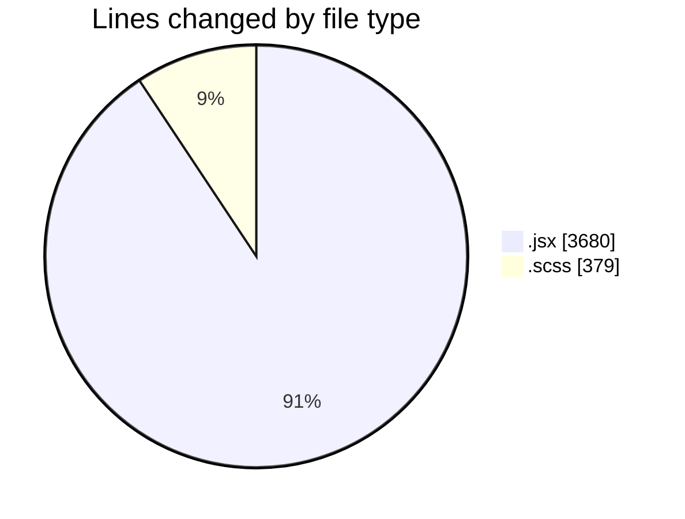
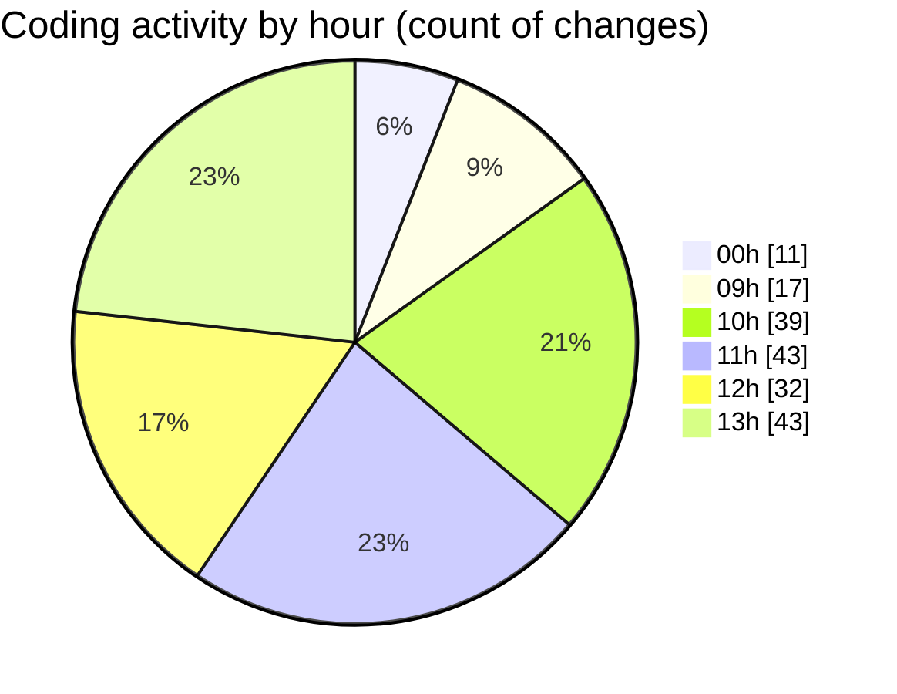

# cda - Activity Summary 

## Overall Statistics

| Stat                   | Value                                                             |
| ---------------------- | ----------------------------------------------------------------- |
| **Lines Added** (➕)   | 3214                                          |
| **Lines Removed** (➖) | 845                                        |
| **Net Change** (↕)    | 2369                |
| **Active Time** (⌚)   | 264 minutes |

## Modified Files
- **index.jsx** (+190, -9)
- **index.jsx** (+245, -23)
- **index.jsx** (+267, -30)
- **index.jsx** (+350, -186)
- **building-contact-info.scss** (+148, -95)
- **building-profile.scss** (+66, -1)
- **index.jsx** (+522, -324)
- **index.jsx** (+55, -0)
- **building-catering-info.scss** (+11, -0)
- **index.jsx** (+199, -80)
- **EditCateringInfoModal.scss** (+16, -4)
- **index.jsx** (+177, -36)
- **index.jsx** (+155, -0)
- **index.jsx** (+104, -0)
- **EditTransportInfoModal.scss** (+6, -0)
- **EditContactInfoModal.scss** (+9, -3)
- **EditAdditionalInfoModal.scss** (+6, -0)
- **BuildingProfile.test.jsx** (+297, -2)
- **index.jsx** (+185, -38)
- **addBuildingModal.scss** (+8, -0)
- **index.jsx** (+93, -7)
- **index.jsx** (+99, -7)
- **AddCateringOutletModal.scss** (+6, -0)

## Visualizations

### By File Type (Lines Changed)

### By Hour (Estimated Activity Count)

> **Last Updated:** 02/09/2026, 13:18:20