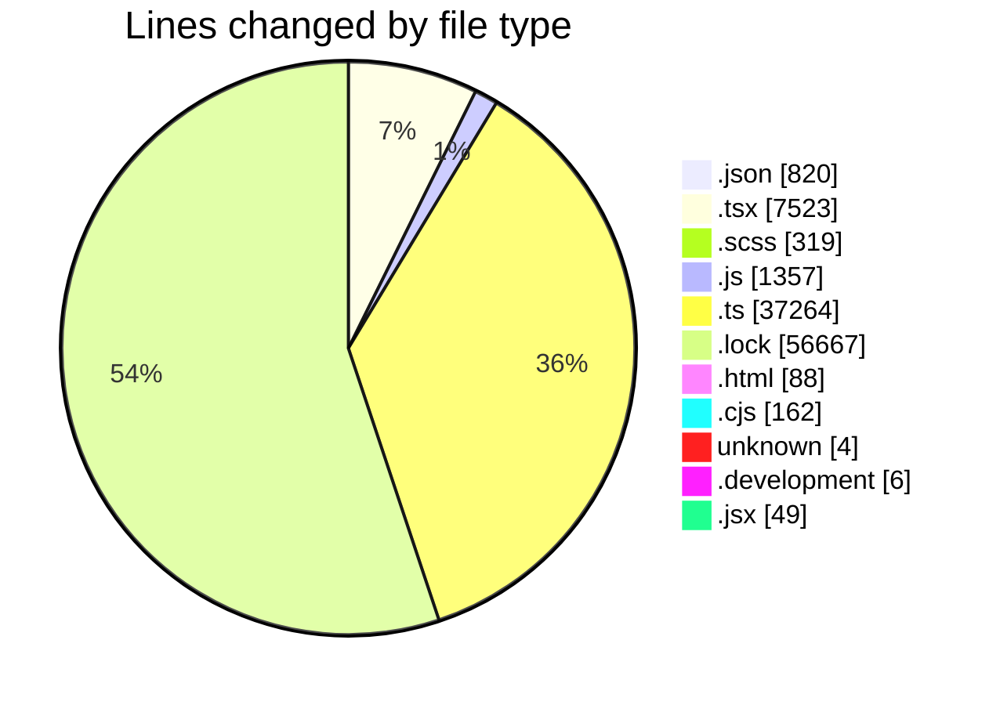
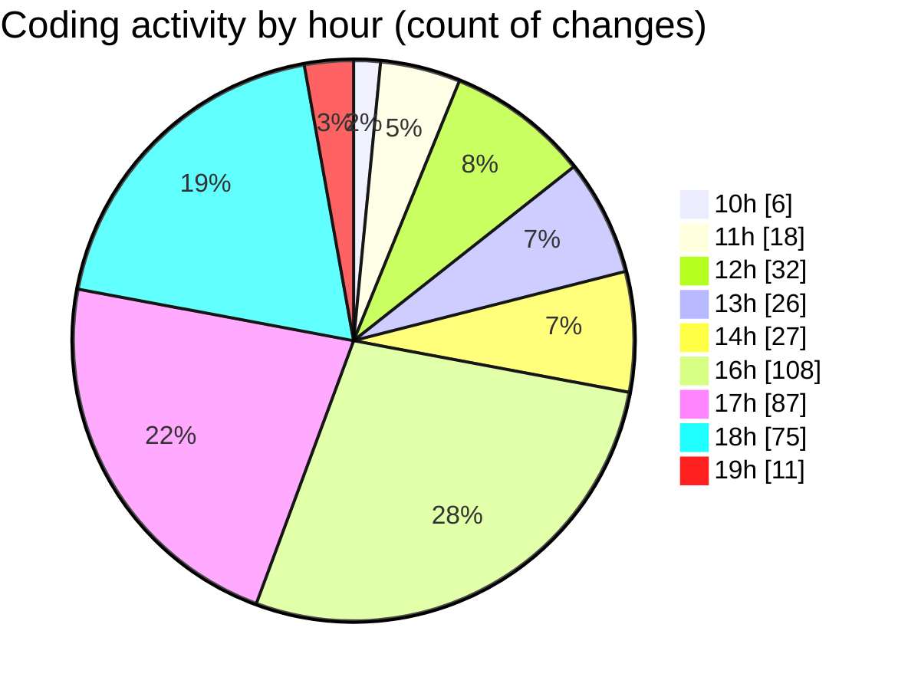

# cda - Activity Summary 

## Overall Statistics

| Stat                   | Value                                                             |
| ---------------------- | ----------------------------------------------------------------- |
| **Lines Added** (➕)   | 77937                                          |
| **Lines Removed** (➖) | 26322                                        |
| **Net Change** (↕)    | 51615                |
| **Active Time** (⌚)   | 601 minutes |

## Modified Files
- **package.json** (+271, -49)
- **App.tsx** (+319, -0)
- **tsconfig.json** (+29, -0)
- **GroupDetails.scss** (+97, -0)
- **GroupDetails.test.tsx** (+472, -0)
- **App.tsx** (+433, -4)
- **GroupDetails.tsx** (+444, -0)
- **queries.js** (+844, -0)
- **skill-export.test.ts** (+741, -0)
- **skill-queries.ts** (+1215, -0)
- **SkillGroups.test.ts** (+1704, -0)
- **package.json** (+203, -0)
- **Groups.tsx** (+97, -0)
- **yarn.lock** (+14168, -0)
- **vite.config.ts** (+44, -0)
- **declarations.d.ts** (+3067, -2579)
- **skills.js** (+459, -0)
- **skills.ts** (+386, -0)
- **transform-group-skill-progress.test.ts** (+152, -0)
- **GroupMembersList.tsx** (+76, -0)
- **SortableTable.tsx** (+109, -0)
- **GroupSkillProgress.tsx** (+133, -0)
- **GroupMembersView.tsx** (+14, -0)
- **GroupSkillProgress.scss** (+8, -0)
- **index.ts** (+2, -0)
- **index.ts** (+2, -0)
- **SortableTable.scss** (+15, -0)
- **SortableTable.test.tsx** (+41, -0)
- **GroupSkillProgress.test.tsx** (+82, -0)
- **SkillExplore.tsx** (+297, -0)
- **tsconfig.node.json** (+21, -0)
- **tsconfig.app.json** (+23, -0)
- **index.html** (+27, -0)
- **gitVersion.cjs** (+21, -0)
- **eslint.config.js** (+33, -0)
- **codegen.ts** (+32, -0)
- **.gitignore** (+4, -0)
- **.env.development** (+5, -1)
- **setupTests.ts** (+17, -0)
- **index.tsx** (+20, -0)
- **index.scss** (+2, -0)
- **Sidebar.test.tsx** (+89, -18)
- **SearchUser.tsx** (+76, -1)
- **SearchUser.tsx** (+102, -0)
- **graphql.ts** (+18469, -8733)
- **yarn.lock** (+27826, -14673)
- **package.json** (+187, -0)
- **GroupManagement.stories.tsx** (+624, -88)
- **CalendarShare.tsx** (+404, -11)
- **CalendarShareForm.tsx** (+64, -12)
- **ConfirmationModal.tsx** (+147, -6)
- **Duty.tsx** (+779, -6)
- **Settings.tsx** (+79, -6)
- **SignInStatusIcon.tsx** (+205, -6)
- **Admin.tsx** (+67, -6)
- **ProfileBadge.tsx** (+163, -6)
- **TeamViewRow.tsx** (+339, -6)
- **SchedulingTeamSelect.tsx** (+138, -0)
- **TooltipBadge.tsx** (+138, -12)
- **DateSwitcher.tsx** (+231, -18)
- **ise-web-components.d.ts** (+17, -0)
- **Sidebar.tsx** (+208, -13)
- **generate-holidays.cjs** (+62, -56)
- **CalendarShare.scss** (+18, -6)
- **codegen.ts** (+32, -0)
- **eslint.config.js** (+21, -0)
- **gitVersion.cjs** (+23, -0)
- **index.html** (+30, -2)
- **tsconfig.app.json** (+18, -0)
- **tsconfig.json** (+5, -0)
- **tsconfig.node.json** (+14, -0)
- **vite.config.ts** (+58, -4)
- **ProgressBar.scss** (+16, -0)
- **SubSkills.scss** (+49, -0)
- **TagTopic.scss** (+83, -0)
- **SkillTopic.scss** (+23, -0)
- **index.scss** (+2, -0)
- **index.html** (+29, -0)
- **setupTests.ts** (+10, -0)
- **ConfirmationModal.test.tsx** (+74, -0)
- **GroupAccessPeopleManager.test.tsx** (+107, -0)
- **InlineUpdateButton.test.tsx** (+183, -0)
- **MarkdownEditor.test.tsx** (+18, -0)
- **SearchUser.test.tsx** (+102, -0)
- **SkillAddButton.test.tsx** (+56, -0)
- **SkillUserQuickFilters.test.tsx** (+29, -0)
- **SkillTagCreateSubSkill.tsx** (+85, -0)
- **SkillUsersModal.test.jsx** (+49, -0)
- **SortableList.test.tsx** (+42, -0)
- **SubSkills.test.tsx** (+168, -0)
- **SkillAdmin.tsx** (+50, -0)

## Visualizations

### By File Type (Lines Changed)

### By Hour (Estimated Activity Count)

> **Last Updated:** 03/09/2026, 19:03:50