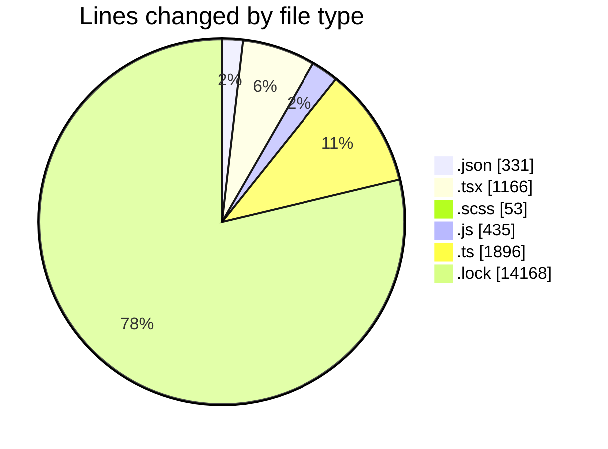
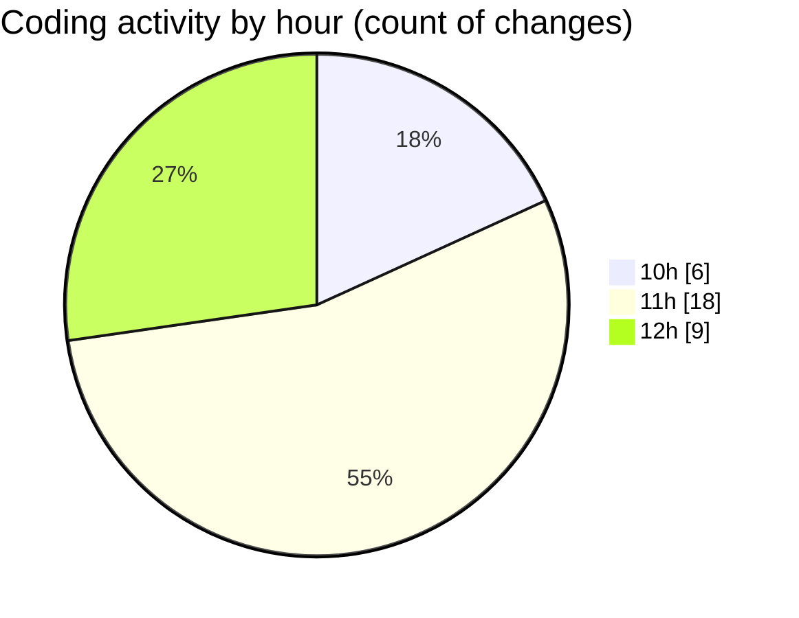

# cda - Activity Summary 

## Overall Statistics

| Stat                   | Value                                                             |
| ---------------------- | ----------------------------------------------------------------- |
| **Lines Added** (➕)   | 18030                                          |
| **Lines Removed** (➖) | 19                                        |
| **Net Change** (↕)    | 18011                |
| **Active Time** (⌚)   | 29 minutes |

## Modified Files
- **package.json** (+162, -17)
- **App.tsx** (+160, -0)
- **tsconfig.json** (+24, -0)
- **GroupDetails.scss** (+53, -0)
- **GroupDetails.test.tsx** (+239, -0)
- **App.tsx** (+430, -2)
- **GroupDetails.tsx** (+238, -0)
- **queries.js** (+435, -0)
- **skill-export.test.ts** (+370, -0)
- **skill-queries.ts** (+608, -0)
- **SkillGroups.test.ts** (+874, -0)
- **package.json** (+128, -0)
- **Groups.tsx** (+97, -0)
- **yarn.lock** (+14168, -0)
- **vite.config.ts** (+44, -0)

## Visualizations

### By File Type (Lines Changed)

### By Hour (Estimated Activity Count)

> **Last Updated:** 03/09/2026, 12:51:17