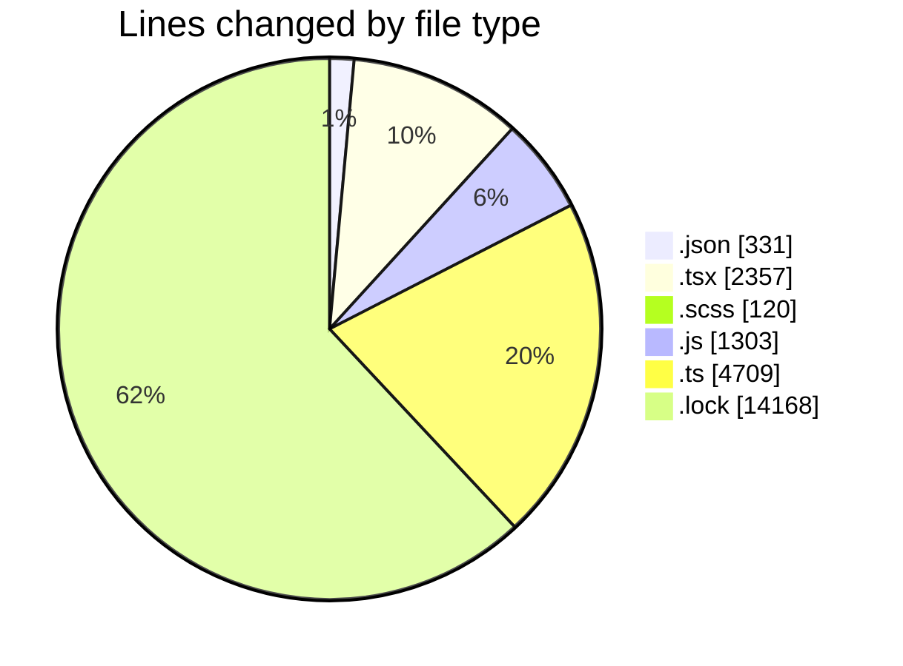
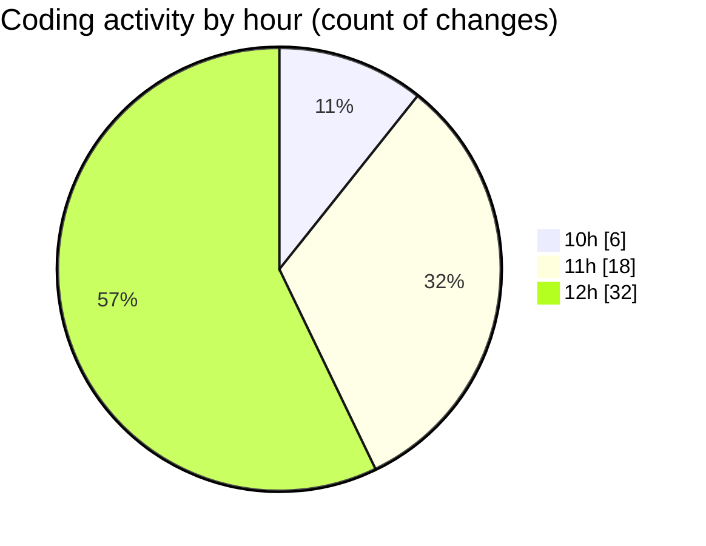

# cda - Activity Summary 

## Overall Statistics

| Stat                   | Value                                                             |
| ---------------------- | ----------------------------------------------------------------- |
| **Lines Added** (➕)   | 22966                                          |
| **Lines Removed** (➖) | 22                                        |
| **Net Change** (↕)    | 22944                |
| **Active Time** (⌚)   | 55 minutes |

## Modified Files
- **package.json** (+162, -17)
- **App.tsx** (+160, -0)
- **tsconfig.json** (+24, -0)
- **GroupDetails.scss** (+97, -0)
- **GroupDetails.test.tsx** (+472, -0)
- **App.tsx** (+430, -2)
- **GroupDetails.tsx** (+444, -0)
- **queries.js** (+844, -0)
- **skill-export.test.ts** (+741, -0)
- **skill-queries.ts** (+1215, -0)
- **SkillGroups.test.ts** (+1704, -0)
- **package.json** (+128, -0)
- **Groups.tsx** (+97, -0)
- **yarn.lock** (+14168, -0)
- **vite.config.ts** (+44, -0)
- **declarations.d.ts** (+460, -3)
- **skills.js** (+459, -0)
- **skills.ts** (+386, -0)
- **transform-group-skill-progress.test.ts** (+152, -0)
- **GroupMembersList.tsx** (+76, -0)
- **SortableTable.tsx** (+109, -0)
- **GroupSkillProgress.tsx** (+133, -0)
- **GroupMembersView.tsx** (+14, -0)
- **GroupSkillProgress.scss** (+8, -0)
- **index.ts** (+2, -0)
- **index.ts** (+2, -0)
- **SortableTable.scss** (+15, -0)
- **SortableTable.test.tsx** (+41, -0)
- **GroupSkillProgress.test.tsx** (+82, -0)
- **SkillExplore.tsx** (+297, -0)

## Visualizations

### By File Type (Lines Changed)

### By Hour (Estimated Activity Count)

> **Last Updated:** 03/09/2026, 13:01:17