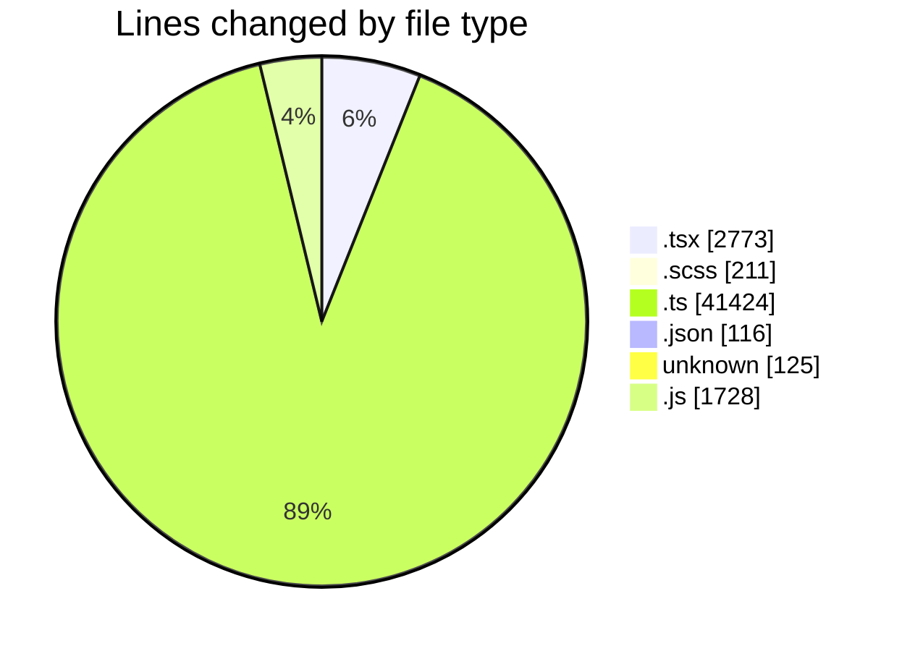
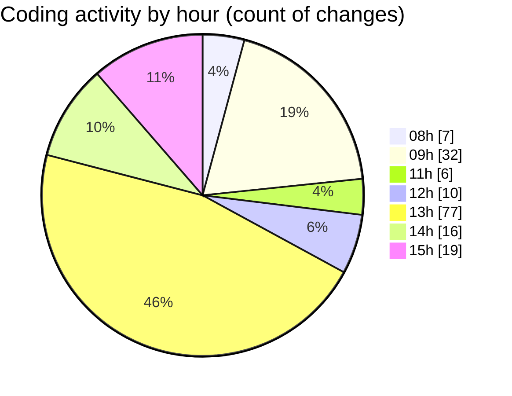

# cda - Activity Summary 

## Overall Statistics

| Stat                   | Value                                                             |
| ---------------------- | ----------------------------------------------------------------- |
| **Lines Added** (➕)   | 45141                                          |
| **Lines Removed** (➖) | 1236                                        |
| **Net Change** (↕)    | 43905                |
| **Active Time** (⌚)   | 284 minutes |

## Modified Files
- **SkillTopicUsers.tsx** (+303, -72)
- **App.tsx** (+222, -8)
- **TagTopic.tsx** (+115, -9)
- **SkillTopic.tsx** (+5, -17)
- **SkillTopicUsers.scss** (+44, -5)
- **SkillTopicUserActions.tsx** (+47, -0)
- **TagTopicDetails.tsx** (+122, -43)
- **SkillTopicUserActions.test.tsx** (+46, -4)
- **TagTopic.test.tsx** (+82, -0)
- **SkillTopic.test.tsx** (+151, -0)
- **SkillTopicUsers.test.tsx** (+149, -0)
- **index.ts** (+3, -0)
- **TagTopicDetails.test.tsx** (+60, -0)
- **SkillTopicUserActions.tsx** (+50, -0)
- **GroupAccessPeopleManager.scss** (+16, -6)
- **GroupAccessPeopleManager.tsx** (+104, -0)
- **GroupCreate.tsx** (+298, -0)
- **package.json** (+22, -22)
- **tsconfig.json** (+36, -36)
- **GroupAccess.tsx** (+86, -49)
- **InlineUpdateButton.scss** (+87, -0)
- **InlineUpdateButton.tsx** (+191, -16)
- **Settings.tsx** (+1, -2)
- **TeamViewRow.tsx** (+1, -2)
- **Admin.tsx** (+1, -2)
- **SignInStatusIcon.tsx** (+1, -2)
- **ProfileBadge.tsx** (+1, -2)
- **Duty.tsx** (+1, -2)
- **ConfirmationModal.tsx** (+1, -2)
- **CalendarShareForm.tsx** (+2, -4)
- **CalendarShare.tsx** (+8, -4)
- **declarations.d.ts** (+443, -886)
- **TooltipBadge.tsx** (+2, -4)
- **DateSwitcher.tsx** (+6, -3)
- **Sidebar.tsx** (+5, -10)
- **Sidebar.test.tsx** (+6, -3)
- **GroupDetails.tsx** (+238, -0)
- **version.ts** (+9, -0)
- **GroupDetails.scss** (+53, -0)
- **vulcan.ts** (+1944, -0)
- **vulcan_views.ts** (+1113, -0)
- **views.ts** (+10874, -0)
- **tables.ts** (+7791, -0)
- **location.ts** (+344, -0)
- **resolvers-types.ts** (+13003, -0)
- **skills.ts** (+387, -0)
- **.env** (+125, -0)
- **SkillGroups.test.ts** (+933, -0)
- **SkillGroups.ts** (+319, -0)
- **skill-queries.ts** (+610, -2)
- **skills.js** (+462, -0)
- **skill-mutations.ts** (+1163, -6)
- **queries.js** (+437, -0)
- **mutations.js** (+827, -2)
- **graphql.ts** (+3, -0)
- **GroupAccess.test.tsx** (+201, -7)
- **skill-group-mutations.ts** (+1228, -3)
- **skill-group-queries.ts** (+359, -1)

## Visualizations

### By File Type (Lines Changed)

### By Hour (Estimated Activity Count)

> **Last Updated:** 04/09/2026, 15:58:50