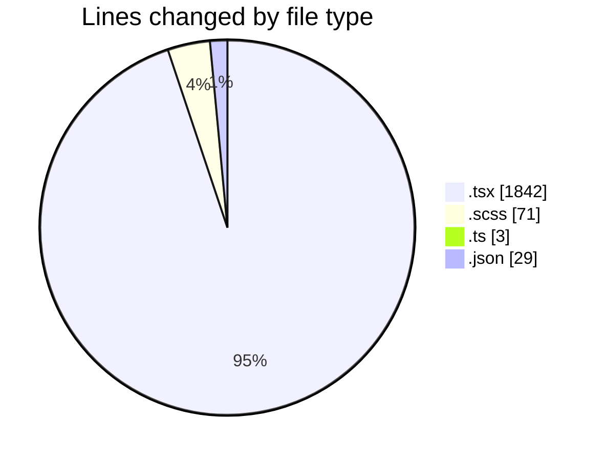
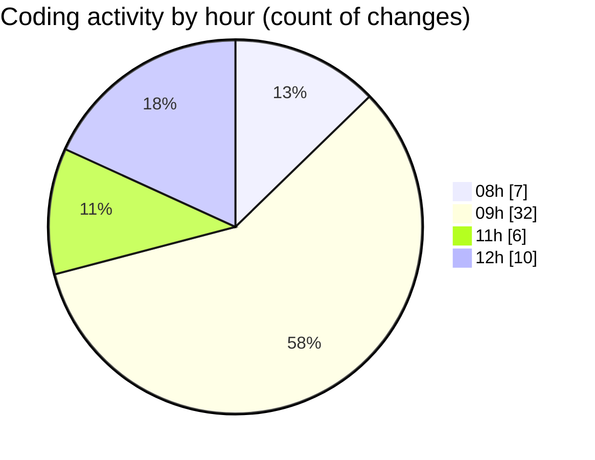

# cda - Activity Summary 

## Overall Statistics

| Stat                   | Value                                                             |
| ---------------------- | ----------------------------------------------------------------- |
| **Lines Added** (➕)   | 1795                                          |
| **Lines Removed** (➖) | 150                                        |
| **Net Change** (↕)    | 1645                |
| **Active Time** (⌚)   | 64 minutes |

## Modified Files
- **SkillTopicUsers.tsx** (+303, -72)
- **App.tsx** (+222, -8)
- **TagTopic.tsx** (+103, -0)
- **SkillTopic.tsx** (+5, -17)
- **SkillTopicUsers.scss** (+44, -5)
- **SkillTopicUserActions.tsx** (+47, -0)
- **TagTopicDetails.tsx** (+90, -27)
- **SkillTopicUserActions.test.tsx** (+46, -4)
- **TagTopic.test.tsx** (+82, -0)
- **SkillTopic.test.tsx** (+151, -0)
- **SkillTopicUsers.test.tsx** (+149, -0)
- **index.ts** (+3, -0)
- **TagTopicDetails.test.tsx** (+60, -0)
- **SkillTopicUserActions.tsx** (+50, -0)
- **GroupAccessPeopleManager.scss** (+16, -6)
- **GroupAccessPeopleManager.tsx** (+104, -0)
- **GroupCreate.tsx** (+298, -0)
- **package.json** (+0, -11)
- **tsconfig.json** (+18, -0)
- **GroupAccess.tsx** (+4, -0)

## Visualizations

### By File Type (Lines Changed)

### By Hour (Estimated Activity Count)

> **Last Updated:** 04/09/2026, 12:48:50