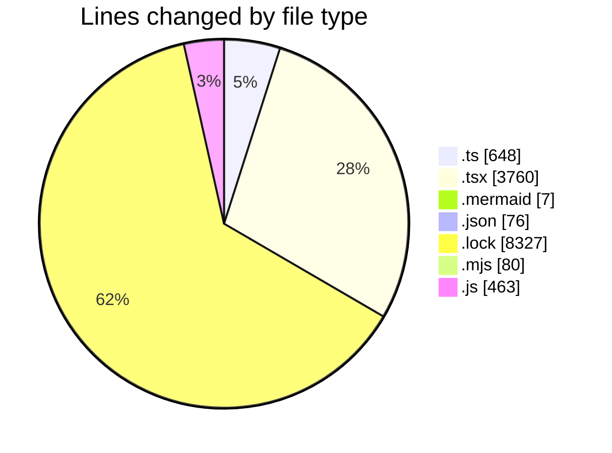
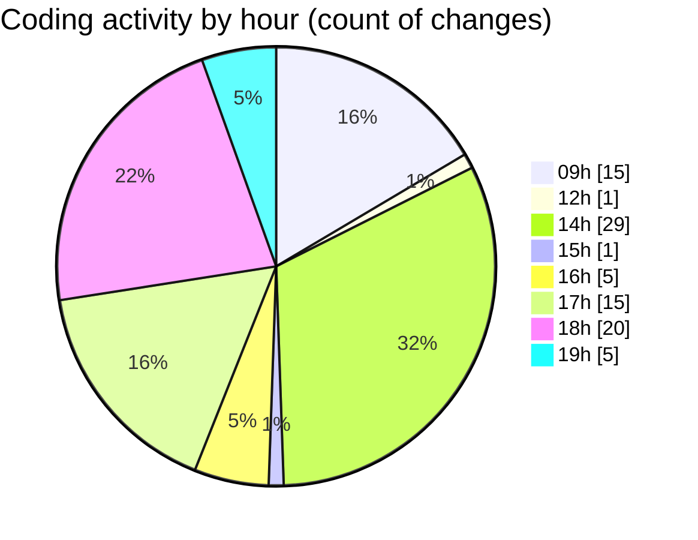

# cda - Activity Summary 

## Overall Statistics

| Stat                   | Value                                                             |
| ---------------------- | ----------------------------------------------------------------- |
| **Lines Added** (➕)   | 13225                                          |
| **Lines Removed** (➖) | 136                                        |
| **Net Change** (↕)    | 13089                |
| **Active Time** (⌚)   | 80 minutes |

## Modified Files
- **declarations.d.ts** (+30, -0)
- **CalendarShare.tsx** (+402, -0)
- **CalendarShareForm.tsx** (+50, -0)
- **ConfirmationModal.tsx** (+140, -0)
- **Duty.tsx** (+772, -0)
- **ProfileBadge.tsx** (+156, -0)
- **SignInStatusIcon.tsx** (+198, -0)
- **Admin.tsx** (+60, -0)
- **Settings.tsx** (+72, -0)
- **TeamViewRow.tsx** (+332, -0)
- **TooltipBadge.tsx** (+124, -0)
- **SchedulingTeamSelect.tsx** (+138, -0)
- **DateSwitcher.tsx** (+216, -0)
- **Sidebar.tsx** (+186, -0)
- **Sidebar.test.tsx** (+74, -0)
- **CreateDraftSkill.mermaid** (+7, -0)
- **package.json** (+76, -0)
- **constants.ts** (+57, -3)
- **parseSkillWorkbook.ts** (+165, -1)
- **SkillCreate.tsx** (+362, -67)
- **yarn.lock** (+8327, -0)
- **toSkillForm.ts** (+110, -0)
- **downloadSkillTemplate.ts** (+12, -0)
- **SkillImportPanel.tsx** (+106, -8)
- **SkillTagCreateSubSkills.tsx** (+139, -11)
- **generate.mjs** (+80, -0)
- **parseSkillWorkbook.test.ts** (+160, -13)
- **toSkillForm.test.ts** (+97, -0)
- **SkillImportPanel.test.tsx** (+128, -19)
- **queries.js** (+449, -14)

## Visualizations

### By File Type (Lines Changed)

### By Hour (Estimated Activity Count)

> **Last Updated:** 08/09/2026, 19:57:23