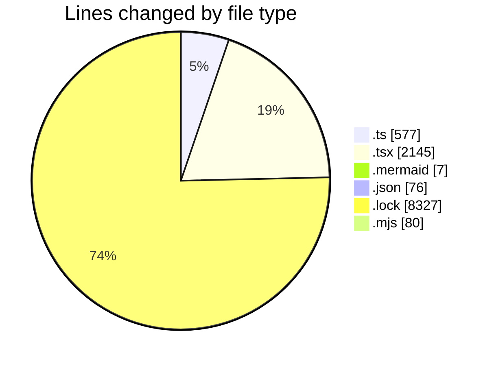
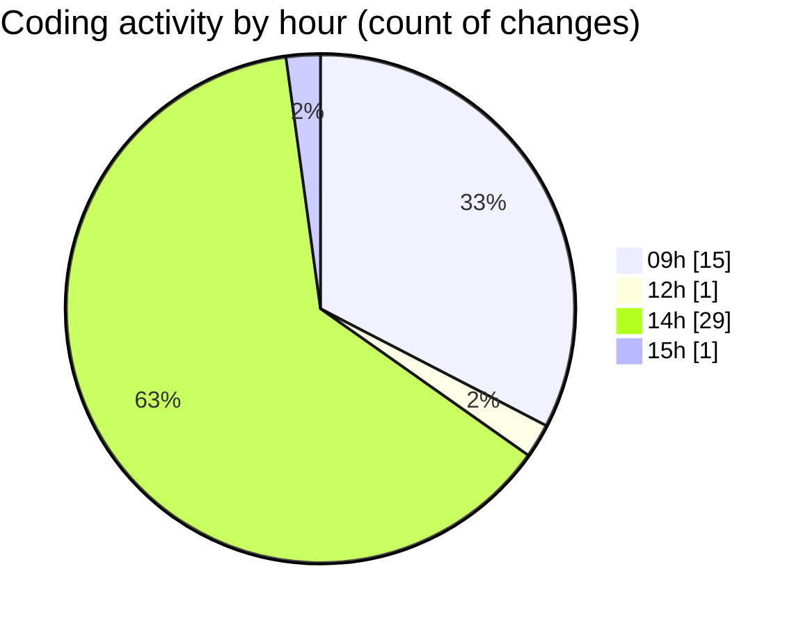

# cda - Activity Summary 

## Overall Statistics

| Stat                   | Value                                                             |
| ---------------------- | ----------------------------------------------------------------- |
| **Lines Added** (➕)   | 11159                                          |
| **Lines Removed** (➖) | 53                                        |
| **Net Change** (↕)    | 11106                |
| **Active Time** (⌚)   | 48 minutes |

## Modified Files
- **declarations.d.ts** (+15, -0)
- **CalendarShare.tsx** (+201, -0)
- **CalendarShareForm.tsx** (+25, -0)
- **ConfirmationModal.tsx** (+70, -0)
- **Duty.tsx** (+386, -0)
- **ProfileBadge.tsx** (+78, -0)
- **SignInStatusIcon.tsx** (+99, -0)
- **Admin.tsx** (+30, -0)
- **Settings.tsx** (+36, -0)
- **TeamViewRow.tsx** (+166, -0)
- **TooltipBadge.tsx** (+62, -0)
- **SchedulingTeamSelect.tsx** (+69, -0)
- **DateSwitcher.tsx** (+108, -0)
- **Sidebar.tsx** (+93, -0)
- **Sidebar.test.tsx** (+37, -0)
- **CreateDraftSkill.mermaid** (+7, -0)
- **package.json** (+76, -0)
- **constants.ts** (+57, -0)
- **parseSkillWorkbook.ts** (+136, -0)
- **SkillCreate.tsx** (+287, -34)
- **yarn.lock** (+8327, -0)
- **toSkillForm.ts** (+105, -0)
- **downloadSkillTemplate.ts** (+12, -0)
- **SkillImportPanel.tsx** (+88, -1)
- **SkillTagCreateSubSkills.tsx** (+139, -11)
- **generate.mjs** (+80, -0)
- **parseSkillWorkbook.test.ts** (+160, -0)
- **toSkillForm.test.ts** (+92, -0)
- **SkillImportPanel.test.tsx** (+118, -7)

## Visualizations

### By File Type (Lines Changed)

### By Hour (Estimated Activity Count)

> **Last Updated:** 08/09/2026, 15:54:47