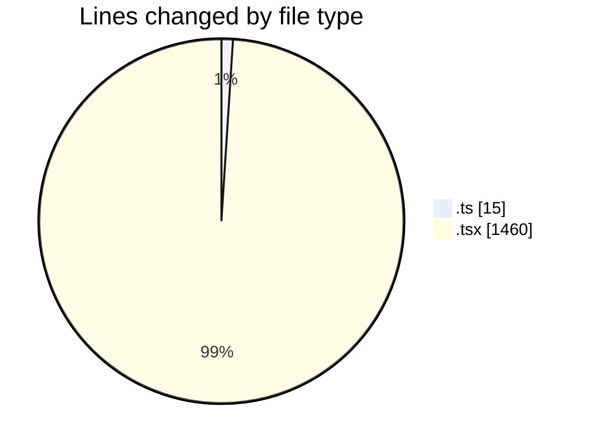
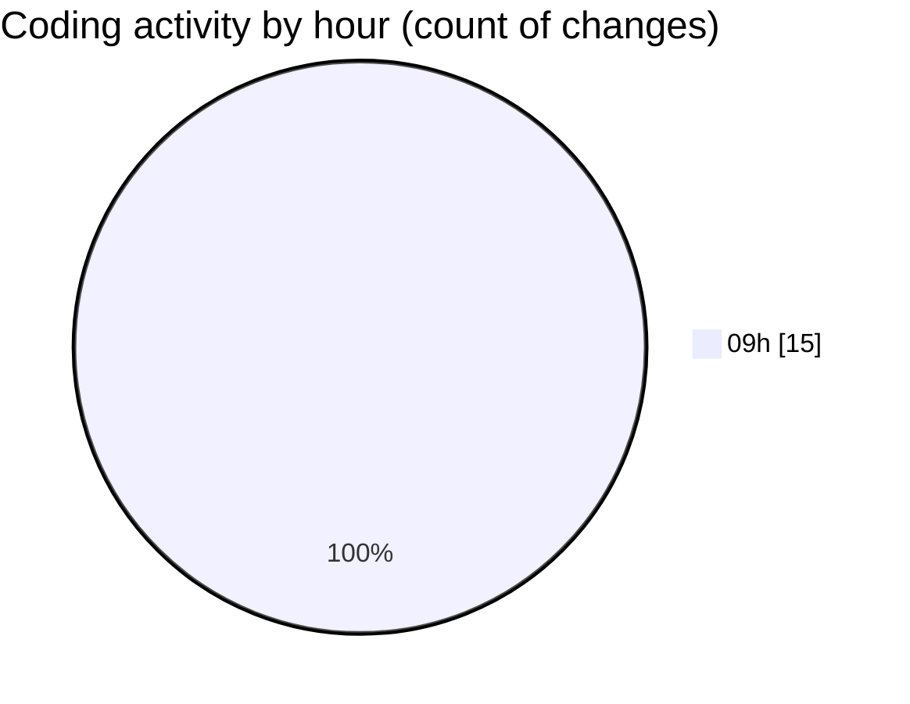

# cda - Activity Summary 

## Overall Statistics

| Stat                   | Value                                                             |
| ---------------------- | ----------------------------------------------------------------- |
| **Lines Added** (➕)   | 1475                                          |
| **Lines Removed** (➖) | 0                                        |
| **Net Change** (↕)    | 1475                |
| **Active Time** (⌚)   | 10 minutes |

## Modified Files
- **declarations.d.ts** (+15, -0)
- **CalendarShare.tsx** (+201, -0)
- **CalendarShareForm.tsx** (+25, -0)
- **ConfirmationModal.tsx** (+70, -0)
- **Duty.tsx** (+386, -0)
- **ProfileBadge.tsx** (+78, -0)
- **SignInStatusIcon.tsx** (+99, -0)
- **Admin.tsx** (+30, -0)
- **Settings.tsx** (+36, -0)
- **TeamViewRow.tsx** (+166, -0)
- **TooltipBadge.tsx** (+62, -0)
- **SchedulingTeamSelect.tsx** (+69, -0)
- **DateSwitcher.tsx** (+108, -0)
- **Sidebar.tsx** (+93, -0)
- **Sidebar.test.tsx** (+37, -0)

## Visualizations

### By File Type (Lines Changed)

### By Hour (Estimated Activity Count)

> **Last Updated:** 08/09/2026, 09:42:30