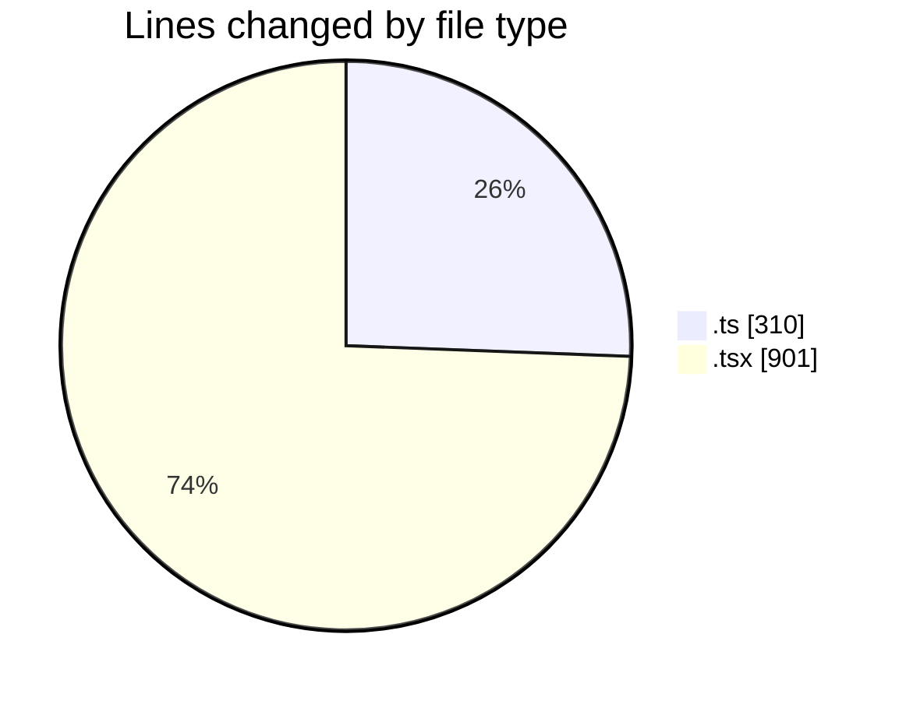
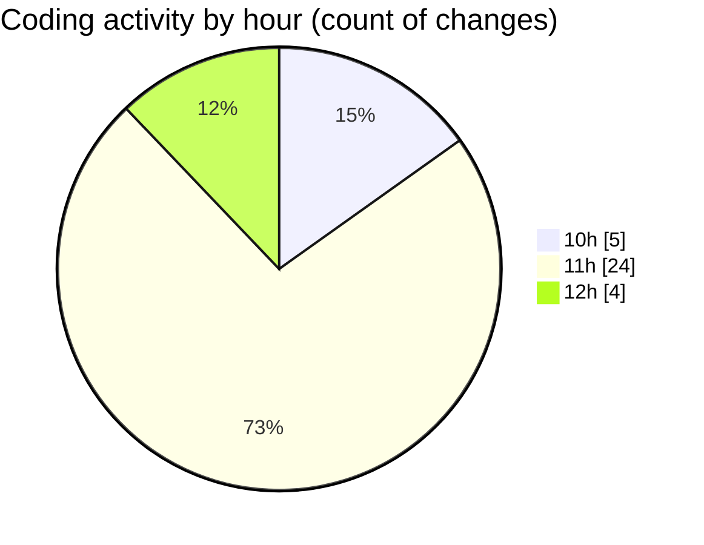

# cda - Activity Summary 

## Overall Statistics

| Stat                   | Value                                                             |
| ---------------------- | ----------------------------------------------------------------- |
| **Lines Added** (➕)   | 1031                                          |
| **Lines Removed** (➖) | 180                                        |
| **Net Change** (↕)    | 851                |
| **Active Time** (⌚)   | 71 minutes |

## Modified Files
- **skillForm.ts** (+30, -8)
- **SkillImportPanel.tsx** (+240, -170)
- **skill-create.test.ts** (+156, -0)
- **toSkillForm.ts** (+114, -0)
- **SkillImportPanel.test.tsx** (+123, -0)
- **SkillCreate.tsx** (+29, -1)
- **SkillTagCreateSubSkill.tsx** (+60, -0)
- **SkillTagCreateSubSkills.tsx** (+5, -0)
- **SkillTopic.test.tsx** (+152, -1)
- **SkillTagCreateOptions.tsx** (+120, -0)
- **parseSkillWorkbook.ts** (+2, -0)

## Visualizations

### By File Type (Lines Changed)

### By Hour (Estimated Activity Count)

> **Last Updated:** 09/09/2026, 12:29:45