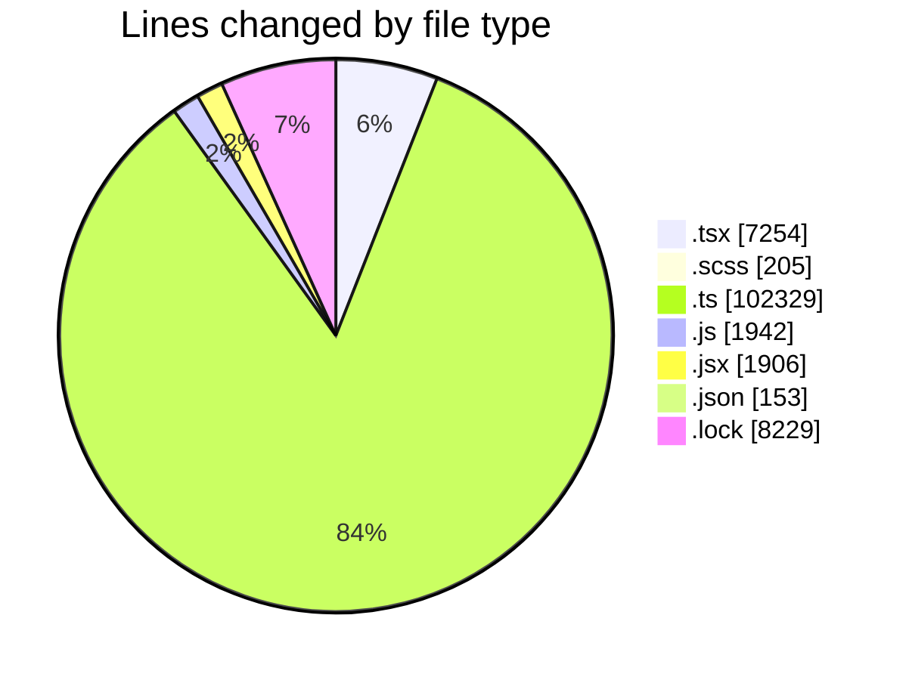
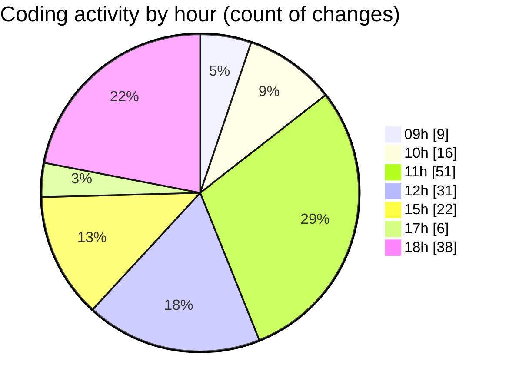

# cda - Activity Summary 

## Overall Statistics

| Stat                   | Value                                                             |
| ---------------------- | ----------------------------------------------------------------- |
| **Lines Added** (➕)   | 121274                                          |
| **Lines Removed** (➖) | 744                                        |
| **Net Change** (↕)    | 120530                |
| **Active Time** (⌚)   | 181 minutes |

## Modified Files
- **SkillImportPanel.tsx** (+534, -21)
- **SkillCreate.tsx** (+1062, -297)
- **SkillImportPanel.test.tsx** (+452, -0)
- **SkillTagCreateSubSkills.test.tsx** (+482, -60)
- **SkillTagCreateSubSkills.tsx** (+429, -0)
- **GroupDetails.tsx** (+244, -0)
- **GroupDetails.scss** (+65, -6)
- **GroupDetails.test.tsx** (+277, -0)
- **Groups.tsx** (+100, -0)
- **SkillTopic.test.tsx** (+455, -2)
- **skill-mutations.ts** (+3605, -65)
- **resolvers-types.ts** (+26374, -55)
- **views.ts** (+22233, -0)
- **tables.ts** (+15906, -2)
- **SkillTopic.tsx** (+51, -0)
- **dump.js** (+32, -0)
- **constants.ts** (+108, -0)
- **parseSkillWorkbook.ts** (+382, -0)
- **parseSkillWorkbook.test.ts** (+374, -0)
- **queries.js** (+1313, -2)
- **index.jsx** (+179, -0)
- **index.jsx** (+163, -0)
- **index.jsx** (+107, -0)
- **index.jsx** (+112, -0)
- **index.jsx** (+206, -0)
- **index.jsx** (+119, -0)
- **index.jsx** (+155, -0)
- **EditCateringInfoModal.scss** (+12, -0)
- **index.jsx** (+104, -0)
- **index.jsx** (+141, -0)
- **EditAdditionalInfoModal.scss** (+6, -0)
- **EditContactInfoModal.scss** (+6, -0)
- **EditTransportInfoModal.scss** (+6, -0)
- **BuildingProfile.test.jsx** (+295, -0)
- **index.jsx** (+147, -0)
- **index.jsx** (+86, -0)
- **index.jsx** (+92, -0)
- **addBuildingModal.scss** (+8, -0)
- **declarations.d.ts** (+15, -0)
- **CalendarShareForm.tsx** (+25, -0)
- **CalendarShare.tsx** (+201, -0)
- **Duty.tsx** (+386, -0)
- **ConfirmationModal.tsx** (+70, -0)
- **ProfileBadge.tsx** (+78, -0)
- **SignInStatusIcon.tsx** (+99, -0)
- **TeamViewRow.tsx** (+166, -0)
- **Settings.tsx** (+36, -0)
- **Admin.tsx** (+30, -0)
- **TooltipBadge.tsx** (+62, -0)
- **SchedulingTeamSelect.tsx** (+69, -0)
- **Sidebar.test.tsx** (+37, -0)
- **DateSwitcher.tsx** (+108, -0)
- **Sidebar.tsx** (+93, -0)
- **package.json** (+152, -1)
- **toSkillForm.ts** (+114, -0)
- **toSkillForm.test.ts** (+97, -0)
- **skills.ts** (+780, -3)
- **skill-queries.ts** (+1400, -92)
- **SkillTagCreateDescription.test.tsx** (+20, -0)
- **SkillTagAdmin.scss** (+67, -0)
- **skills.ts** (+17, -0)
- **SortableItem.scss** (+29, -0)
- **SkillTagCreateDescription.tsx** (+47, -0)
- **SortableItem.tsx** (+41, -0)
- **SkillTagCreateSubSkill.tsx** (+85, -0)
- **SkillTagCreateOptions.tsx** (+156, -0)
- **SkillTagCreateSubSkill.test.tsx** (+55, -0)
- **SkillTagCreateOptions.test.tsx** (+70, -0)
- **yarn.lock** (+8229, -0)
- **vulcan.ts** (+1944, -0)
- **20251105120156-replace-profile-skill-tags.js** (+70, -0)
- **skills.js** (+492, -15)
- **skill-mutations.ts** (+282, -34)
- **policies.ts** (+23, -1)
- **SkillGroups.ts** (+321, -1)
- **SkillPermissions.ts** (+104, -41)
- **views.d.ts** (+9101, -4)
- **skill-queries.ts** (+376, -31)
- **transform-skill-favourites.test.ts** (+464, -9)
- **graphql.ts** (+10050, -0)
- **graphql.ts** (+7921, -0)
- **TagTopicDetails.test.tsx** (+62, -0)
- **ManageSkillsTab.test.tsx** (+116, -0)
- **SkillTopicUsers.test.tsx** (+151, -0)
- **SkillCreate.test.tsx** (+133, -0)
- **SkillTopicUserActions.test.tsx** (+44, -0)
- **TagTopic.test.tsx** (+84, -2)
- **SkillUser.test.tsx** (+86, -0)
- **TagTopic.tsx** (+113, -0)
- **MarkdownEditor.tsx** (+63, -0)
- **20260910120000-add-status-to-profile-skill-tag.js** (+18, -0)

## Visualizations

### By File Type (Lines Changed)

### By Hour (Estimated Activity Count)

> **Last Updated:** 10/09/2026, 18:51:09