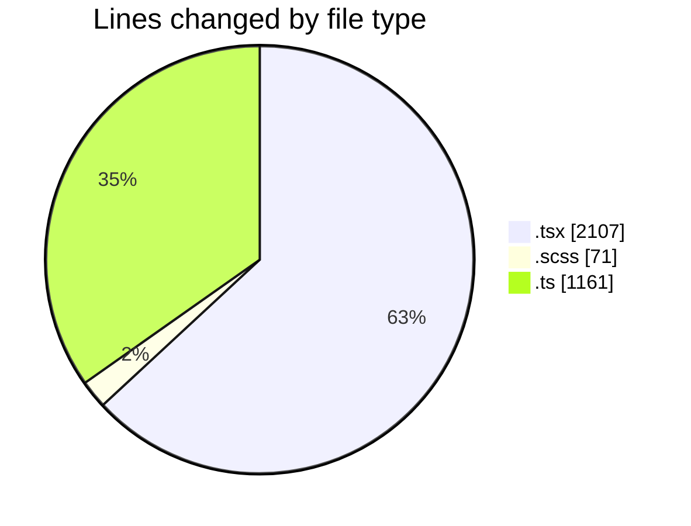
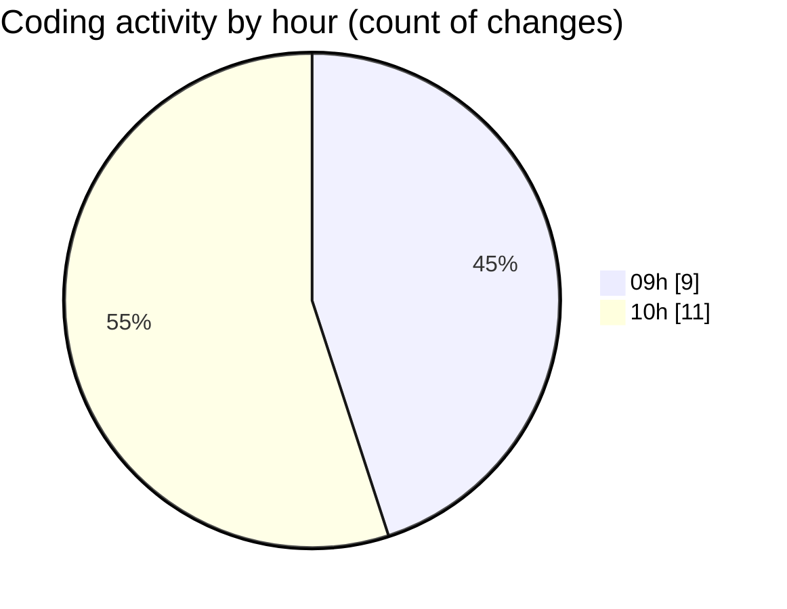

# cda - Activity Summary 

## Overall Statistics

| Stat                   | Value                                                             |
| ---------------------- | ----------------------------------------------------------------- |
| **Lines Added** (➕)   | 3174                                          |
| **Lines Removed** (➖) | 165                                        |
| **Net Change** (↕)    | 3009                |
| **Active Time** (⌚)   | 27 minutes |

## Modified Files
- **SkillImportPanel.tsx** (+178, -0)
- **SkillCreate.tsx** (+420, -99)
- **SkillImportPanel.test.tsx** (+151, -0)
- **SkillTagCreateSubSkills.test.tsx** (+271, -60)
- **SkillTagCreateSubSkills.tsx** (+156, -0)
- **GroupDetails.tsx** (+244, -0)
- **GroupDetails.scss** (+65, -6)
- **GroupDetails.test.tsx** (+277, -0)
- **Groups.tsx** (+100, -0)
- **SkillTopic.test.tsx** (+151, -0)
- **skill-mutations.ts** (+1161, -0)

## Visualizations

### By File Type (Lines Changed)

### By Hour (Estimated Activity Count)

> **Last Updated:** 10/09/2026, 10:25:46