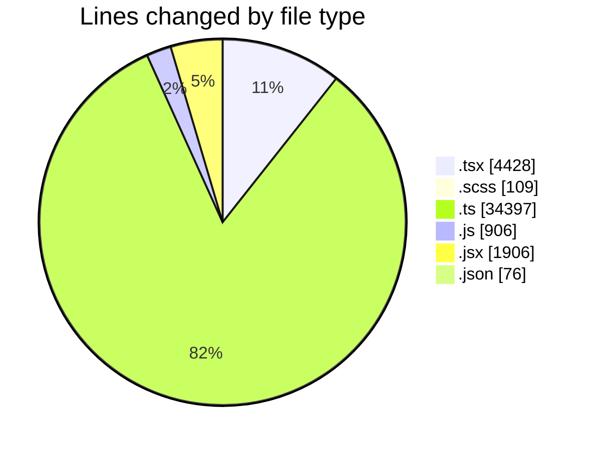
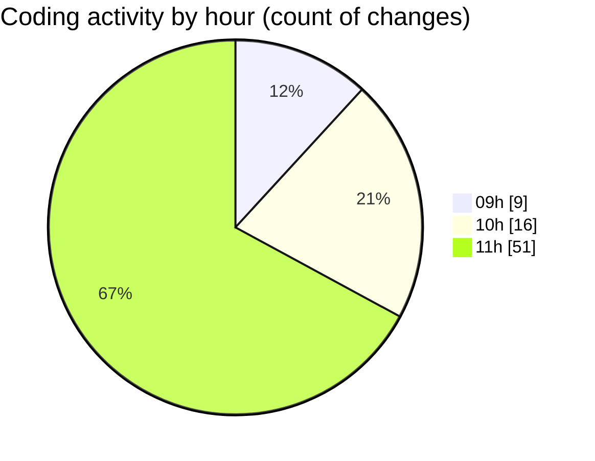

# cda - Activity Summary 

## Overall Statistics

| Stat                   | Value                                                             |
| ---------------------- | ----------------------------------------------------------------- |
| **Lines Added** (➕)   | 41655                                          |
| **Lines Removed** (➖) | 167                                        |
| **Net Change** (↕)    | 41488                |
| **Active Time** (⌚)   | 73 minutes |

## Modified Files
- **SkillImportPanel.tsx** (+356, -0)
- **SkillCreate.tsx** (+741, -99)
- **SkillImportPanel.test.tsx** (+302, -0)
- **SkillTagCreateSubSkills.test.tsx** (+271, -60)
- **SkillTagCreateSubSkills.tsx** (+312, -0)
- **GroupDetails.tsx** (+244, -0)
- **GroupDetails.scss** (+65, -6)
- **GroupDetails.test.tsx** (+277, -0)
- **Groups.tsx** (+100, -0)
- **SkillTopic.test.tsx** (+153, -2)
- **skill-mutations.ts** (+1161, -0)
- **resolvers-types.ts** (+13160, -0)
- **views.ts** (+11069, -0)
- **tables.ts** (+7917, -0)
- **SkillTopic.tsx** (+51, -0)
- **dump.js** (+32, -0)
- **constants.ts** (+108, -0)
- **parseSkillWorkbook.ts** (+382, -0)
- **parseSkillWorkbook.test.ts** (+374, -0)
- **queries.js** (+874, -0)
- **index.jsx** (+179, -0)
- **index.jsx** (+163, -0)
- **index.jsx** (+107, -0)
- **index.jsx** (+112, -0)
- **index.jsx** (+206, -0)
- **index.jsx** (+119, -0)
- **index.jsx** (+155, -0)
- **EditCateringInfoModal.scss** (+12, -0)
- **index.jsx** (+104, -0)
- **index.jsx** (+141, -0)
- **EditAdditionalInfoModal.scss** (+6, -0)
- **EditContactInfoModal.scss** (+6, -0)
- **EditTransportInfoModal.scss** (+6, -0)
- **BuildingProfile.test.jsx** (+295, -0)
- **index.jsx** (+147, -0)
- **index.jsx** (+86, -0)
- **index.jsx** (+92, -0)
- **addBuildingModal.scss** (+8, -0)
- **declarations.d.ts** (+15, -0)
- **CalendarShareForm.tsx** (+25, -0)
- **CalendarShare.tsx** (+201, -0)
- **Duty.tsx** (+386, -0)
- **ConfirmationModal.tsx** (+70, -0)
- **ProfileBadge.tsx** (+78, -0)
- **SignInStatusIcon.tsx** (+99, -0)
- **TeamViewRow.tsx** (+166, -0)
- **Settings.tsx** (+36, -0)
- **Admin.tsx** (+30, -0)
- **TooltipBadge.tsx** (+62, -0)
- **SchedulingTeamSelect.tsx** (+69, -0)
- **Sidebar.test.tsx** (+37, -0)
- **DateSwitcher.tsx** (+108, -0)
- **Sidebar.tsx** (+93, -0)
- **package.json** (+76, -0)
- **toSkillForm.ts** (+114, -0)
- **toSkillForm.test.ts** (+97, -0)

## Visualizations

### By File Type (Lines Changed)

### By Hour (Estimated Activity Count)

> **Last Updated:** 10/09/2026, 11:41:27