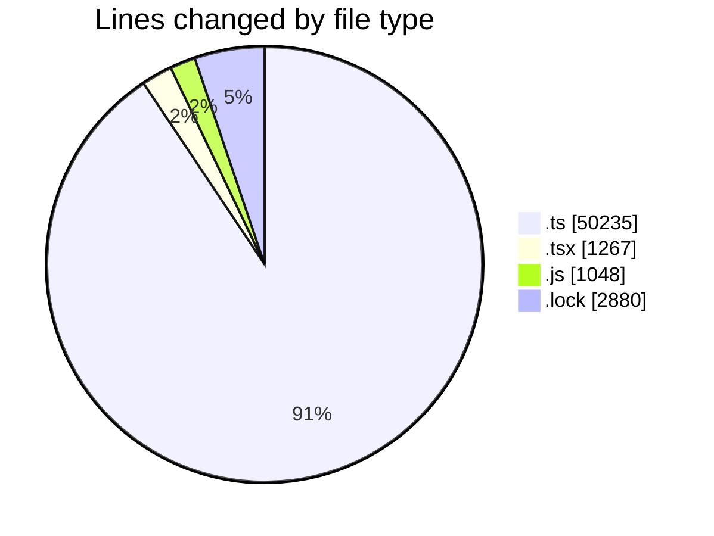
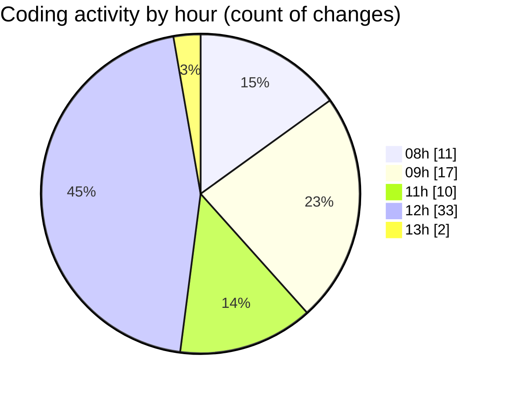

# cda - Activity Summary 

## Overall Statistics

| Stat                   | Value                                                             |
| ---------------------- | ----------------------------------------------------------------- |
| **Lines Added** (➕)   | 54771                                          |
| **Lines Removed** (➖) | 659                                        |
| **Net Change** (↕)    | 54112                |
| **Active Time** (⌚)   | 111 minutes |

## Modified Files
- **skill-mutations.ts** (+2399, -0)
- **skill-queries.ts** (+1684, -244)
- **resolvers-types.ts** (+13195, -0)
- **skill-mutations.ts** (+518, -0)
- **skill-queries.ts** (+1157, -359)
- **calendar-queries.ts** (+3612, -33)
- **SkillCreate.tsx** (+222, -0)
- **queries.js** (+437, -0)
- **TagTopic.tsx** (+106, -0)
- **TagTopic.test.tsx** (+101, -17)
- **server.js** (+85, -0)
- **diagnosticsErrorLogging.js** (+40, -0)
- **diagnosticsErrorLogging.d.ts** (+8, -0)
- **types.d.ts** (+58, -0)
- **index.d.ts** (+9, -0)
- **clear_view_views.ts** (+4813, -0)
- **yarn.lock** (+2880, -0)
- **20260910120001-add-status-to-profile-skill-tag.js** (+18, -6)
- **skills.js** (+462, -0)
- **views.ts** (+11073, -0)
- **views.ts** (+11073, -0)
- **TagTopicDetails.test.tsx** (+62, -0)
- **SkillTagCreateSubSkills.test.tsx** (+112, -0)
- **ManageSkillsTab.test.tsx** (+116, -0)
- **SkillCreate.test.tsx** (+133, -0)
- **SkillTopicUserActions.test.tsx** (+44, -0)
- **SkillTopicUsers.test.tsx** (+151, -0)
- **SkillUser.test.tsx** (+86, -0)
- **SkillTagCreateSubSkills.tsx** (+117, -0)

## Visualizations

### By File Type (Lines Changed)

### By Hour (Estimated Activity Count)

> **Last Updated:** 11/09/2026, 13:10:25