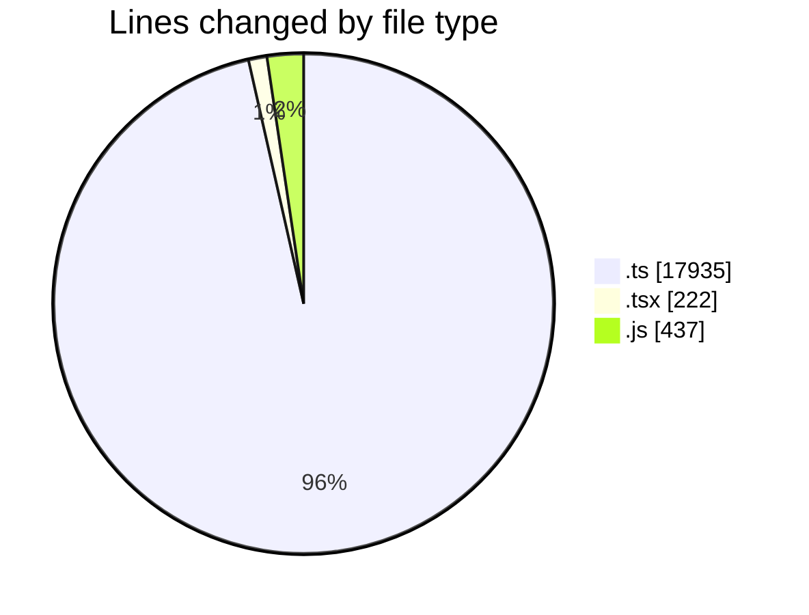
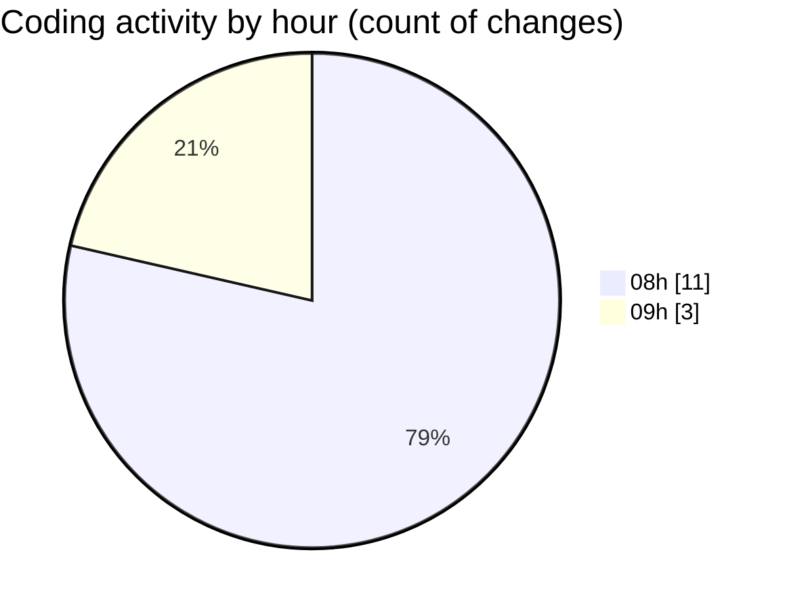

# cda - Activity Summary 

## Overall Statistics

| Stat                   | Value                                                             |
| ---------------------- | ----------------------------------------------------------------- |
| **Lines Added** (➕)   | 18583                                          |
| **Lines Removed** (➖) | 11                                        |
| **Net Change** (↕)    | 18572                |
| **Active Time** (⌚)   | 22 minutes |

## Modified Files
- **skill-mutations.ts** (+1242, -0)
- **skill-queries.ts** (+720, -0)
- **resolvers-types.ts** (+13195, -0)
- **skill-mutations.ts** (+255, -0)
- **skill-queries.ts** (+706, -0)
- **calendar-queries.ts** (+1806, -11)
- **SkillCreate.tsx** (+222, -0)
- **queries.js** (+437, -0)

## Visualizations

### By File Type (Lines Changed)

### By Hour (Estimated Activity Count)

> **Last Updated:** 11/09/2026, 09:10:41