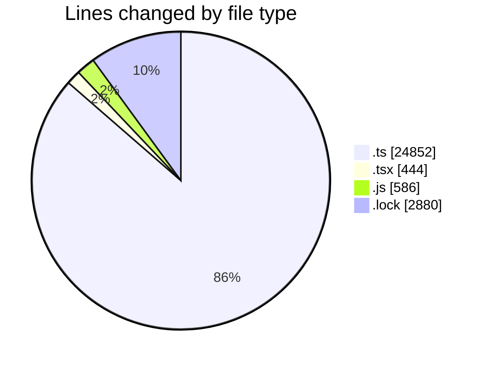
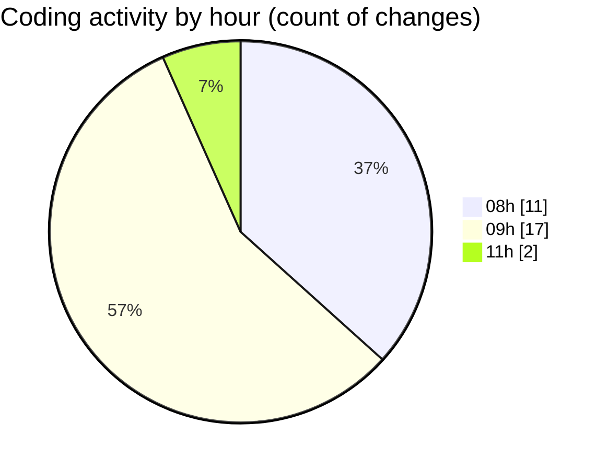

# cda - Activity Summary 

## Overall Statistics

| Stat                   | Value                                                             |
| ---------------------- | ----------------------------------------------------------------- |
| **Lines Added** (➕)   | 28650                                          |
| **Lines Removed** (➖) | 112                                        |
| **Net Change** (↕)    | 28538                |
| **Active Time** (⌚)   | 40 minutes |

## Modified Files
- **skill-mutations.ts** (+1242, -0)
- **skill-queries.ts** (+720, -0)
- **resolvers-types.ts** (+13195, -0)
- **skill-mutations.ts** (+255, -0)
- **skill-queries.ts** (+862, -78)
- **calendar-queries.ts** (+3601, -11)
- **SkillCreate.tsx** (+222, -0)
- **queries.js** (+437, -0)
- **TagTopic.tsx** (+106, -0)
- **TagTopic.test.tsx** (+99, -17)
- **server.js** (+85, -0)
- **diagnosticsErrorLogging.js** (+40, -0)
- **diagnosticsErrorLogging.d.ts** (+8, -0)
- **types.d.ts** (+58, -0)
- **index.d.ts** (+9, -0)
- **clear_view_views.ts** (+4813, -0)
- **yarn.lock** (+2880, -0)
- **20260910120001-add-status-to-profile-skill-tag.js** (+18, -6)

## Visualizations

### By File Type (Lines Changed)

### By Hour (Estimated Activity Count)

> **Last Updated:** 11/09/2026, 11:55:25