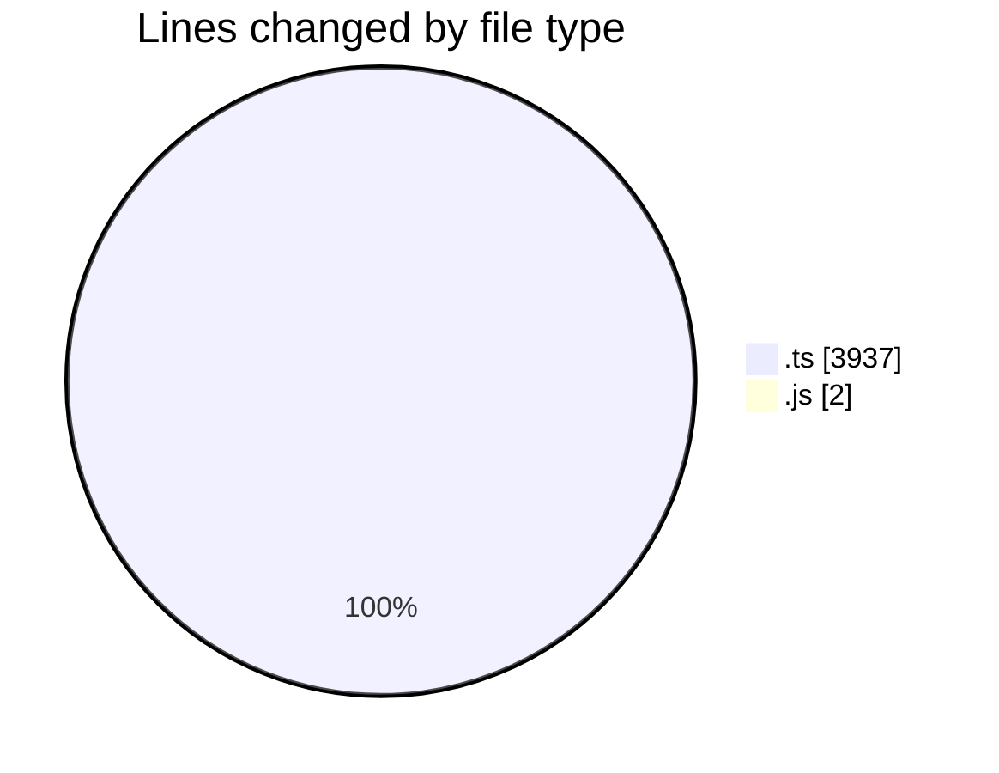
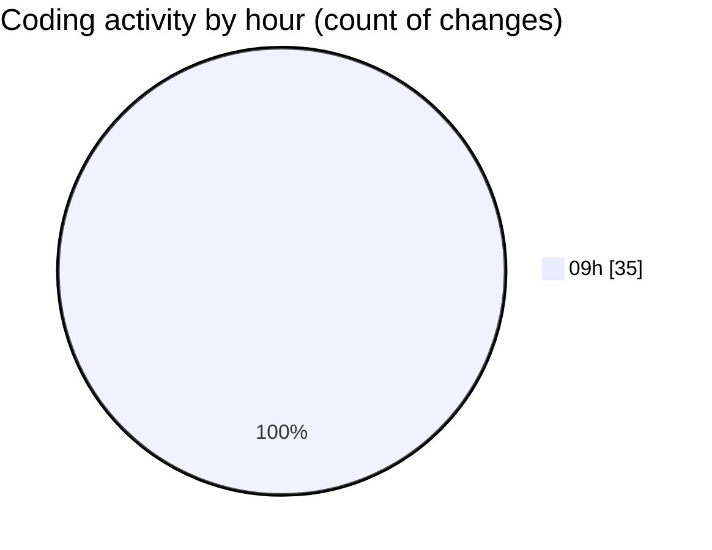

# cda - Activity Summary 

## Overall Statistics

| Stat                   | Value                                                             |
| ---------------------- | ----------------------------------------------------------------- |
| **Lines Added** (➕)   | 3579                                          |
| **Lines Removed** (➖) | 360                                        |
| **Net Change** (↕)    | 3219                |
| **Active Time** (⌚)   | 29 minutes |

## Modified Files
- **skill-mutations.ts** (+60, -109)
- **skill-queries.ts** (+106, -198)
- **skill-group-mutations.ts** (+1273, -51)
- **calendar-queries.ts** (+11, -0)
- **skill-team-queries.ts** (+528, -0)
- **skill-admin-mutations.ts** (+302, -0)
- **skill-assign-mutations.ts** (+323, -0)
- **skill-people-queries.ts** (+245, -0)
- **skill-group-queries.ts** (+361, -0)
- **SkillPermissions.ts** (+175, -0)
- **sub-skill-mutations.ts** (+195, -0)
- **queries.js** (+0, -2)

## Visualizations

### By File Type (Lines Changed)

### By Hour (Estimated Activity Count)

> **Last Updated:** 14/09/2026, 09:48:23