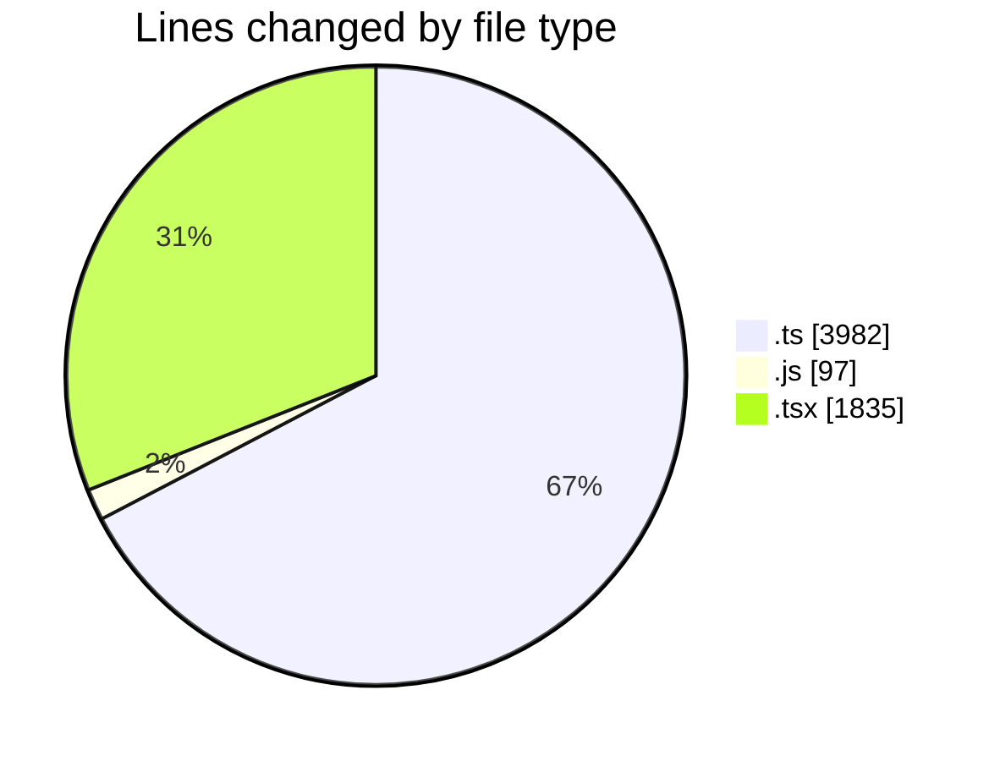
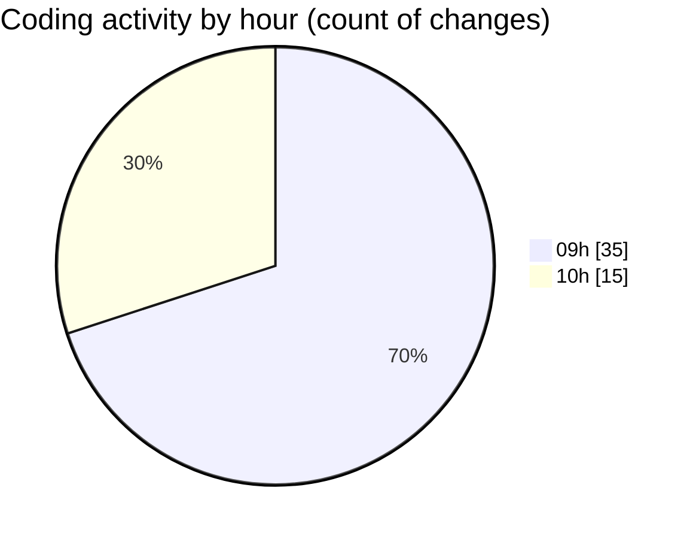

# cda - Activity Summary 

## Overall Statistics

| Stat                   | Value                                                             |
| ---------------------- | ----------------------------------------------------------------- |
| **Lines Added** (➕)   | 5548                                          |
| **Lines Removed** (➖) | 366                                        |
| **Net Change** (↕)    | 5182                |
| **Active Time** (⌚)   | 37 minutes |

## Modified Files
- **skill-mutations.ts** (+60, -109)
- **skill-queries.ts** (+106, -198)
- **skill-group-mutations.ts** (+1273, -51)
- **calendar-queries.ts** (+11, -0)
- **skill-team-queries.ts** (+528, -0)
- **skill-admin-mutations.ts** (+302, -0)
- **skill-assign-mutations.ts** (+323, -0)
- **skill-people-queries.ts** (+245, -0)
- **skill-group-queries.ts** (+361, -0)
- **SkillPermissions.ts** (+175, -0)
- **sub-skill-mutations.ts** (+195, -0)
- **queries.js** (+0, -2)
- **Desk.test.tsx** (+623, -0)
- **FindUser.tsx** (+93, -0)
- **DeskOption.tsx** (+114, -0)
- **Desk.tsx** (+151, -0)
- **block-navigation.js** (+89, -6)
- **CancelBookingAsAdmin.tsx** (+67, -0)
- **UserProvider.tsx** (+15, -0)
- **BookingRow.tsx** (+87, -0)
- **CancelBooking.tsx** (+75, -0)
- **DeskMap.tsx** (+295, -0)
- **Book.tsx** (+315, -0)
- **usePersonSearch.ts** (+45, -0)

## Visualizations

### By File Type (Lines Changed)

### By Hour (Estimated Activity Count)

> **Last Updated:** 14/09/2026, 10:43:23