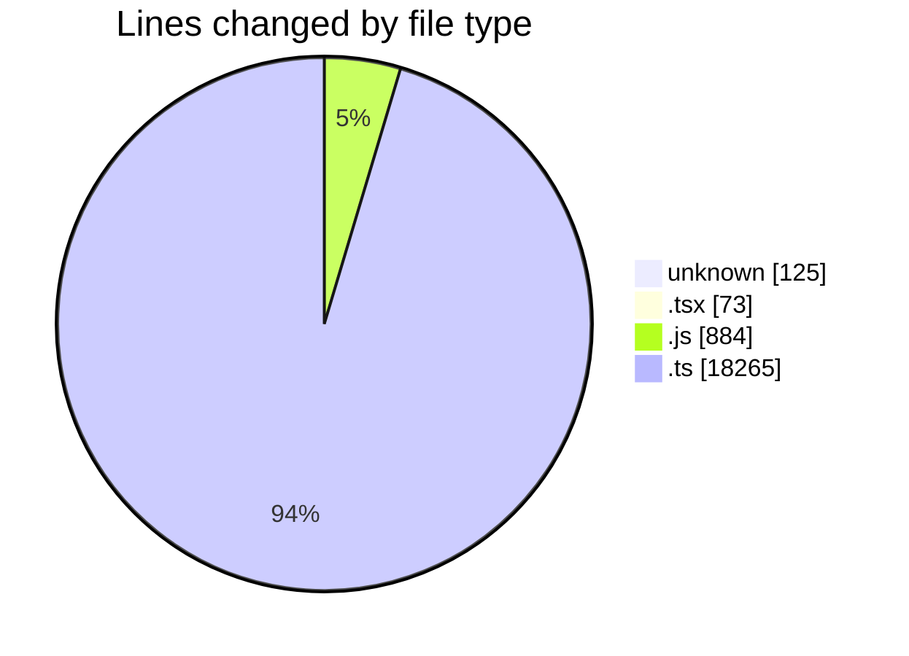
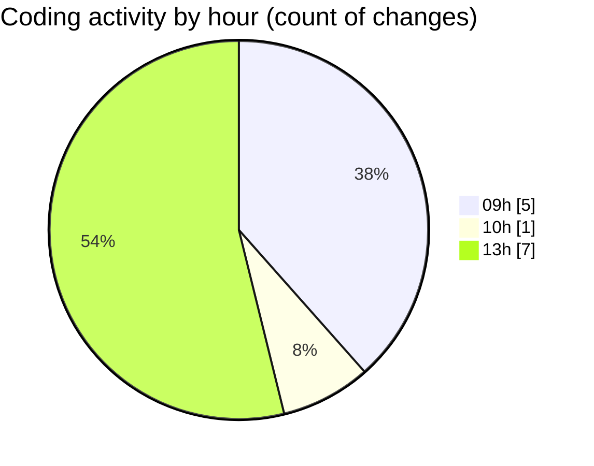

# cda - Activity Summary 

## Overall Statistics

| Stat                   | Value                                                             |
| ---------------------- | ----------------------------------------------------------------- |
| **Lines Added** (➕)   | 19344                                          |
| **Lines Removed** (➖) | 3                                        |
| **Net Change** (↕)    | 19341                |
| **Active Time** (⌚)   | 10 minutes |

## Modified Files
- **.env** (+125, -0)
- **App.tsx** (+8, -0)
- **queries.js** (+24, -0)
- **SkillListItem.tsx** (+4, -0)
- **graphql.ts** (+9934, -0)
- **gql.ts** (+334, -0)
- **graphql.ts** (+7972, -0)
- **skills.js** (+23, -0)
- **mutations.js** (+837, -0)
- **skill-queries.ts** (+25, -0)
- **SkillAdmin.tsx** (+58, -3)

## Visualizations

### By File Type (Lines Changed)

### By Hour (Estimated Activity Count)

> **Last Updated:** 15/09/2026, 13:18:24