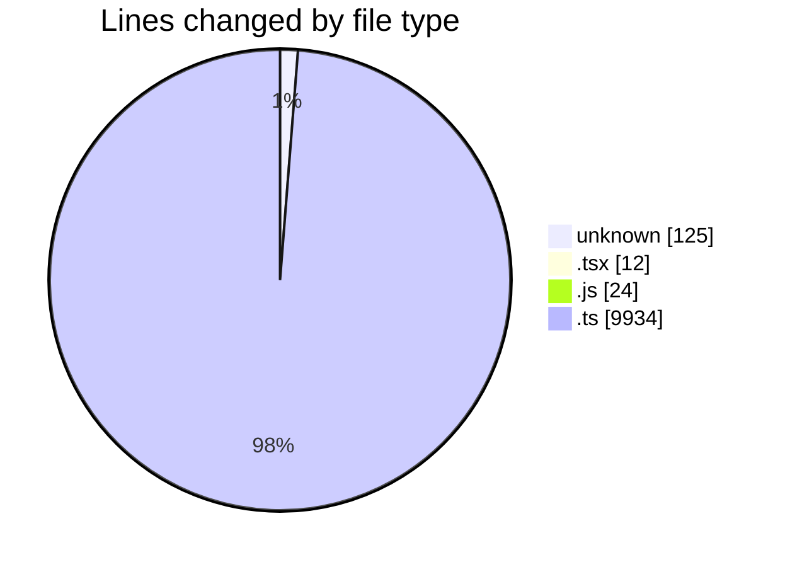
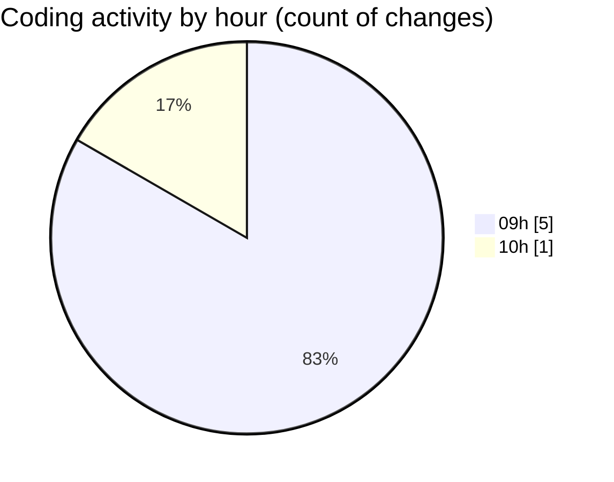

# cda - Activity Summary 

## Overall Statistics

| Stat                   | Value                                                             |
| ---------------------- | ----------------------------------------------------------------- |
| **Lines Added** (➕)   | 10095                                          |
| **Lines Removed** (➖) | 0                                        |
| **Net Change** (↕)    | 10095                |
| **Active Time** (⌚)   | 4 minutes |

## Modified Files
- **.env** (+125, -0)
- **App.tsx** (+8, -0)
- **queries.js** (+24, -0)
- **SkillListItem.tsx** (+4, -0)
- **graphql.ts** (+9934, -0)

## Visualizations

### By File Type (Lines Changed)

### By Hour (Estimated Activity Count)

> **Last Updated:** 15/09/2026, 10:08:24