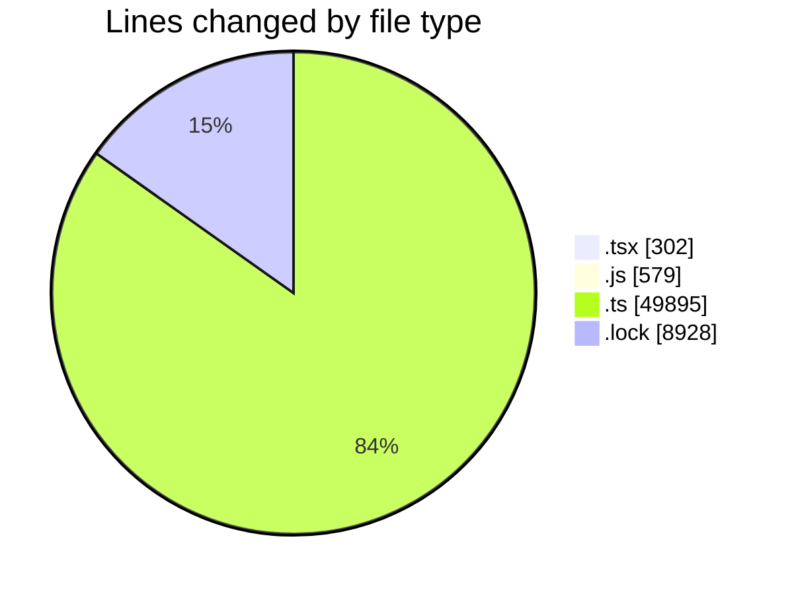
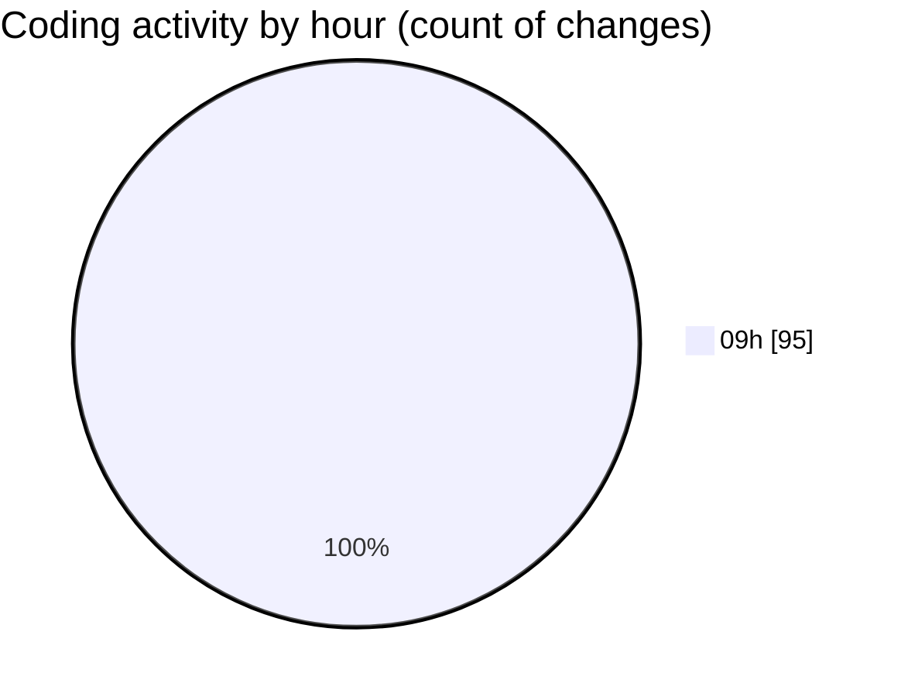

# cda - Activity Summary 

## Overall Statistics

| Stat                   | Value                                                             |
| ---------------------- | ----------------------------------------------------------------- |
| **Lines Added** (➕)   | 56970                                          |
| **Lines Removed** (➖) | 2734                                        |
| **Net Change** (↕)    | 54236                |
| **Active Time** (⌚)   | 114 minutes |

## Modified Files
- **SkillListItem.tsx** (+63, -4)
- **TagTopic.tsx** (+106, -0)
- **TagTopicDetails.tsx** (+79, -0)
- **SkillAdmin.tsx** (+50, -0)
- **skills.js** (+519, -42)
- **views.ts** (+11273, -87)
- **tables.ts** (+8063, -60)
- **skill-mutations.ts** (+1335, -126)
- **skill-queries.ts** (+837, -137)
- **skill-people-queries.ts** (+245, -3)
- **skill-group-queries.ts** (+361, -3)
- **skill-assign-mutations.ts** (+323, -3)
- **skill-admin-mutations.ts** (+302, -15)
- **skill-group-mutations.ts** (+1249, -24)
- **skill-team-queries.ts** (+528, -3)
- **SkillGroups.ts** (+321, -1)
- **skills.ts** (+393, -3)
- **skill-mutations.ts** (+262, -48)
- **policies.ts** (+24, -0)
- **skill-queries.ts** (+406, -92)
- **SkillPermissions.ts** (+104, -41)
- **resolvers-types.ts** (+13268, -10)
- **transform-skill-favourites.test.ts** (+458, -3)
- **sub-skill-mutations.ts** (+195, -3)
- **views.d.ts** (+9101, -4)
- **SkillPermissions.ts** (+175, -6)
- **yarn.lock** (+6912, -2016)
- **20260910120000-add-status-to-profile-skill-tag.js** (+18, -0)

## Visualizations

### By File Type (Lines Changed)

### By Hour (Estimated Activity Count)

> **Last Updated:** 16/09/2026, 09:36:50