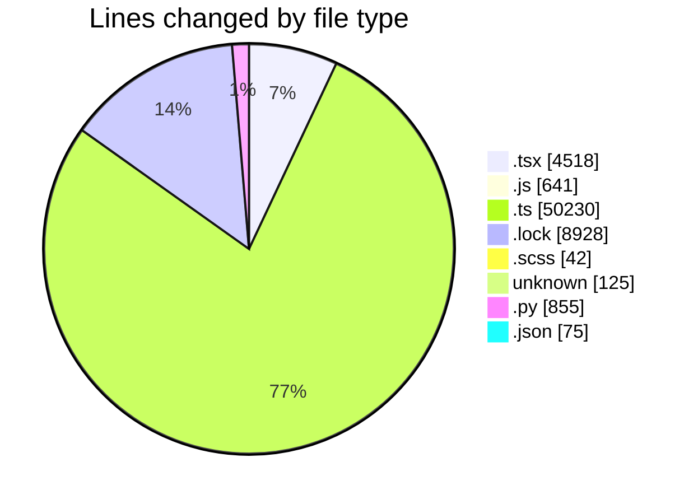
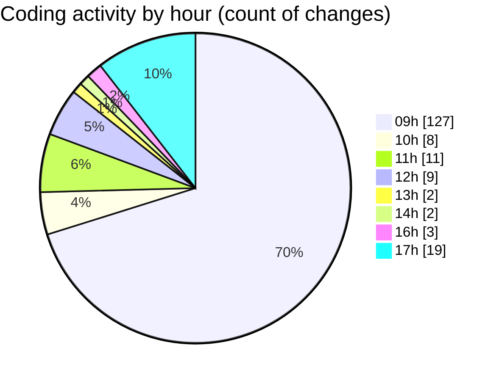

# cda - Activity Summary 

## Overall Statistics

| Stat                   | Value                                                             |
| ---------------------- | ----------------------------------------------------------------- |
| **Lines Added** (➕)   | 61554                                          |
| **Lines Removed** (➖) | 3860                                        |
| **Net Change** (↕)    | 57694                |
| **Active Time** (⌚)   | 215 minutes |

## Modified Files
- **SkillListItem.tsx** (+75, -17)
- **TagTopic.tsx** (+106, -0)
- **TagTopicDetails.tsx** (+82, -0)
- **SkillAdmin.tsx** (+55, -0)
- **skills.js** (+554, -69)
- **views.ts** (+11273, -87)
- **tables.ts** (+8063, -60)
- **skill-mutations.ts** (+1364, -207)
- **skill-queries.ts** (+882, -137)
- **skill-people-queries.ts** (+245, -3)
- **skill-group-queries.ts** (+361, -3)
- **skill-assign-mutations.ts** (+323, -3)
- **skill-admin-mutations.ts** (+302, -15)
- **skill-group-mutations.ts** (+1249, -24)
- **skill-team-queries.ts** (+528, -3)
- **SkillGroups.ts** (+321, -1)
- **skills.ts** (+393, -3)
- **skill-mutations.ts** (+358, -96)
- **policies.ts** (+24, -0)
- **skill-queries.ts** (+406, -92)
- **SkillPermissions.ts** (+104, -41)
- **resolvers-types.ts** (+13286, -10)
- **transform-skill-favourites.test.ts** (+458, -3)
- **sub-skill-mutations.ts** (+195, -3)
- **views.d.ts** (+9101, -4)
- **SkillPermissions.ts** (+175, -6)
- **yarn.lock** (+6912, -2016)
- **20260910120000-add-status-to-profile-skill-tag.js** (+18, -0)
- **SkillCreate.tsx** (+772, -550)
- **MyDrafts.tsx** (+59, -0)
- **index.ts** (+3, -0)
- **DraftSkills.test.tsx** (+50, -0)
- **PendingSkillsTab.tsx** (+58, -0)
- **ManageSkillsTab.tsx** (+112, -0)
- **InlineMarkdown.scss** (+30, -12)
- **App.tsx** (+225, -11)
- **SkillTagCreateSubSkills.test.tsx** (+217, -109)
- **.env** (+125, -0)
- **DraftSkills.tsx** (+85, -25)
- **DraftSkills.test.tsx** (+79, -0)
- **SubSkills.tsx** (+205, -0)
- **PendingSkillTopic.test.tsx** (+49, -0)
- **main.py** (+403, -201)
- **main.py** (+202, -49)
- **SkillTagCreateSubSkills.tsx** (+117, -0)
- **declarations.d.ts** (+15, -0)
- **CalendarShare.tsx** (+201, -0)
- **CalendarShareForm.tsx** (+25, -0)
- **ConfirmationModal.tsx** (+70, -0)
- **ProfileBadge.tsx** (+78, -0)
- **Duty.tsx** (+386, -0)
- **Settings.tsx** (+36, -0)
- **Admin.tsx** (+30, -0)
- **SignInStatusIcon.tsx** (+99, -0)
- **SchedulingTeamSelect.tsx** (+69, -0)
- **TeamViewRow.tsx** (+166, -0)
- **DateSwitcher.tsx** (+108, -0)
- **TooltipBadge.tsx** (+62, -0)
- **Sidebar.test.tsx** (+37, -0)
- **Sidebar.tsx** (+93, -0)
- **package.json** (+75, -0)

## Visualizations

### By File Type (Lines Changed)

### By Hour (Estimated Activity Count)

> **Last Updated:** 16/09/2026, 17:16:50