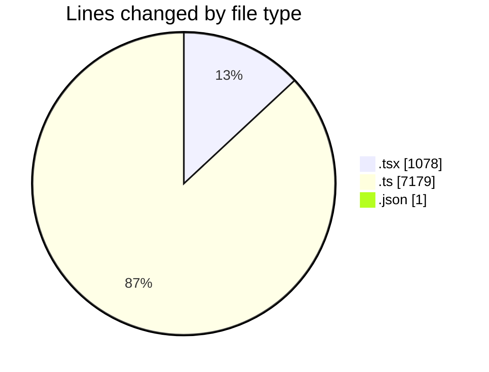
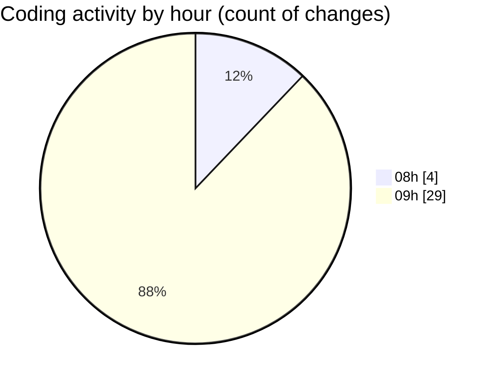

# cda - Activity Summary 

## Overall Statistics

| Stat                   | Value                                                             |
| ---------------------- | ----------------------------------------------------------------- |
| **Lines Added** (➕)   | 8131                                          |
| **Lines Removed** (➖) | 127                                        |
| **Net Change** (↕)    | 8004                |
| **Active Time** (⌚)   | 30 minutes |

## Modified Files
- **Restricted.tsx** (+27, -0)
- **RequestReport.tsx** (+252, -3)
- **getLinkedReport.ts** (+0, -4)
- **allocate-reports.ts** (+0, -86)
- **SkillCreate.tsx** (+165, -21)
- **package.json** (+1, -0)
- **SkillTagCreateSubSkills.tsx** (+39, -0)
- **SkillTagCreateSubSkills.test.tsx** (+109, -0)
- **SkillListItem.tsx** (+7, -0)
- **App.tsx** (+95, -0)
- **App.tsx** (+29, -13)
- **skill-mutations.ts** (+81, -0)
- **TagTopic.tsx** (+14, -0)
- **DraftSkills.test.tsx** (+3, -0)
- **declarations.d.ts** (+19, -0)
- **PendingSkillsTab.test.tsx** (+85, -0)
- **PendingSkillTopic.test.tsx** (+3, -0)
- **vulcan.ts** (+2064, -0)
- **clear_view_views.ts** (+4925, -0)
- **SkillCreate.test.tsx** (+213, -0)

## Visualizations

### By File Type (Lines Changed)

### By Hour (Estimated Activity Count)

> **Last Updated:** 17/09/2026, 10:01:50