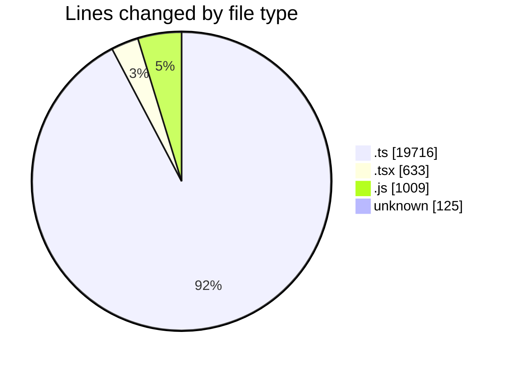
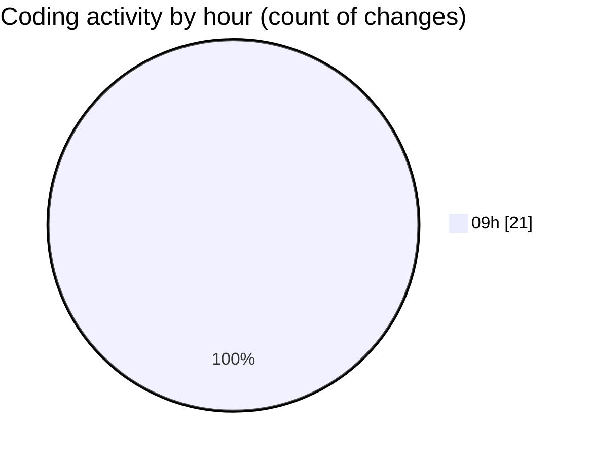

# cda - Activity Summary 

## Overall Statistics

| Stat                   | Value                                                             |
| ---------------------- | ----------------------------------------------------------------- |
| **Lines Added** (➕)   | 21435                                          |
| **Lines Removed** (➖) | 48                                        |
| **Net Change** (↕)    | 21387                |
| **Active Time** (⌚)   | 18 minutes |

## Modified Files
- **tables.ts** (+8041, -0)
- **views.ts** (+11191, -0)
- **SkillCreate.tsx** (+18, -16)
- **PendingSkillTopic.tsx** (+1, -1)
- **skills.js** (+486, -0)
- **skill-queries.ts** (+422, -0)
- **skill-queries.ts** (+31, -31)
- **queries.js** (+523, -0)
- **SkillCreate.test.tsx** (+232, -0)
- **.env** (+125, -0)
- **PendingSkillsTab.test.tsx** (+107, -0)
- **SkillTagCreateOptions.tsx** (+128, -0)
- **SkillTagCreateOptions.test.tsx** (+130, -0)

## Visualizations

### By File Type (Lines Changed)

### By Hour (Estimated Activity Count)

> **Last Updated:** 18/09/2026, 09:30:31