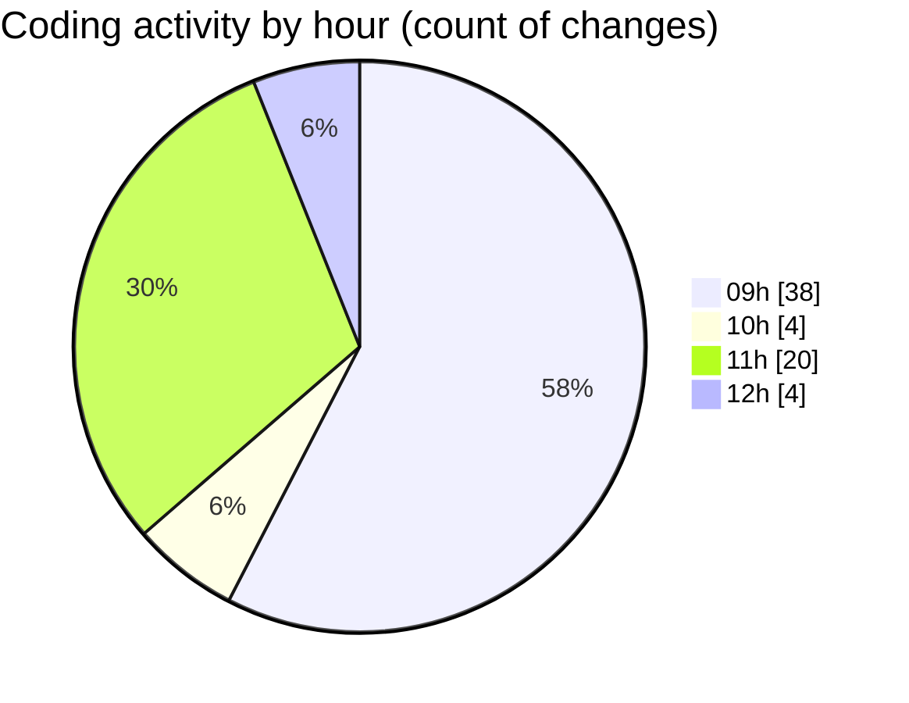

# cda - Activity Summary 

## Overall Statistics

| Stat                   | Value                                                             |
| ---------------------- | ----------------------------------------------------------------- |
| **Lines Added** (➕)   | 43498                                          |
| **Lines Removed** (➖) | 96                                        |
| **Net Change** (↕)    | 43402                |
| **Active Time** (⌚)   | 45 minutes |

## Modified Files
- **tables.ts** (+8041, -0)
- **views.ts** (+11191, -0)
- **SkillCreate.tsx** (+18, -34)
- **PendingSkillTopic.tsx** (+1, -2)
- **skills.js** (+486, -1)
- **skill-queries.ts** (+431, -0)
- **skill-queries.ts** (+36, -31)
- **queries.js** (+523, -0)
- **SkillCreate.test.tsx** (+232, -0)
- **.env** (+125, -0)
- **PendingSkillsTab.test.tsx** (+107, -0)
- **SkillTagCreateOptions.tsx** (+128, -0)
- **SkillTagCreateOptions.test.tsx** (+130, -0)
- **mutations.js** (+838, -0)
- **calendar-queries.ts** (+1804, -3)
- **resolvers-types.ts** (+13438, -0)
- **skill-mutations.ts** (+1247, -0)
- **PendingSkillsTab.tsx** (+67, -0)
- **skill-create.test.ts** (+179, -0)
- **skill-mutations.ts** (+265, -0)
- **EventForm.test.tsx** (+981, -11)
- **ScrollableDatepicker.test.tsx** (+116, -0)
- **location.tsx** (+60, -0)
- **main.tsx** (+62, -1)
- **MediaUploader.test.tsx** (+172, -0)
- **AddAttendeeModal.tsx** (+235, -0)
- **mapEventToForm.ts** (+60, -0)
- **block-navigation.js** (+89, -6)
- **prettify.js** (+939, -1)
- **sorter.js** (+212, -6)
- **EventForm.tsx** (+1113, -0)
- **PersonSelectOption.test.tsx** (+66, -0)
- **index.ts** (+12, -0)
- **ClearIndicator.tsx** (+18, -0)
- **PersonSelectOption.tsx** (+56, -0)
- **stripOwner.ts** (+6, -0)
- **types.ts** (+14, -0)

## Visualizations

### By File Type (Lines Changed)

### By Hour (Estimated Activity Count)

> **Last Updated:** 18/09/2026, 12:10:31